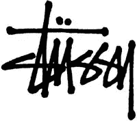
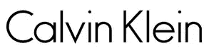
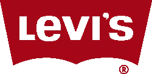

# 创建印刷徽标

> 原文：<https://www.sitepoint.com/creating-typographic-logos/>

当你开始设计徽标时，考虑一下徽标的类别会很有帮助。这些是:

*   印刷的
*   类型和符号
*   仅符号

在这里，我们将看看第一类，印刷标识。

印刷标志或文字标志是完全由字体制成的标志。他们有一种误解，认为他们很快就能组装起来，他们的设计不需要任何技巧。绝对不是这样的。标志设计师需要解决诸如“谁是客户”和“谁是目标受众”这样的问题

虽然在徽标上简单地使用公司或个人的名字似乎很简单，但排版必须是高标准的，否则会看起来很业余。好的排版意味着选择一个合适的字体(或定制或专有字体)，注意单词间距和字母间距。应该考虑字体的形状和易读性。还要记住，现在可能流行的字体可能很快就会过时。经典字体之所以“经典”是有原因的。

印刷徽标的一个优点是该标记是可识别的。肯定有成百上千的标志以地球仪、旋风标志和其他无意义的形状为特征，但当标志由公司名称的字体处理组成时，就不会出错。一个缺点是，如果没有经过专业处理，纯文字标识看起来很普通。

## 著名的印刷标志

以下是一些著名的印刷标志的例子。

下面你可以看到两个使用风格化字体创建的标志。他们显然是两种截然不同的公司，有两种截然不同的目标受众。

 

马克斯、斯潘塞和卡尔文·克莱恩都使用干净的无衬线字体。

 

红底白字，有人穿过这两家公司生产的牛仔裤吗？

 

你最喜欢的印刷 logos 有哪些？

## 分享这篇文章