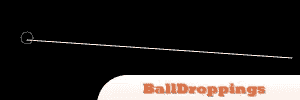
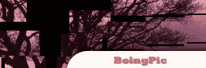
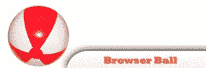
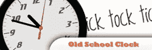
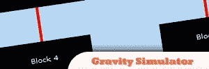
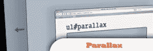
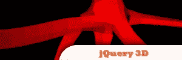
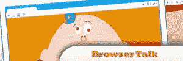
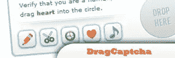

# 10 个非常有趣的 jQuery 插件

> 原文：<https://www.sitepoint.com/10-extreme-fun-jquery-plugins/>

Have fun with these jQuery extreme experiments!

## [1。落球](http://balldroppings.com/js/)

这是一个令人上瘾和吵闹的 jQuery 玩具，试试吧！

来源

 

## [2。BoingPic](http://www.kelvinluck.com/assets/jquery/boingPic/index.html)

上传一张图片，拆成碎片！

来源

 

## [3。浏览器球](http://experiments.instrum3nt.com/markmahoney/ball/)

允许你扔一个球穿过几个窗口。

来源

 

## [4。时钟](http://css-tricks.com/css3-clock/)

通过将 CSS3 的 rotate 属性与 jQuery 结合使用，可以得到一个非常酷的老式时钟。

来源

 

## [5。jQuery 手势](http://friggeri.net/blog/2008/12/21/jquery-gestures)

这个插件是一个例子，它展示了一个图像库，这个图像库可以处理你用鼠标做的手势。

来源

 

## [6。jQuery 重力模拟器](http://blog.themeforest.net/tutorials/simulate-gravity-with-jquery/)

剪下一个字符串，看到块下落，上下弹跳，直到他们停止在 jQuery easing 方法的帮助下。

来源

 

## [7。jParallax](http://webdev.stephband.info/parallax.html)

有一个很大的视差效果，使用这个插件炒作你的网站。

来源

## 8.3d 怪物

通过使用 3d 引擎的这个功能来看看 jQuery 是多么的伟大和强大。

## 9.BrowserTalk

操控您的网络浏览器窗口，启用您的麦克风并授予对应用程序的访问权限。

 

## 10。DragCaptcha

在某一点上拖动指定的图标，以确定访问者是否是人类。

来源

## 分享这篇文章