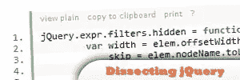
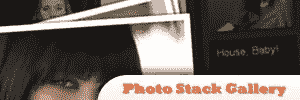
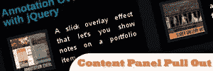

# 12 个大型 jQuery 插件

> 原文：<https://www.sitepoint.com/12-mega-jquery-plugins/>

是时候使用大型 jQuery 插件了！这些插件是 HTML5，CSS3 和 PHP good 的结合。抓紧了！这可能会让你大吃一惊。

## [1。最新帖子博客滑动条](http://tympanus.net/codrops/2010/06/17/latest-post-blogroll-slider/)

这是 jQuery 和 PHP 的结合，用于最新的 blogroll 滑块。

来源:
[http://tym pus . net/codrops/2010/06/17/latest-post-blogroll-slider/](http://tympanus.net/codrops/2010/06/17/latest-post-blogroll-slider/)

 

## [2。剖析 jQuery 过滤器](http://net.tutsplus.com/tutorials/javascript-ajax/quick-tip-dissecting-jquery-filters/)

通过一次取一个 jQuery 源代码块来剖析 jQuery 过滤器，分解它，并了解进程中发生了什么。

来源:
[http://net . tuts plus . com/tutorials/JavaScript-Ajax/quick-tip-classing-jquery-filters/](http://net.tutsplus.com/tutorials/javascript-ajax/quick-tip-dissecting-jquery-filters/)

 

## [3。HTML5 和 jQuery 的音乐组合](http://tympanus.net/codrops/2010/07/26/music-portfolio-template/)

创建一个艺术家组合与一个 discography 排队和 HTML5 自动播放器。

来源:
[http://tym pus . net/codrops/2010/07/26/music-portfolio-template/](http://tympanus.net/codrops/2010/07/26/music-portfolio-template/)

 

## [4。漫游墙](http://addyosmani.com/blog/wanderwall/)

在 CSS3 和 HTML5 的帮助下，你会惊讶于这个基于悬停的界面。

来源:
【http://addyosmani.com/blog/wanderwall/】T4

 

## [5。动画 404 页](http://tutorialzine.com/2010/08/animated-404-not-found-page-css-jquery/)

用这个重新设计旧的 404 页面。

来源:
[http://tutorial zine . com/2010/08/animated-404-not-found-page-CSS-jquery/](http://tutorialzine.com/2010/08/animated-404-not-found-page-css-jquery/)

 

## [6。交互式光掩模](http://tympanus.net/codrops/2010/07/01/interactive-photo-desk/)

创建一个交互式照片台，为用户提供一些真实的交互。

来源:
[http://tym pus . net/codrops/2010/07/01/interactive-photo-desk/](http://tympanus.net/codrops/2010/07/01/interactive-photo-desk/)

 

## [7。缩略图导航](http://tympanus.net/codrops/2010/07/29/thumbnails-navigation-gallery/)

创建一个非凡的画廊，可滚动的缩略图从导航中滑出。

来源:
[http://tym pus . net/codrops/2010/07/29/缩略图-导航-图库/](http://tympanus.net/codrops/2010/07/29/thumbnails-navigation-gallery/)

 

## [8。美丽的照片堆栈图库](http://tympanus.net/codrops/2010/06/27/beautiful-photo-stack-gallery-with-jquery-and-css3/)

这是一个漂亮而新鲜的图库，它以滑动条的形式显示相册，当它被选中时，就会显示该相册的图片。

来源:
[http://tym pus . net/codrops/2010/06/27/beautiful-photo-stack-gallery-with-jquery-and-css3/](http://tympanus.net/codrops/2010/06/27/beautiful-photo-stack-gallery-with-jquery-and-css3/)

 

## [9。滑动面板照片墙画廊](http://tympanus.net/codrops/2010/05/14/sliding-panel-photo-wall-gallery-with-jquery/)

这是一个整页的照片墙画廊，这是一个整页的拇指与良好的灯光效果时，悬停。

来源:
[http://tym pus . net/codrops/2010/05/14/sliding-panel-photo-wall-gallery-with-jquery/](http://tympanus.net/codrops/2010/05/14/sliding-panel-photo-wall-gallery-with-jquery/)

 

## 10。内容面板拉出

创建在预定义的滚动位置滑出的内容面板。

来源:
[http://tym pus . net/codrops/2010/11/01/pull-out-content-panel/](http://tympanus.net/codrops/2010/11/01/pull-out-content-panel/)

 

## [11。花式分页插件](http://tympanus.net/codrops/2009/11/17/jpaginate-a-fancy-jquery-pagination-plugin/)

jPaginate 是一个 jQuery 分页插件，可以动态显示页码。用户只需点击或悬停在箭头上，即可浏览可用的页码。

来源:
[http://tym pus . net/codrops/2009/11/17/JPA ginate-a-fancy-jquery-pagination-plugin/](http://tympanus.net/codrops/2009/11/17/jpaginate-a-fancy-jquery-pagination-plugin/)

 

## [12。注释叠加效果](http://tympanus.net/codrops/2010/10/12/annotation-overlay-effect/)

这是一个简单的叠加效果，显示网页设计师的投资组合项目的注释，只是举例。

来源:
[http://tym pus . net/codrops/2010/10/12/annotation-overlay-effect/](http://tympanus.net/codrops/2010/10/12/annotation-overlay-effect/)

## 分享这篇文章