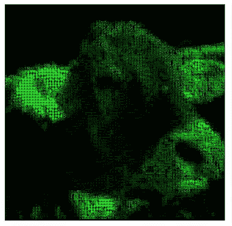

# jQuery 矩阵效果

> 原文：<https://www.sitepoint.com/jquery-matrix-effects/>

## 介绍

这是一个很酷的 jQuery 插件，基于著名电影《黑客帝国》。这很简单。这个插件模仿电影本身的数字效果，选择一个将变成它的图像，并开始做修改。你应该试试这个，很有趣！



## 它是如何工作的？

当您将图像加载到画布中时，可以读取像素，然后读取颜色:

```
data =  ctx.getImageData(x, y, settings.grainSize, settings.grainSize).data
```

令人兴奋的是，可以读取图像的矩形，jQuery 使用它来计算图像每个部分的平均颜色。然后，该颜色将被替换图像部分的像素的字符使用。

```
//get a portion of image
data = ctx.getImageData(x, y, settings.grainSize, settings.grainSize).data;
var r_avg = 0, g_avg = 0, b_avg = 0;

//sum all channels values
for (var i = 0; i &lt; data.length; i += 4) {
    r_avg += data[i];
    g_avg += data[i + 1];
    b_avg += data[i + 2];
}

//calculate average color for each channel
r_avg = Math.round(r_avg / (data.length / 4));
g_avg = Math.round(g_avg / (data.length / 4));
b_avg = Math.round(b_avg / (data.length / 4));
```

它会生成许多 B 标签，每个标签都有字符:

```
var block = document.createElement("b");
jQuery(matrix_cont).append(block);
var r = image_colors[i].r;
var g = image_colors[i].g;
var b = image_colors[i].b;
block.innerHTML = getChar(r, g, b);
switch (settings.colors) {
    case "bn":
        var gray = Math.round((r + g + b) / 3);
        jQuery(block).css("color", "rgb(" + gray + "," + gray + "," + gray + ")");
        break;
    case "green":
        jQuery(block).css("color", "rgb(0," + g + ",0)");
        break;
    case "all":
    default:
        jQuery(block).css("color", "rgb(" + r + "," + g + "," + b + ")");
        break;
}
```

了解字符
第一个字符代表深色，最后一个字符代表浅色。

```
chars: ['.', '¸', '¹', '`', '*', '_', '°', 'ª', '^', '+', '±', '¢', '®', '"', 'υ',
            '»', '½', '¾', 'h', 'e', '8', 's', 'p', '=', '/', '$', '§', 'ξ', 'u', '6', '9',
            '5', 'y', 'j', 'd', 'q', 'H', 'ç', 'B', 'V', '8', 'Z', 'W', 'S',
            '%', 'e', 'n', 'm', '&amp;', 'à', 'ω', 'Ψ', 'o', '#', 'k', '●', '♦', '♥']
```

## 如何使用

将这些代码包含在您的头部标签中。

```
<script src="js/jquery.js" type="text/javascript"><!--mce:0--></script>
<script src="js/jquery.matrix-0.1.js" type="text/javascript"><!--mce:1--></script>
```

用这个来激活它。

```
$(function () { $("img").matrix(); });
```

来源:
[http://romanovian.com/blog/jquery-matrix/](http://romanovian.com/blog/jquery-matrix/)

## 分享这篇文章