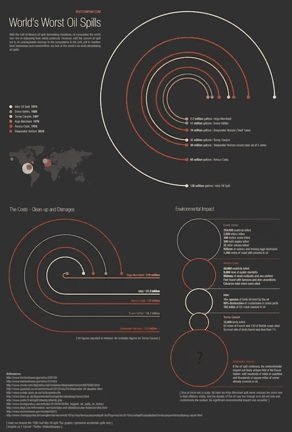
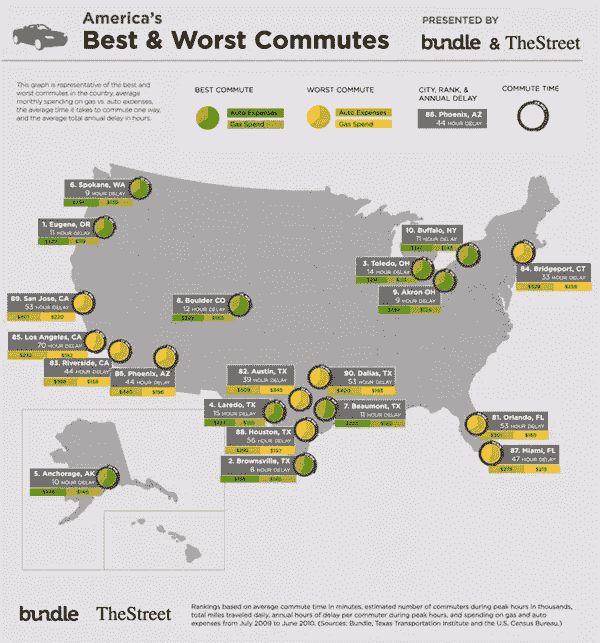
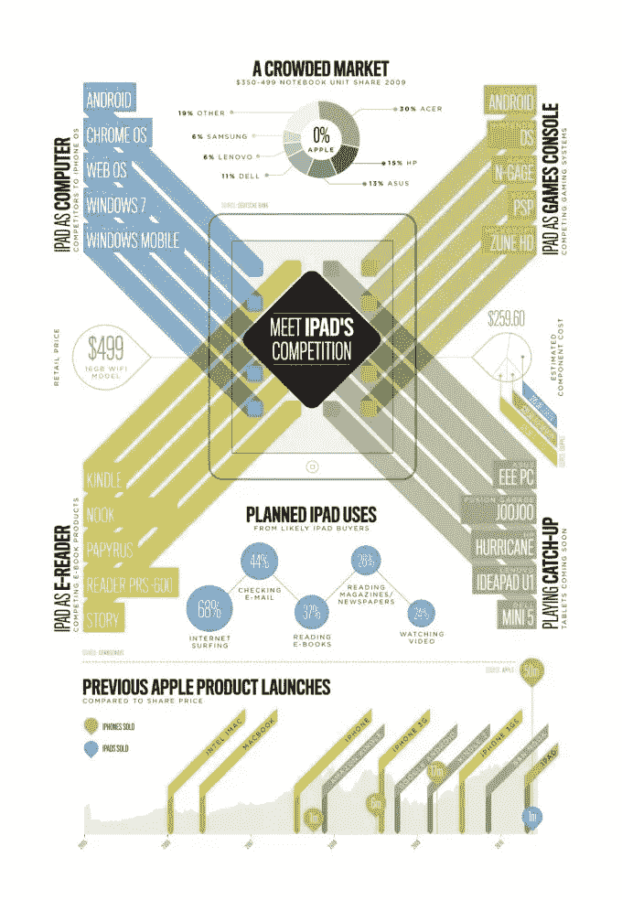
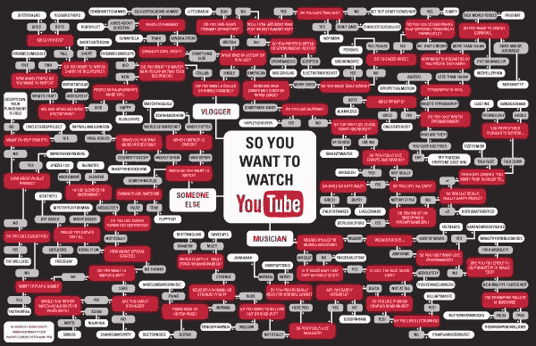
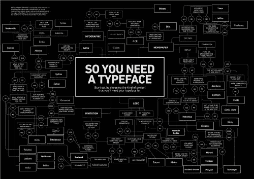
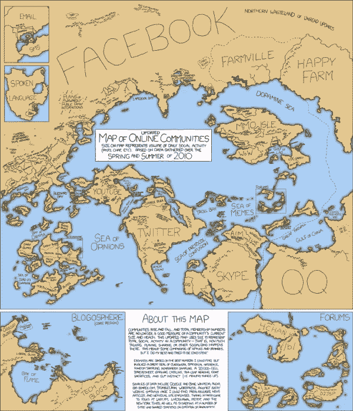
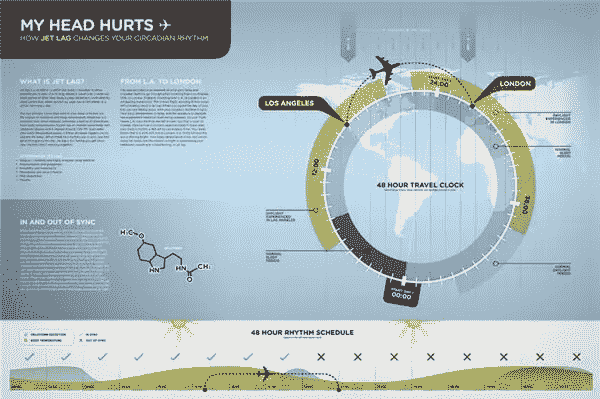
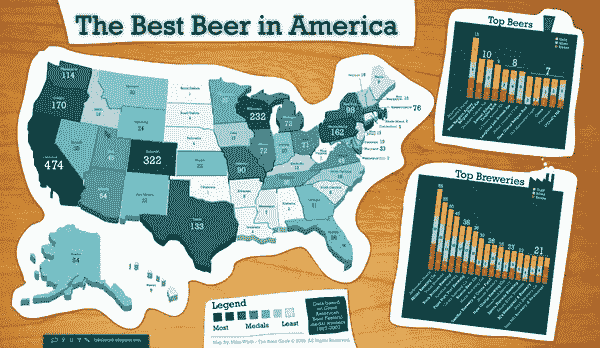

# 2010 年十大引人注目的信息图表

> 原文：<https://www.sitepoint.com/ten-eye-catching-information-graphics-of-2010/>

信息图或信息图是信息和数据的图形视觉表示。成功的信息图以引人注目的方式清晰快速地显示信息(就像成功的网页设计一样)。在过去的几年里，在这个领域工作的设计师的意识和数量都有了显著的增长，他们创作出了一些非常漂亮的设计作品。

本周我一直在回顾基于 [CSS 的设计](https://www.sitepoint.com/ten-beautiful-css-web-sites-of-2010/)、[基于 Flash 的设计](https://www.sitepoint.com/ten-beautiful-flash-web-sites-of-2010/)、[标志设计](https://www.sitepoint.com/ten-humorous-logos-of-2010/)，今天我来看看 2010 年的一些精彩的信息图形设计。

今年早些时候，英国石油公司的石油泄漏是一个巨大的毁灭性新闻，但它不是有史以来最大的石油泄漏事件。

令人震惊的手机使用人口统计数据对一些人来说可能令人震惊，也可能不令人震惊，但这张图看起来很棒，提供了很多信息。

作为一名通勤者(在爱尔兰)，我很有兴趣看到这张美国最佳和最差通勤图表

[迎接 iPad 的竞争](http://sectiondesign.co.uk/meet-ipads-competition)按部分显示有多少设备可用。

"[所以你想看 YouTube](http://karenkavett.blogspot.com/2010/07/so-you-want-to-watch-youtube-flowchart.html) ？"流程图是由设计专业的学生凯伦·卡维特创作的。点击这里看更大的[版本](http://www.karenkavett.com/blogp/youtubeflowchart_final_big.jpg)。

上面的 YouTube 图表的灵感来自另一个叫做“[的很酷的图形，所以你需要一个字体](http://mrdouglaswood.wordpress.com/2010/04/20/48-so-you-need-a-typeface/)？”作者道格拉斯·伍德。看[大版](http://mrdouglaswood.files.wordpress.com/2010/04/soyouneedatypeface.jpg)这里。

今年世界杯在非洲举行，Marca.com 有一个极好的互动比赛时间表([你仍然可以在这里访问](http://www.marca.com/deporte/futbol/mundial/sudafrica-2010/calendario-english.html))。

XKCD 绘制的在线社区地图。

这一组精美的图片来自平面设计专业的学生 Matt Kursmark，展示了昼夜节律是如何工作的，以及时差是如何对其产生不利影响的。

最后，这张图在今年引起了相当大的关注，“美国最好的啤酒”信息图。点击此处查看[全尺寸](http://4.bp.blogspot.com/_V1hky3QMM4k/SXzCVJ8FBAI/AAAAAAAABIU/9yYZRJqHRJk/s1600-h/GABF+Medal+Map.jpg)。

**你觉得这些信息图形怎么样？这是你感兴趣的设计领域吗？**

## 分享这篇文章