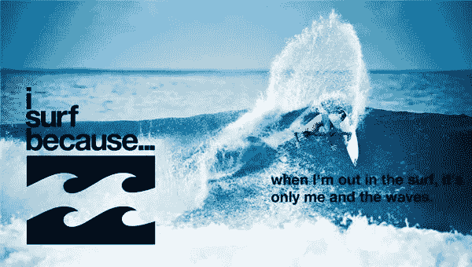
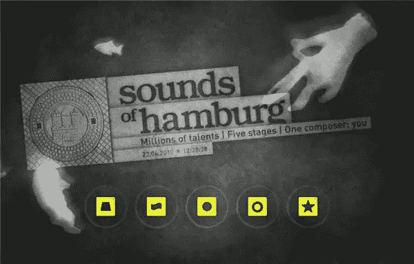
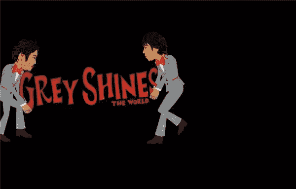
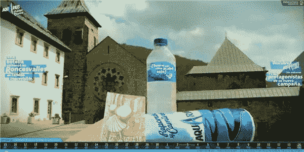
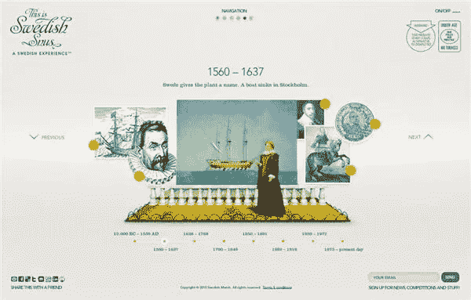
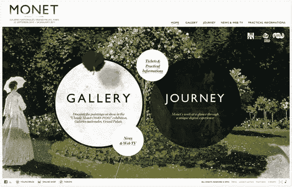
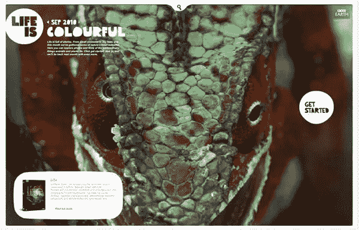
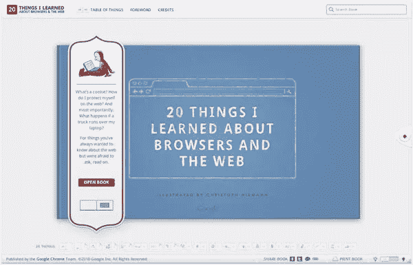
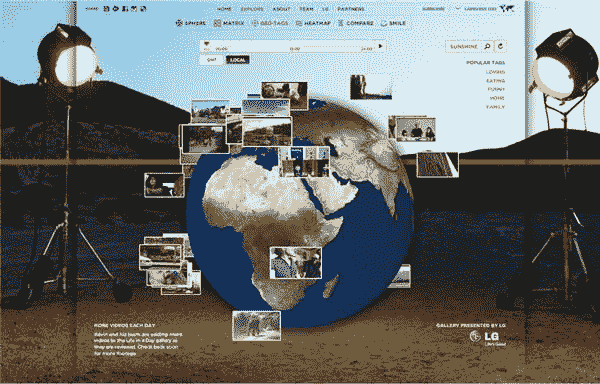
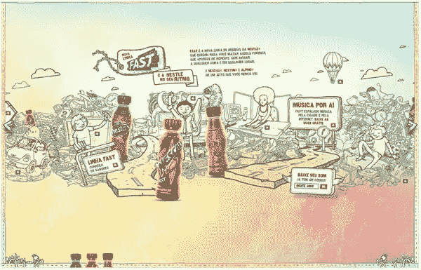

# 2010 年十大精美 Flash 网站

> 原文：<https://www.sitepoint.com/ten-beautiful-flash-web-sites-of-2010/>

继续回顾 2010 年出现在我们屏幕上的一些可爱的设计。昨天我们看了一下基于 CSS 的网站，今天我将重点介绍过去 12 个月中引起我注意的一些基于 Flash 的网站。当谈到 Flash 时，有些设计师可能会有点爱恨交加。它为创意设计和动画提供了极好的机会，如果你有动作脚本技能，只有你的想象力限制你能做什么。另一方面，因为搜索引擎优化的困难和缺乏精确定位网站特定部分的能力，以及因为某个智能手机制造商强烈反对在他们的(I)手机上使用 flash player，所以它是不受欢迎的。

但是在这篇文章中，让我们来思考和看看这项技术的一些伟大的用途。

我冲浪是因为是一个为冲浪者提供的网站，它汇集了关于这项运动的美丽图片、视频和鼓舞人心的陈述。

汉堡的声音融合了城市的声音和管弦乐。

我不太清楚这个网站实际上实现了什么，但我喜欢看它。Grey Shines 是一个音乐节目，以日本 Grey 公司员工的手绘角色为特色。

水瓶座能量饮料是西班牙圣詹姆斯大道的赞助商。

瑞典鼻烟。瑞典语那是什么？是的，这是无烟烟草，还有什么？

2010 年莫奈博览会的绝佳地点。

[BBC 地球——生命是](http://lifeis.bbcearth.com/)。来自 BBC 档案馆的精彩图片和视频集合。

[我学到的二十件事](http://www.20thingsilearned.com/)是一个引人入胜的网站，基于谷歌撰写的描述现代浏览器如何工作的文章。

[一天的生活](http://www.youtube.com/lifeinaday?x=explore)是一个全球性的项目，旨在制作一部用户生成的地球上一天的电影。

作为雀巢快速饮料的网站，它结合了可爱的插图和一个叫做“快速环绕”的系统，即我们周围的空气。

你对这些 Flash 网站有什么看法？2010 年还有哪些 Flash 网站吸引了你的眼球？

## 分享这篇文章