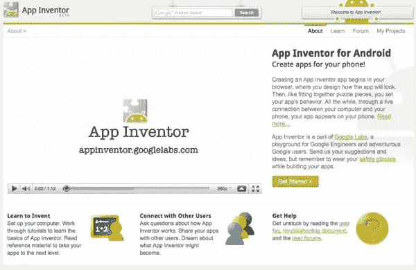
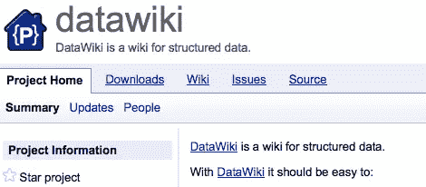
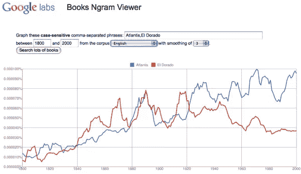

# 谷歌实验室正在研发四款新应用

> 原文：<https://www.sitepoint.com/google-labs-apps/>

我会定期查看谷歌实验室，看看是否有什么有趣的应用。

以下是谷歌正在开发、测试和评估的四款最新应用。带他们去试驾…你觉得他们中有谁有持久力吗？

## [安卓应用发明者](http://appinventor.googlelabs.com/)

App Inventor 允许非开发人员通过可视化设计应用程序来构建 Android 应用程序，这些应用程序具有指定应用程序逻辑的块。您可以使用 App Inventor 构建游戏、教育应用程序，甚至增强交流的应用程序。您可以使用 GPS 位置传感器来构建位置感知应用程序，让您的应用程序通过使用手机功能进行通信，并与 web 集成来构建混搭应用程序。

## [数据维基](http://datawiki.googlelabs.com/)

Google DataWiki 是一个管理结构化数据的工具。它扩展了普通 wiki 的概念，使创建、编辑、共享和可视化结构化数据变得更加容易。然后，链接数据格式，使其更加有用和相关。

## [谷歌图书 Ngram 浏览器](http://ngrams.googlelabs.com/)

基于 Google Books 超过 10%的已出版书籍的内容数据库，Google Books Ngram Viewer 可以让你看到这些年来短语在书中出现的频率。你可以在你的浏览器中绘制从 1400 年到今天的短语出现的图表。

## [谷歌共享空间](http://gadgetspaces.googlelabs.com/)

谷歌共享空间允许你创建一个空间，里面有一个协作小工具和一个聊天框。这些小工具基于 Wave 技术，因此已经有超过 50 种不同类别的小工具，包括生产力、协作和规划。

您可以通过访问画廊并单击其中一个特色小工具来创建一个新空间。共享空间可以很容易地与一个网址。您还可以使用 Google 共享空间来创建自己的实时协作小工具和空间。

注意:这款游戏刚刚发布，所以仍然存在一些问题。

### 更多的测试正在进行中…

除了正在渗透的一系列新应用，谷歌还为现有应用开发了一些新功能，包括:

[日历实验室](http://www.google.com/calendar/render?settings=4):

*   温和的提醒
*   自动拒绝事件
*   事件附件
*   智能重新调度程序
*   年视图
*   跳转到日期
*   世界时钟

[Gmail 实验室:](http://mail.google.com/mail/?ui=2&fs=1&view=pu&st=labs)

*   高级 IMAP 控件
*   已验证发件人的身份验证图标
*   刻板的反应
*   自定义日期格式
*   邮件中的谷歌文档预览
*   邮件中的谷歌地图预览
*   隐藏已读标签
*   收件箱预览
*   消息翻译
*   引用所选文本

[谷歌地图实验室:](http://maps.google.com/maps?showlabs=1)

*   距离测量工具
*   将地图“链接”缩短为一个更紧凑的 URL
*   拖动和缩放
*   可旋转地图
*   智能变焦

[YouTube:](http://www.youtube.com/testtube)

*   评论搜索
*   观众的洞察力
*   标题编辑器
*   HTML5 视频
*   YouTube 音乐探索

## 分享这篇文章