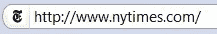
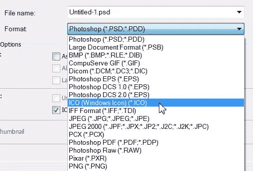

# 在 Photoshop 中设计网站图标

> 原文：<https://www.sitepoint.com/design-a-website-favicon-in-photoshop/>

favicons(favorites icons 的缩写)是那些在你的网络浏览器地址栏左边的小图标，是你整个网站品牌的一部分。它们会出现在你的网络浏览器中，也会出现在新闻提要中，所以在你的网站中包含它们是很重要的。收藏夹图标*实际上*是很小的图标；它们的尺寸是 16 像素乘 16 像素——没有太大的工作空间。浏览一下网页，看看其他网站在用什么。在这种小尺寸下，有些图标比其他图标工作得更好，简洁是关键。

[](https://www.sitepoint.com/wp-content/uploads/2010/12/Amazon.png)

[](https://www.sitepoint.com/wp-content/uploads/2010/12/NTTimes.png)

[](https://www.sitepoint.com/wp-content/uploads/2010/12/Sitepoint.png)

[](https://www.sitepoint.com/wp-content/uploads/2010/12/Wired.png)

好吧，那我们开始吧。

1.  下载 Photoshop 的插件，它允许您以 Windows 图标(ICO)文件格式保存文件。你可以从 www.telegraphics.com.au/sw/下载一个名为 ICO 格式的免费插件。免费下载中包含安装说明。
2.  打开 Photoshop。选取“文件”>“新建”,创建一个分辨率为 72 ppi、尺寸为 64 x64 像素的新文档。我们将缩小后，我们创建的图形。
3.  在新文档中创建或放置您的作品。如果您在收藏夹图标中使用文本，请确保关闭抗锯齿功能，以便边缘清晰美观。
4.  对于我的图标，我使用了紫色的爪子印，爪子的一部分用粉红色突出显示。这是使用矢量图形创建的。
    
5.  设计就绪后，选择“图像”>“图像大小”。确保对话框底部的“约束比例”复选框处于选中状态；然后将宽度或高度字段设置为 16 像素(Photoshop 会自动将另一个字段更改为 16)。单击确定。
    
6.  如果您的设计看起来有点模糊，请使用模糊蒙版滤镜。
7.  现在你的图标已经准备好了，选择“文件”>“另存为”,然后从对话框底部的“格式”弹出菜单中选择“窗口图标”。然后单击保存。[](https://www.sitepoint.com/wp-content/uploads/2010/12/ICO-format.png)

这就是你的图标完成。非常容易。

如果您为自己的网站创建了 favicon，那么您可以将该文件上传到网站的根级别，也就是您的索引页面所在的位置。并非所有的网络浏览器都支持图标，但是对于支持图标的浏览器，你可以在网页的部分插入以下代码:

```
<link rel="SHORTCUT ICON" href="/favicon.ico">
```

**note:**Want more?

如果你想阅读更多关于 Jennifer 的文章，请订阅我们的网页设计时事通讯，SitePoint [*设计视图*](https://www.sitepoint.com/newsletter/) 。

如果你喜欢读这篇文章，你会爱上[可学的](https://learnable.com?utm_source=sitepoint&utm_medium=link&utm_campaign=learnablelink)；向大师们学习新技能和技术的地方。会员可以即时访问 SitePoint 的所有电子书和互动在线课程，如[Photoshop](https://learnable.com/courses/foundations-of-photoshop-2712?utm_source=sitepoint&utm_medium=link&utm_campaign=learnablelink)基础。

对本文的评论已经关闭。对 Photoshop 有疑问？为什么不在我们的[论坛](https://www.sitepoint.com/forums/forumdisplay.php?8-Graphics?utm_source=sitepoint&utm_medium=link&utm_campaign=forumlink)上问呢？

## 分享这篇文章