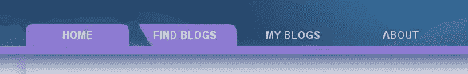

# jQuery Flash 风格的导航菜单

> 原文：<https://www.sitepoint.com/jquery-flash-style-navigation-menu/>

不，这不是闪光。这是 100%的 jQuery！这个菜单是我发现的最好的 jQuery 菜单之一，这就是你如何在自己的网站上实现它！



*   html 是一个简单的无序列表
*   css 可以定制颜色来匹配你的网站
*   jQuery 可以根据您需要的速度和效果进行定制

[观看现场演示](http://blogoola.com/)

**JavaScript 文件中包含以下内容:**

```
(function($) {
	$.extend($.fx.step,{
	    backgroundPosition: function(fx) {
            if (fx.state === 0 && typeof fx.end == 'string') {
                var start = $.curCSS(fx.elem,'backgroundPosition');
                start = toArray(start);
                fx.start = [start[0],start[2]];
                var end = toArray(fx.end);
                fx.end = [end[0],end[2]];
                fx.unit = [end[1],end[3]];
			}
            var nowPosX = [];
            nowPosX[0] = ((fx.end[0] - fx.start[0]) * fx.pos) + fx.start[0] + fx.unit[0];
            nowPosX[1] = ((fx.end[1] - fx.start[1]) * fx.pos) + fx.start[1] + fx.unit[1];
            fx.elem.style.backgroundPosition = nowPosX[0]+' '+nowPosX[1];

           function toArray(strg){
               strg = strg.replace(/left|top/g,'0px');
               strg = strg.replace(/right|bottom/g,'100%');
               strg = strg.replace(/([0-9.]+)(s|)|$)/g,"$1px$2");
               var res = strg.match(/(-?[0-9.]+)(px|%|em|pt)s(-?[0-9.]+)(px|%|em|pt)/);
               return [parseFloat(res[1],10),res[2],parseFloat(res[3],10),res[4]];
           }
        }
	});
})($);

$('#mynav a')
.css( {backgroundPosition: "0 0"} )
.mouseover(function(){
	$(this).stop().animate({backgroundPosition:"(-150px 0)"}, {duration:700})
})
.mouseout(function(){
	$(this).stop().animate({backgroundPosition:"(-300px 0)"}, {duration:700, complete:function(){
		$(this).css({backgroundPosition: "0 0"})
	}})
})
```

**HTML 中包含以下内容:**

```
 *   [首页](http://blogoola.com/)

*   [查找博客](http://blogoola.com/find-blogs/)

*   [我的博客](http://blogoola.com/my-blogs/)

*   [关于](http://blogoola.com/about/)

*   [常见问题解答](http://blogoola.com/faq/) 
```

这是 jQuery 用来制作菜单项动画的两个背景图像(你可以改变颜色以适应你的网站，在它们之间切换以获得不同的悬停效果)。


## 分享这篇文章