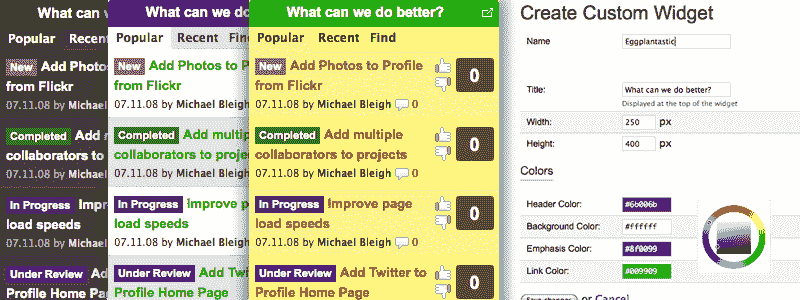
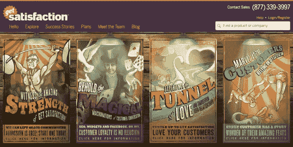
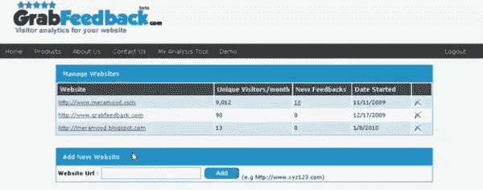
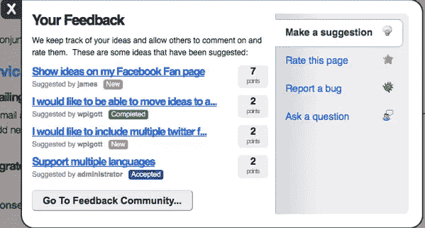
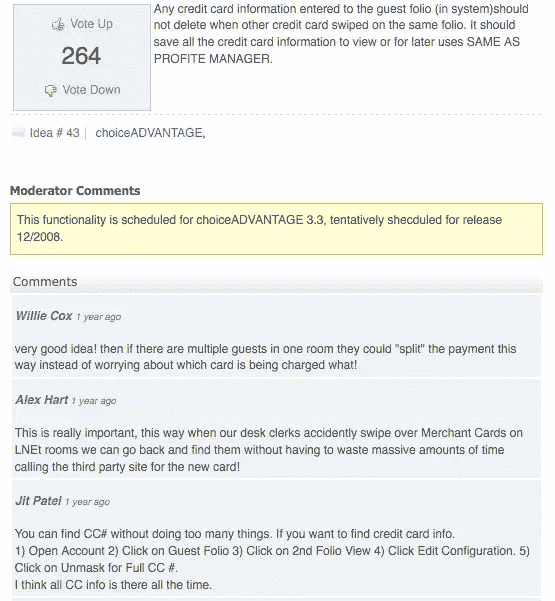
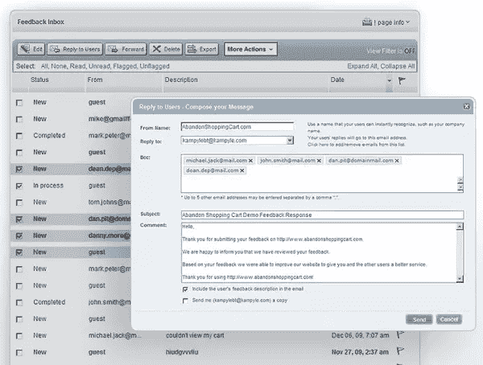
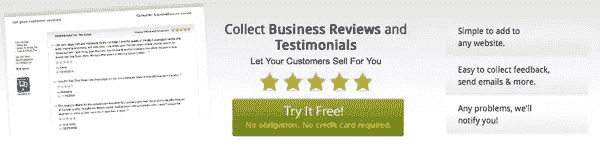
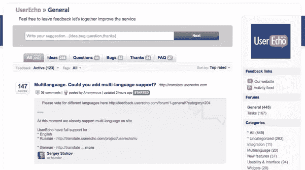
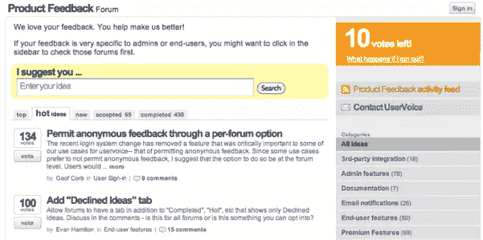
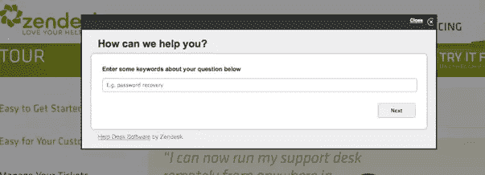

# 帮助你改善客户关系的 10 个客户反馈工具

> 原文：<https://www.sitepoint.com/customer-feedback-tools/>

有许多不同的方法可以询问和评估客户反馈，包括调查、非正式问卷、公开讨论等。，但你也可以使用更结构化的工具来进入你的客户的头脑，解决问题，改善你的工作方式。

一个完善的客户反馈工具可以为你的客户提供一个表达关切、提问、获取信息和留下评论的地方。这里有 10 个顾客反馈工具供你回顾。

## [众声](http://www.crowdsound.com/)

CrowdSound 是一个社交反馈工具，让你的客户通过一个可定制的小工具从你的网站上对建议进行投票。功能包括审核、定制、建议和反馈、iPhone 兼容性等。

## [获得满足感](http://getsatisfaction.com/)

Get Satisfaction 是一个受欢迎的客户社区工具，它让客户和顾客建立对话，并建立一个“社会”信息知识库。值得注意的功能包括可定制的小部件、移动软件、审核、数据导出、CRM 集成、分析等。

## [抓取反馈](http://www.grabfeedback.com/)

GrabFeeback 让您收集、管理和分析客户的反馈，以便您能够解决问题、改善沟通和提高满意度。您可以查看每天反馈量的实时数据，定制反馈表，并使用仪表板分析客户地理、人口统计、性别、浏览器等。

## [想法效果](http://www.ideaffect.com/)

Ideaffect 是一个反馈社区，为您的客户提供了一个发布建议或反馈产品或服务的途径。您可以通过 SSL 连接定制外观和设计、创建报告、导出数据、嵌入小部件、调节等等。

## [观念等级](http://ideascale.com/)

IdeaScale 可以让你在你的社区内建立一个对话，作为一个团体来发展想法。它附带了集成工具，如:iPhone 支持、wiki 支持和 Twitter/脸书集成。

## 坎派尔

Kampyle 是一个反馈工具，可以直接构建到您的网站中，帮助您减少客户流失，提高转化率，提高客户满意度和忠诚度。您可以查看实时反馈、创建图表、建立对话和集成分析工具。

## 税率点

RatePoint 的业务评论工具为您提供了收集客户反馈和评论所需的所有工具。你可以通过链接、电子邮件、Twitter 和脸书收集无限量的评论和推荐，解决争议，并根据收到的反馈改进业务。

## [用户回声](http://userecho.com/)

UserEcho 是一款客户反馈工具，可让您让客户参与讨论、组织和标记您的反馈、收集投票等。

## [用户声音](http://uservoice.com/)

UserVoice 是一个反馈工具，用于收集反馈并对反馈进行优先排序，您和您的客户可以使用它来获得答案、分享想法并快速学习。功能包括随键入搜索功能、简单注册、投票限制、持续讨论、小工具和脸书集成。

## [Zendesk](http://www.zendesk.com/)

Zendesk 是一个受欢迎的服务台工具，可以帮助您与客户建立联系，让他们随时与您沟通，包括通过电子邮件、Twitter、在您的网站上、通过您的网络工具等。功能包括社区论坛、知识库、建议答案等等。

## 分享这篇文章