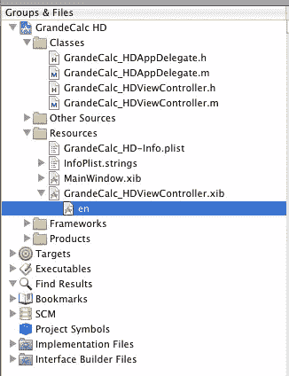
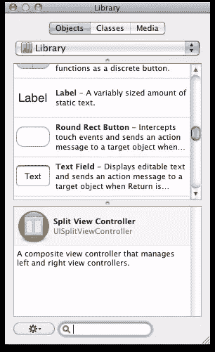
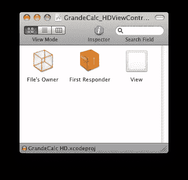
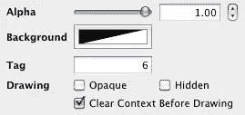
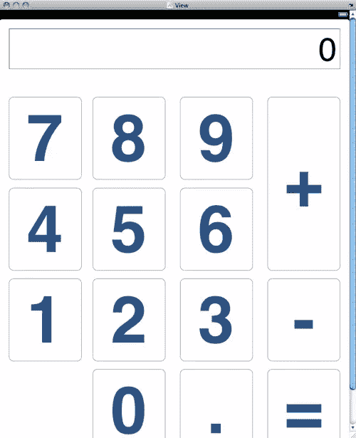
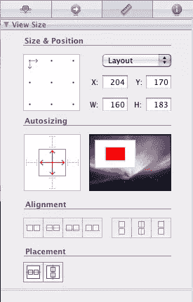
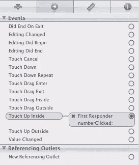
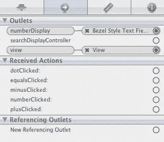

# 如何使用 Xcode 和界面构建器构建 iPad 应用程序

> 原文：<https://www.sitepoint.com/how-to-build-ipad-apps-with-xcode-and-interface-builder/>

几周前，安迪·怀特[带我们快速参观了 Xcode](https://www.sitepoint.com/article/kicking-off-iphone-development/) ，并带领我们完成了一个简单的 iPhone“Hello，World”应用程序的开发。

在本教程中，我们将基于这些知识，向您介绍界面构建器，这是 Xcode 的一个伴侣，旨在让您快速轻松地为您的应用程序开发界面。在这个过程中，我们将为 iPad 开发一个简单的应用程序:一个我们称之为 GrandeCalc HD 的大计算器。

## 创建项目

创建项目从启动 XCode 开始，并使用文件菜单创建一个新项目。

对于这个应用程序，我们想要创建一个基于视图的应用程序。确保选择 iPad，因为默认设备系列是 iPhone。不要担心，您的项目将创建与这两种设备兼容的代码——这一选择只是意味着您将使用 iPad 布局作为界面构建器的默认布局。

项目向导的下一部分要求您命名项目。我把我的命名为 GrandeCalc HD，命名空间为 com.jherrington.calculatorhd，你可以随便叫你的。

创建项目时，您会看到类似这样的内容:


这向您展示了驱动应用程序的两个主要 Objective-C 类。一个 Objective-C 类有两个组件，第一个是类的接口定义(包括成员变量、属性和公共方法之类的东西)；这在`.h`头文件中。另一个是`.m`文件中类的实现。

两个类中的第一个是应用程序委托。这个类处理以应用程序为中心的事件，比如启动、关闭等等。我们根本不会去碰那门课。另一个是视图控制器。这个类挂接到视图中的界面元素，并对用户点击它们做出响应。我们将在那里添加一些 Objective-C 代码。

现在我们已经有了应用程序的代码框架，是时候构建一个接口了。首先查看项目的资源部分，如下所示。



视图的显示区域在`.xib`文件中定义。这是一个界面构建器文件，它具有本地化(在本例中，只有英语)版本的界面。该文件包括所有的控件、它们的布局和大小、它们的文本、标签、到相应 Objective-C 类的连接等等。

我们通过双击该文件开始编辑它。

## 构建界面

双击`.xib`文件将打开界面构建器。到了那里，你会看到三个窗口。一个是包含视图内容的大窗口；第二个较小的窗口包含用户界面元素的工具箱，如下所示。



这就是我们要为计算器抓取文本显示和按钮的地方。

第三个窗口显示了这里看到的`.xib`文件的内容。



当我们将按钮和标签链接到完成所有工作的 Objective-C 类时，这个窗口将变得非常重要。在这种情况下，第一个 Responder 对象实际上表示将处理所有事件的 Objective-C 类。

下一步是将一些按钮和一个 UITextField 拖放到视图上，然后开始编辑它们。你可以随心所欲地设计按钮的布局和样式；唯一的关键点是将每个数字按钮的标记值设置为按钮的数值。这样，我们将能够使用代码中的标签值作为相关的数值，为每个按钮使用相同的事件处理程序。以下是如何设置数字 6 按钮的标记值，例如:



我想到的布局是这样的:



如果你的看起来有点不同，不要担心。只要所有相关的按钮和标签都到位，我们就能把它连接起来，做成一个功能计算器。

在我们继续开发我们的应用程序逻辑之前，还有最后一步需要注意:我们希望确保我们的界面能够优雅地处理设备方向的变化(从纵向到横向，反之亦然)。您可以通过从“文件”菜单中选择“模拟界面”来模拟应用程序界面的外观。模拟器启动后，尝试使用 Cmd-left 或 Cmd-right 左右旋转模拟的 iPad。哎呦！我们的界面目前不能很好地处理风景模式。让我们看看我们能做些什么。布局中的每个元素都有一组选项，这些选项决定了它将如何响应设备方向的变化。选择一个按钮，然后选择“属性”窗口顶部的标尺图标。您希望调整您的设置，如下所示:



重要的部分是自动调整大小。这定义了元素在界面重新布局期间如何改变形状和位置。沿着框边缘的线条定义了元素的位置相对于屏幕的每个边缘是固定的还是浮动的。框内部的控件决定了元素在重新布局时是改变高度还是宽度。对于按钮和文本显示，指定它们是浮动的，并且它们改变宽度和高度。为此，请确保框内的两个箭头都是实心红色，框外的线是虚线。一旦完成，再次测试界面:它在纵向和横向模式下看起来都很好。

UI 布局完成后，是时候回到 Xcode 来处理 Objective-C 了。

## 逻辑

Objective-C 视图类有两个关键元素；`IBAction` s 和`IBOutlet`s .`IBAction`是一种响应事件(例如，按钮触摸)的方法。一个`IBOutlet`是类用来连接用户界面元素(比如计算器中的数字标签)的属性。如果你想监听事件，你需要添加`IBAction` s。如果你想改变界面的状态，或者读取它的当前状态，你需要`IBOutlet` s

因为`IBAction` s 和`IBOutlet` s 是公共的，所以它们进入头文件。计算器视图的头文件如下所示:

```
#import 

@interface GrandeCalc_HDViewController : UIViewController {
	IBOutlet UITextField* numberDisplay;
	float heldValue;
	int lastOpDirection;
}

@property (nonatomic, retain) UITextField* numberDisplay;

-(IBAction)numberClicked:(id)sender;
-(IBAction)dotClicked:(id)sender;
-(IBAction)plusClicked:(id)sender;
-(IBAction)minusClicked:(id)sender;
-(IBAction)equalsClicked:(id)sender;

@end 
```

唯一的出口是`numberDisplay`字段，它连接到视图中的数字显示。然后有五个动作；它们分别对应于按下的数字，以及按下的点、加号、减号和等号按钮。在每种情况下，都会传递一个`sender`对象。这个`sender`是生成事件的 UI 元素。例如，这可能是按下的数字按钮。

由于所有的数字按钮都指向同一个事件处理程序，我们将使用这些按钮的标记值来区分它们的数值。在点、加、减和等于的情况下，我们将忽略`sender`，因为我们将只把它与单个 UI 元素挂钩。

如果您是 Objective-C 的新手，您应该注意到成员变量(如`numberDisplay`、`heldValue`和`lastOpDirection`)是在`@interface`块中定义的。之后定义属性和方法。在这个例子中，有一个属性，`numberDisplay`，和五个公共方法。接口将使用`numberDisplay`属性来设置和获取指向 UI 中数字显示元素的对象指针。

保存在`.m`文件中的视图的实现如下所示:

```
#import "GrandeCalc_HDViewController.h"

@implementation GrandeCalc_HDViewController

@synthesize numberDisplay;

- (BOOL)shouldAutorotateToInterfaceOrientation:
  (UIInterfaceOrientation)interfaceOrientation {
    return YES;
}

- (void)didReceiveMemoryWarning {
    [super didReceiveMemoryWarning];
}

- (void)dealloc {
    [super dealloc];
}

-(IBAction)numberClicked:(id)sender {
	UIButton *buttonPressed = (UIButton *)sender;
	int val = buttonPressed.tag;
	if ( [numberDisplay.text compare:@"0"] == 0 ) {
		numberDisplay.text = [NSString
         stringWithFormat:@"%d", val ];
	} else {
		numberDisplay.text = [NSString
         stringWithFormat:@"%@%d", numberDisplay.text, val ];
	}
}

-(IBAction)dotClicked:(id)sender {
	numberDisplay.text = [NSString stringWithFormat:@"%@.", numberDisplay.text ];
}

-(IBAction)plusClicked:(id)sender {
	float curValue = [numberDisplay.text floatValue];
	numberDisplay.text = [NSString stringWithString:@"0" ];
	heldValue = curValue;
	lastOpDirection = 1;
}

-(IBAction)minusClicked:(id)sender {
	float curValue = [numberDisplay.text floatValue];
	numberDisplay.text = [NSString stringWithString:@"0" ];
	heldValue = curValue;
	lastOpDirection = -1;
}

-(IBAction)equalsClicked:(id)sender {
	float newValue = heldValue +
       ( [numberDisplay.text floatValue] * lastOpDirection );
	numberDisplay.text = [NSString
        stringWithFormat:@"%g", newValue ];
	heldValue = 0.0f;
	lastOpDirection = 0;
}

@end
```

同样，如果您是 Objective-C 的新手，所有这些都需要一些时间来适应，但是尽管语法有点奇怪，您应该能够看到一些 Java 和 C++熟悉的面向对象模式。

浏览代码，你会发现每个方法都以减号开始，然后有一个方法声明。减号意味着它是一个对象方法。加号表示一个类方法。该方法的语法与头文件中的语法完全相同，只是在这种情况下还有一个方法体。

在每个方法中，您都会找到实现该方法的 Objective-C 代码。在这些代码中，你会发现你可能熟悉的基本 C 操作；例如，算术运算符和变量的定义方式。真正独特的部分是 Objective-C 的面向对象调用语法。

让我们来看看:

```
[NSString stringWithString:@"0" ]
```

这意味着创建一个值为“0”的新字符串。`@`符号指定我们想要一个 Objective-C 字符串，而不是 C 字符串。在这种情况下，我们在`NSString`上调用一个类方法。

现在看看这个命令:

```
[NSString stringWithFormat:@"%@%d", numberDisplay.text, val ];
```

这大致相当于对`sprintf`的调用。在这种情况下，格式字符串采用数字显示的当前文本值，并附加被按下的数字的值。所有这些括号起初都令人困惑，但是一旦你熟悉了它们，它们就会开始变得有意义。

现在有了代码和设置好的界面，是时候使用 Interface Builder 将两者连接起来了。在此之前，您需要在 Xcode 中点击 **Build 并运行**来构建您的项目；这将确保 Interface Builder 拥有所有可用的输入和输出，因此您可以将它们与您的接口组件连接起来。

## 将接口连接到代码

Interface Builder 寻找 Objective-C 视图类的`IBOutlet`和`IBAction`元素，并为我们提供了一个将控件连接到它们的接口。要链接按钮，首先选择该按钮，然后转到“检查器”窗口的“连接”面板(用带箭头的蓝色圆圈表示)。



从这里，您可以看到与按钮相关的所有事件。你可以点击任何一个圆圈，并把它拖到内容窗口中的**文件的所有者**项。对于我们的按钮，我们将使用“Touch Up Inside”事件。当您将事件放在**文件的所有者**上时，您会看到一个弹出窗口，显示所有可用的`IBAction`方法。只需选择合适的按钮:`numberClicked`表示数字按钮，`plusClicked`表示加号，以此类推。用同样的方法把所有的按钮连接起来。

最后一步是将`numberDisplay`变量连接到数字显示 UI 元素。首先进入内容窗口，选择**文件的所有者**。这应该会在检查器窗口中显示如下图所示的内容。



然后，您可以将`numberDisplay`的连接器拖到布局区域的用户界面元素上，将两者连接起来。

此时，您可以保存界面并关闭界面构建器。然后尝试从 Xcode IDE 运行您的应用程序。它应该或多或少地像你期望的计算器那样工作。当然，我们的应用逻辑非常简单；有很多方法可以改进应用程序的行为。

如果计算器无法工作，问题可能出在您定义的用户界面(即。xib 文件)和 Objective-C 文件。按照上一篇文章中的[说明，向 Objective-C 类的 click 方法添加断点，并查看这些方法是否被调用。如果没有，返回到接口构建器，确保将正确的事件连接到 Objective-C 类中的`IBAction`方法。](https://www.sitepoint.com/article/kicking-off-iphone-development/)

## 从这里去哪里

这只是学习 Objective-C 和 iOS 设备开发的冰山一角。在本文中，我们学习了如何构建一个项目，构建一个用户界面，并将其连接到后端 Objective-C 类，让它做一些事情。如果您想到的应用程序使用网络，那么有一个健壮的 HTTP 库可供您使用。如果你的理想应用本质上更图形化，有一个惊人的石英图形和效果库等着你去享受。

请随意使用本文中的代码作为起点。如果你想出了很棒的东西，一定要让我知道，我会在 App Store 上买(假设你保持相对便宜！).

## 分享这篇文章