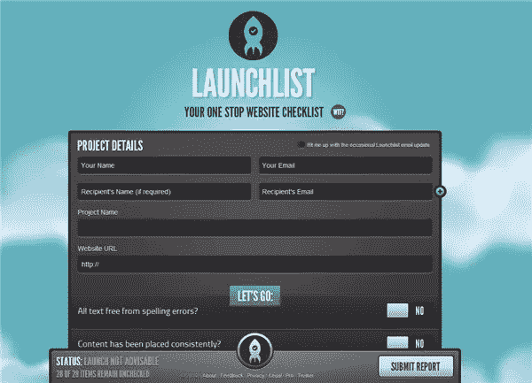
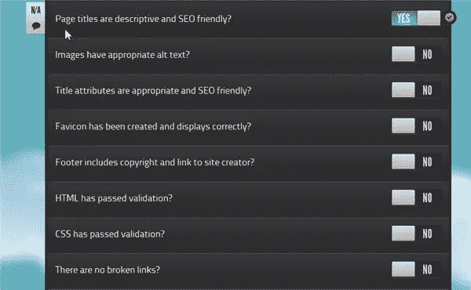

# 准备启动…启动列表

> 原文：<https://www.sitepoint.com/prepare-to-launch-with-launchlist/>

Launchlist 是一款面向网页设计者和开发者的免费应用，旨在当你的网站发布日期临近时助你一臂之力。从本质上来说，这个应用程序是一个问题清单，在启动一个新网站之前应该回答这些问题。该应用程序创建了一个报告，您可以在向世界发布您美丽的新作品之前将其用作检查点。

要使用该应用程序，您需要输入您的姓名、电子邮件、项目详细信息和网站 URL。如果你在测试其他人的网站，你可以添加收件人的姓名和电子邮件，他们也会收到使用该应用程序创建的报告。然后，用户回答发布前的问题，回答是或否。如果问题不相关，您可以将其标记为“不适用”,该问题将被忽略。清单上有近 30 个问题，如果你愿意，你可以在底部添加你自己的自定义字段。

有些问题与设计有关，但也包括对可访问性和 SEO 焦点的检查。示例问题包括:

*   所有文本都没有拼写错误？
*   内容一直在放？
*   页面和内容格式已经过测试？
*   打印样式表存在并经过测试？
*   元数据已经包括在内，是否合适？

完成后，提交表格，您和您的收件人将收到一份清单报告，其中包含您的记录摘要。

做这个需要 app 吗？不完全是。你可以很容易地在纸上或 word 文档中创建自己的列表。但是，您可能会发现这个应用程序很有用，因为它已经为您构建好了，并且在流程结束时会创建一个报告。

Launchlist 目前对[免费](http://lite.launchlist.net/)可用，但你可以注册，以便在 [Pro 版](http://launchlist.net/)推出附加功能时得到通知。

你用过 Launchlist 吗？你觉得它有帮助吗？你是否有自己的清单，在创建网站之前浏览一遍？

## 分享这篇文章