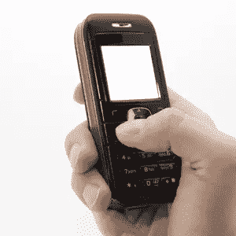

# 您(和您的客户)需要移动战略的 15 个理由

> 原文：<https://www.sitepoint.com/why-you-need-mobile-strategy/>

智能手机、移动设备和移动网络用户的数量正在快速增长。你可以忽略这种人口统计，希望你的在线业务足以弥补自身的差距，或者用数据支撑自己，并开始为你的业务制定移动战略。

让我们不要忘记你为其开发网站和应用程序的客户，或者那些你在他们开发营销活动时提供咨询的客户。如果你没有提到移动可访问性的影响，也没有就他们如何最大化他们的移动存在提出建议，你可能会错过一大块拼图。

有效的移动战略也不仅仅是创建一个手机友好型网站。您需要将移动计划集成到整体业务战略中，构建分析工具和指标，并随着技术的变化继续监控和修改战略。

听起来很难接受？是的，但是在你放弃这个想法之前，看看这些统计数据。

## 为什么选择移动战略？

这 15 个数据足以让你考虑创建一个移动策略，或者向你的客户推荐一个。

1.  据估计，美国有 8200 万手机网络用户。 *( [千禧传媒](http://www.mediapost.com/publications/?fa=Articles.showArticle&art_aid=138523&nid=120293) )*
2.  83%的美国成年人拥有手机或智能手机。 *( [皮尤互联网](http://www.pewinternet.org/Reports/2010/Internet-broadband-and-cell-phone-statistics/Report.aspx) )*
3.  35%的美国成年人使用手机上网。 *( [皮尤互联网](http://www.pewinternet.org/Reports/2010/Internet-broadband-and-cell-phone-statistics/Report.aspx) )*
4.  预计 2012 年智能手机出货量将达到 4.5 亿部，超过笔记本电脑和台式电脑的总和。 *( [Brandanywhere 和 Luth Research](http://www.mediapost.com/publications/?fa=Articles.showArticle&art_aid=139639) )*
5.  二分之一的消费者会优先选择有移动网站的品牌。 *( [Brandanywhere 和 Luth Research](http://www.mediapost.com/publications/?fa=Articles.showArticle&art_aid=139614) )*
6.  40%的美国女性拥有智能手机。 *( [comScore](http://www.mediapost.com/publications/?fa=Articles.showArticle&art_aid=138523&nid=120293) )*
7.  2010 年，32%的美国妈妈拥有智能手机。 *( [comScore](http://www.mediapost.com/publications/?fa=Articles.showArticle&art_aid=138523&nid=120293) )*
8.  1/3 的美国女性每周至少使用一次手机网络。*([comScore](http://www.mediapost.com/publications/?fa=Articles.showArticle&art_aid=138523&nid=120293))T3)*
9.  只有 4.8%的美国零售商拥有手机专用网站。 *( [Brandanywhere 和 Luth Research](http://www.mediapost.com/publications/?fa=Articles.showArticle&art_aid=139614) )*
10.  到 2015 年，全球移动广告收入将上升至约 241 亿美元。 *( [信息电信&媒体](http://www.bloomberg.com/news/2010-11-23/mobile-advertising-sales-to-grow-tenfold-by-2015-informa-says.html) )*
11.  1230 万美国移动用户点击了移动广告，然后购买了该商品。 *( [移动护卫](http://www.mediapost.com/publications/?fa=Articles.showArticle&art_aid=139895)的光速研究)*
12.  2011 年，美国移动广告支出将达到 10 亿美元。 *( [eMarketer](http://www.mediapost.com/publications/index.cfm?fa=Articles.showArticle&art_aid=137962) )*
13.  80%的美国手机用户目前正在使用或将在 24 个月内使用手机短信优惠券。 *( [IHL 集团](http://www.mediapost.com/publications/index.cfm?fa=Articles.showArticle&art_aid=139503&passFuseAction=PublicationsSearch.showSearchReslts&art_searched=&page_number=4) )*
14.  94%的手机用户将短信作为他们手机计划的一部分。 *( [IHL 集团](http://www.mediapost.com/publications/index.cfm?fa=Articles.showArticle&art_aid=139503&passFuseAction=PublicationsSearch.showSearchReslts&art_searched=&page_number=4) )*
15.  85%的美国零售商支持 iPhone/iPod 平台，88%的零售商计划这样做。 *( [IHL 集团](http://www.mediapost.com/publications/index.cfm?fa=Articles.showArticle&art_aid=139503&passFuseAction=PublicationsSearch.showSearchReslts&art_searched=&page_number=4) )*

## 准备好开始了吗？

在您开始规划和制定移动战略时，以下几篇文章值得一读:

*   [您的移动营销计划分为四个简单步骤](http://adage.com/digitalnext/article?article_id=145881)
*   [制定制胜移动战略的 10 个技巧](http://www.clickz.com/clickz/column/1721831/tips-creating-winning-mobile-strategy)
*   [您的移动战略有多成熟？](http://blogs.forrester.com/thomas_husson/10-10-19-how_mature_is_your_mobile_strategy)
*   [优化移动电子邮件营销的 5 个技巧](http://blog.blueskyfactory.com/best-practice/5-tips-for-mobile-email-marketing/)
*   [7 个让你的网站移动友好的技巧](https://www.sitepoint.com/7-tips-to-make-your-web-site-mobile-friendly/)

*图片来源:[sqback](http://www.sxc.hu/profile/sqback)*

## 分享这篇文章