# Adobe Business Catalyst 简介—第 3 部分

> 原文：<https://www.sitepoint.com/introduction-to-adobe-business-catalyst-part-3/>

**将用户生成的内容添加到 Adobe Business Catalyst:服装市场**

在本系列的前几篇文章中，我们使用 Adobe Business Catalyst 创建了一个具有内容管理功能、集成在线商店和动态功能的电子商务网站，而无需编写任何自定义代码。在这一期中，我们将进一步扩展站点，构建一个定制的 web 应用程序来支持在线市场。最后，用我们的[小测验](https://www.sitepoint.com/quiz/adobebusinesscatalyst/business-catalyst-part-3)来测试一下自己。

在这种情况下，我们的客户，舞蹈学校，想要创建一个在线市场，人们可以列出并出售他们的服装。我将使用这个项目作为用户生成内容功能的一个例子，您可以通过一点规划将它添加到您的客户的站点，但是不需要后端数据库开发。

附加阅读包括:

*   [Adobe Business Catalyst 简介-第 1 部分](https://www.sitepoint.com/intro-business-catalyst/)
*   [Adobe Business Catalyst 简介–第 2 部分](https://www.sitepoint.com/business-catalyst-part-2/)
*   [Adobe Business Catalyst 简介–第 3 部分](https://www.sitepoint.com/introduction-to-adobe-business-catalyst-part-3/)
*   [如何使用 Adobe Business Catalyst 建立在线商店](https://www.sitepoint.com/how-to-set-up-an-online-store-with-adobe-business-catalyst/)

**规划您的网络应用**

执行应用程序将会很容易，但是我想强调我在文章中提到的另一个主题:规划。花些时间想想你和你的客户想要实现什么，以及你认为它应该如何适应现有的网站，这将意味着一个令人满意的项目和一个令人沮丧的项目之间的区别。

首先，让我们简单地阐明我们想要做什么:我们希望允许人们上传他们希望出售的服装信息。这样的信息会被其他使用舞蹈学校网站的人搜索或浏览。本质上，我们在谈论一些*用户故事*。用户故事是一个小故事，它描述了你想添加到应用程序中的一个独立的功能。记住，即使你不需要写任何后端代码，你仍然在设计一个应用程序。对于我们的网站，我们可以与我们的客户讨论几个将为他们的网站添加功能的场景:

*   创建服装列表
*   浏览服装列表
*   搜索服装列表

这个想法是为了获得更多的细节，我们希望这是如何在网站上工作。虽然我们不会为本文中的每个场景编写一个用户故事，但我们将为第一个场景编写一个:创建一个服装清单。

简的女儿莫莉已经穿不下她的比赛服了，需要一件新的。现在的裙子状况很好，简想卖掉它来支付新裙子的部分费用。简知道她的舞蹈学校的许多家庭使用学校的网站来了解课程信息，并购买鞋子、音乐和他们需要的其他物品。简想列出有关莫莉待售服装的信息。这些信息应该包括尺寸，条件，价格，如何联系简，以及礼服的图片。

在实践中，您可以写一些不同的用户故事来捕捉细微的变化，但是这篇文章为我们提供了一些很好的开始细节。此外，它很容易发送给你的客户，以便他们可以审查它并提供反馈，你们两人可以用同样的方式开始思考新功能。

Business Catalyst 中的 **web 应用**是围绕一个共同主题组织的信息片段的集合。在这个例子中，主题是一件衣服，信息是描述这件衣服的一组细节。

这些详细信息是我们将在 web 应用程序中设置为字段的数据元素。每个 web 应用程序都会自动有一个名称和描述，但是您应该列出需要创建的其他字段，例如:

*   价格
*   舞者的年龄
*   衣服的年代
*   衡量
*   卖家的姓名、电话、电邮地址

现在我们有了一个为每件衣服收集和显示的字段列表，所以我们就快到了。我们也想让顾客上传他们的服装图片。在传统的应用程序中，管理文件上传功能可能很棘手，但在 Adobe Business Catalyst 中，这很容易。

在我们开始之前，让我们转到**文件管理器**并创建我们想要用于与应用程序相关的页面的内容。

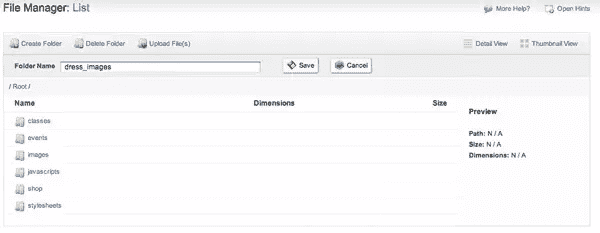

我们将为将要上传的图片创建一个目录，并为与应用程序本身相关的文件创建一个目录。

**创建网络应用**

一个网络应用程序是一个模块，所以进入**模块>网络应用程序**，点击**建立一个新的网络应用程序**。您需要提供三部分信息:Web 应用程序详细信息、客户选项和客户能否创建 Web 应用程序？和客户选项。Adobe Business Catalyst 为您提供了许多功能，让您可以轻松创建应用程序。

该过程在向导中被分解为四个步骤: **Web 应用详细信息**(您所在的页面)**添加定制字段**、**定制 Web 应用布局**，以及**设置自动响应器**。

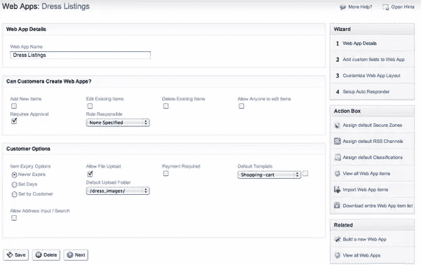

在 **Web 应用详细信息**中，您将命名应用。在我的例子中，我正在制作服装列表，所以我将其命名为**服装列表**。总是尽量使用有意义的名字，避免过于专业；这是一个商业应用程序，我们希望使用与业务相关的名称。

为了完成接下来的两个部分，让我们回想一下我们的用户故事。Jane 想自己创建一个列表，那么顾客能创建网络应用吗？是**是的**。勾选**框，添加新项目**。

我们希望列表立即显示，所以我们取消了**需要批准**——这将为我们提供一个简单的应用程序，让客户创建一个在提交时自动显示的列表。虽然我们将在本文稍后为该应用程序添加身份验证，但我们不会使用系统管理角色，因此将负责的**角色保留为**无指定**。**

在**客户选项**部分，您可以管理内容到期、文件上传和电子商务选项。询问你的客户这是否是他们想要收费的服务。在我们的例子中，列出一件衣服是免费的，但是把这个数据想象成一个分类广告部分，并且考虑一个网络应用可能为你的客户带来的收入机会。

接下来，点击**允许文件上传**复选框，然后选择您之前创建的包含上传图像的目录。最后，我将使用我们在本系列的第一篇文章中制作的现有的**购物车模板**。设置完成后，让我们点击**下一步**，继续添加字段。

**自定义字段**

这是您构建 web 应用程序核心的屏幕。为列表中的每个数据元素添加一个字段。键入字段名称后，选择字段类型并确定它是可选的还是必需的。要将字段添加到您的应用程序，请点击**保存字段**。随着时间的推移，可以添加或删除应用程序中的字段，但在进行修改后，您必须更新基于 web 应用程序的页面。

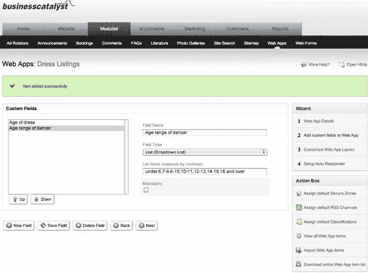

字段类型在创建应用程序时非常灵活；您可以有字符串的文本输入，如姓名、较长文本块的文本框、选项列表、日期/时间数据类型和图像数据类型。您甚至可以将已经创建的数据源作为一种数据类型，这是非常强大的。

创建完您的字段集后，单击 Next，您可以定制为 web 应用程序生成的模板的外观。每个 web 应用程序都为每个交互提供了三个模板:列表、细节和编辑。 **List** 是根据应用程序中的数据浏览或搜索每个项目时返回的数据。**细节**是单个项目页面的外观。**编辑**是编辑物品清单数据的数据录入表单。对于大多数应用程序来说，**列表**和**细节**是你想要使用的第一个模板。

在我们开始定制之前，让我们做一些测试数据，以便我们可以看到我们在做什么。点击右侧导航栏上的**查看网络应用项目**。你会看到你还没有任何项目。点击**创建新的 Web 应用项目**。

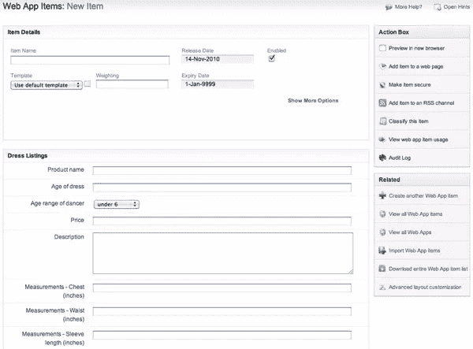

在表单中输入一些数据并提交。如果您愿意，可以为一些测试数据添加一些项目——您可以在上线之前删除它们。

**定制您的模板**

让我们返回来定制我们已经创建的 web 应用程序的外观。将鼠标悬停在上面菜单中的网络应用链接上，然后点击**管理网络应用**。点击 web 应用名称返回到您的应用，点击**定制 Web 应用布局**返回到**列表**模板。默认情况下，您的列表将显示您的项目中的两个数据元素: *{tag_counter}、*计算列出的项目数，以及 *{tag_name}、*使用 name 字段中的文本生成到详细页面的链接。

注意:返回到本系列的第 1 部分以了解有关 Adobe Business Catalyst 自定义标签的更多信息。

我想在清单中添加一些数据元素，以预测客户想要选择什么。使用**标签插入**下拉菜单，我可以找到与我之前添加的所有字段相对应的标签。我将使用物品的名称、舞者的年龄和价格，因为这些是用于过滤物品的最基本的字段。我将添加一点文本来标记将要显示的数据，以代替标签。

此外，您可以切换到 HTML 视图，对清单的外观和感觉进行更细粒度的控制。

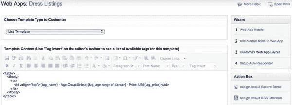

**向页面添加模块**

如果您还记得我们上一篇文章中的[，Adobe Business Catalyst 可以非常容易地为您创建的页面和模板添加动态功能。让我们为 web 应用程序创建一个列表页面，并开始我们的服装市场。](https://www.sitepoint.com/article/business-catalyst-part-2)

进入**网站>网页**，点击**创建新网页**。记下文件名和页面名，并确定使用哪个模板，以及文件应该位于哪个目录中。

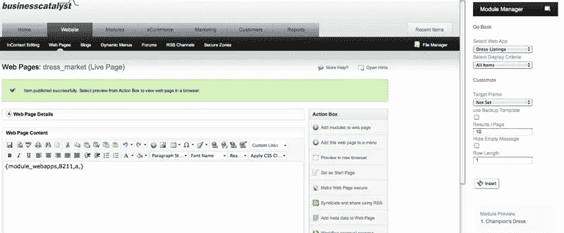

现在转到**动作框**并点击**添加模块到网页**按钮。将加载**模块**窗格，你可以向下滚动到网络应用。向下滚动到**显示网络应用项目列表**。点击链接，然后选择您想要添加的 web 应用列表。

从那里，您可以选择一个附加的过滤器或只列出所有项目。我们会在这一页列出所有项目。预览页面以查看您到目前为止创建的项目列表。现在，单击其中一个链接，您将进入项目详情页面。

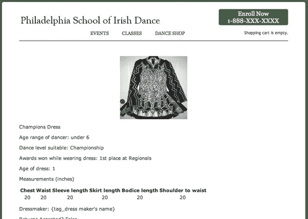

这是“开箱即用”的页面——在我添加一些自己的 HTML 和 CSS 来清理布局之前。

让我们总结一下我们迄今为止所做的工作:

*   Web 应用程序已创建并包含测试数据
*   列表页面已创建，Web 应用程序模块已添加到页面中
*   详细信息页面正在工作

如你所知，现在有很多调整要做——你必须设计你想要的每个页面的外观，然后你需要编写 CSS 来执行设计(或者使用一些已经可用的预建样式)。

此外，你会想从你的主导航添加一些链接，这将意味着在这个特殊的设计编辑一些模板。我现在不打算在这上面花太多时间，因为我们已经介绍了如何使用 Adobe Business Catalyst 对外观进行非常精细的控制。如果您需要复习本系列前面所涉及的任何主题，请点击这些链接查看[第 1 部分](https://www.sitepoint.com/article/intro-business-catalyst)或[第 2 部分](https://www.sitepoint.com/article/business-catalyst-part-2)。

回到我们最初的用户故事，我们已经为 Jane 创建了列出她女儿衣服的底层功能。然而，该网站并没有我们需要的所有功能，让客户开始上传物品。

**创建提交页面**

让我们创建一个新页面，并将其命名为**服装市场提交**。我们还要确保点击了**启用**按钮；这将确保我们添加到页面的功能正常工作。让我们添加提交模块，这样我们就建立了面向客户的数据输入页面。

转到**动作框**，点击**添加模块到页面**链接；然后向下滚动模块列表，点击**网络应用**链接。点击**客户的 Web Apps 输入表单**。选择要为其创建提交页面的 web 应用程序，然后单击插入。

如果您愿意，您可以预览页面，对其进行一些调整，并生成更多的测试数据。

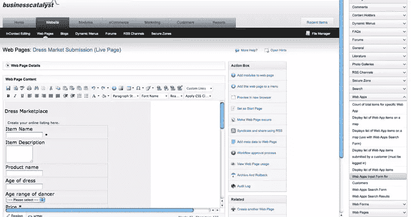

**获取提交表单**

像这样的网络应用对你的客户来说是一个收集客户信息的好机会。通过向公众开放列表，网站的流量增加了；对于在网上市场上出售服装的人和学校来说，这都是有价值的。

但是客户生成网站内容的能力应该以某种方式加以限制。大多数网站强制要求人们创建一个账户并登录后才能在网站上发布材料——我们现在将把这一功能添加到我们的网站中。

**创建安全区域**

在 Adobe Business Catalyst 中，有许多级别的用户角色。有像你和你的客户一样的系统用户(我们在[第 2 部分](https://www.sitepoint.com/article/business-catalyst-part-2)中探讨了如何限制不同的用户角色权限)。您登录到主管理部分，并使用 Business Catalyst 界面来管理、修改、增强和更新站点。

您的客户将获得驻留在客户网站的外观和感觉中的工具。从 Adobe Business Catalyst 术语来看，他们将更像是网站的“订户”,尽管他们拥有我们授予他们的权限。在这种情况下，它将是访问特定页面的权限，如**提交**页面。

要求一个人登录到你的站点来完成某些任务——称为*认证*——需要我们做更多的规划。我们需要确定网站中的哪些页面需要客户登录，并定义创建帐户所需的信息。然后，我们必须创建一个注册页面和登录部分，然后将整个用户体验编织在一起。花些时间计划一下创建帐户需要收集的信息:

*   用户名
*   密码
*   西方人名的第一个字
*   姓
*   标题
*   住宅电话
*   电子邮件地址

这在几分钟后会很重要。但是，首先让我们评估一下设置身份验证要做的所有事情:

*   创建区域
*   将提交页面添加到安全区域
*   创建注册 web 表单
*   将注册表单添加到页面
*   将登录名添加到注册页面
*   电子邮件确认消息

这可能看起来很多，但 Adobe Business Catalyst 中的工具可以在几分钟内轻松地为您的站点添加安全性，无需编码。

**创建安全区域**

转到**网站>安全区域**并创建一个新区域。在第一步中，您将命名区域并选择成功登录后要登录的页面。我将为服装市场创建一个，并选择**提交**页面作为登录页面。

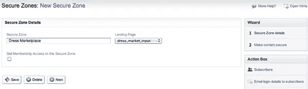

接下来你必须将**提交页面**添加到**安全区域**。在下拉列表中选择**网页**；在左侧的资产列表中选择**提交**页面，并单击单个右箭头将其移动到右侧。

这类似于我们在第 2 部分中为用户创建权限的方式。您可以保护的不仅仅是页面；您可以保护其他类型的内容，如博客和论坛。

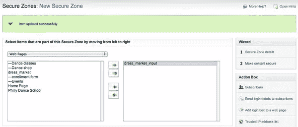

此时，只有登录的客户才能进入**提交**页面。如果您尝试导航到那里，您将被阻止并提示登录。

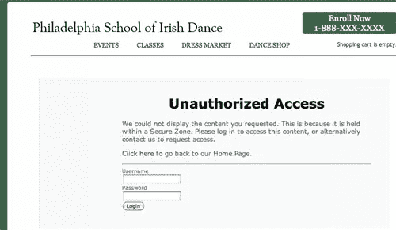

糟糕，您没有此区域的帐户！好了，让我们制作注册和登录页面，这样我们就可以进入**提交**页面。

**创建注册和登录页面**

首先，让我们在**模块> Web 表单**中创建注册表单。让我们使用新的 web form builder 来创建表单——它有一个非常直观的界面来向表单添加字段。首先命名表单，并使用**安全区域**下拉菜单将表单链接到该区域。在这个例子中，我们不打算添加工作流，所以保持在**不要使用工作流**。

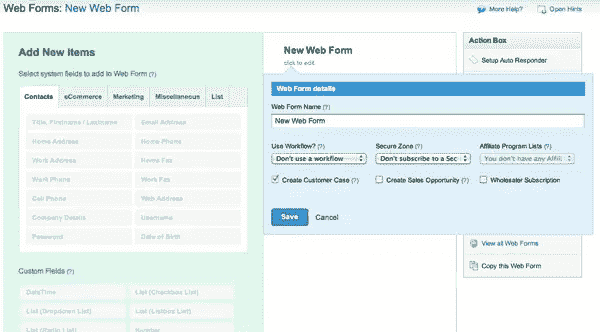

在计划过程的早期，您已经确定了注册表单中要使用的字段，所以让我们在**表单构建器**中找到它们。我们需要的一切都在**联系人**选项卡中，但是如果我们愿意，我们可以添加自定义字段，甚至验证码图片验证到注册方案中。

当您从左侧添加字段时，它们会显示在右侧列中。您可以预览表单，甚至可以从这里将其添加到网页中。

我们需要为我们的注册表单创建一个页面。创建页面，从**添加模块**工具添加注册表单，或者返回到 **Web 表单**部分，通过一次点击插入来添加表单。

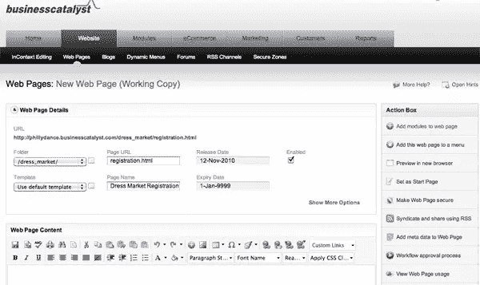

**保存并发布您的新注册页面**

要访问安全内容，第一次通过的用户需要创建一个新帐户，但之后，他们只需登录就可以了。

现在我们需要向页面添加一个登录表单。从**网页**部分打开页面，点击**添加模块**，选择**安全区**部分。选择**安全区域**登录表单，从下拉列表中选择您的区域，并将其插入页面。

和以前一样，您可以根据需要设计表单的外观，使其看起来整洁并与您的设计很好地集成。准备好后，保存并发布页面。稍微清理一下 HTML 和 CSS 之后，你就有了一个可以工作的注册页面。

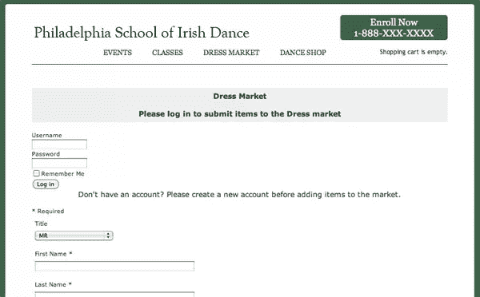

为了使它更加完美，让我们为登录用户添加一些更动态的内容。打开**提交**页面，进入模块管理器，点击**安全区**。

有许多预构建的工具可以预测您想要添加到经过身份验证的用户体验中的项目。我将添加一行“[name]已登录。单击此处注销。

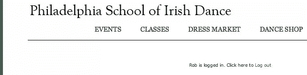

这实际上是两个模块的组合:**客户名字**和**链接以退出安全区域**。试用这些工具，为您的用户创造更丰富的体验。

**连接圆点**

好了，你有注册/登录页面，你的**提交**页面仅限于登录的客户。我们如何到达那里？我添加了一个来自**列表**页面的链接来驱动客户创建账户。

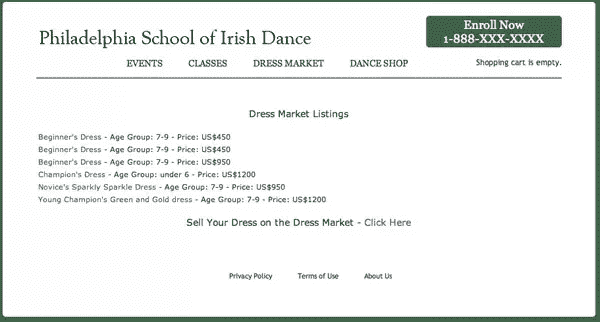

**添加搜索**

这包括浏览列表的能力，但随着市场内容的增加，人们可能希望通过搜索来过滤他们收到的结果。Adobe Business Catalyst 具有预构建的模块，允许您搜索在您的站点上生成的 web 应用程序数据。

进入**网站>** **网页**，打开你的物品页面。添加一些 HTML，用一个`<div>`将搜索部分和浏览部分分开；对于每一个(我们稍后会添加一些 jQuery)。使用**模块管理器**将**网络应用搜索表单**插入到您创建的新`div`中。从下拉框中选择**服装列表**并插入模块。

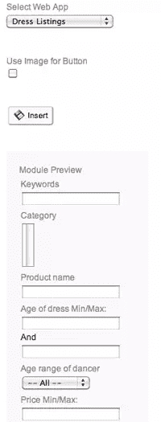

最初，搜索表单将为您提供所有要过滤的字段。

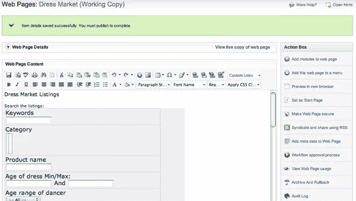

您可以自定义字段、HTML 和 CSS 的数量，以满足您的需求。

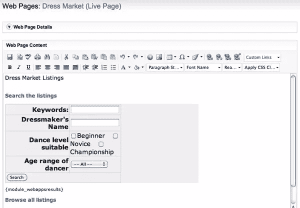

现在您已经实现了一个简单的搜索表单，但是页面有点笨拙，必须上下滚动才能浏览和搜索。让我们添加一点 jQuery 来折叠 div，并使用一个效果来打开和关闭显示或隐藏搜索或浏览功能的 div。

**添加一些 jQuery**

创造一个令人满意和直观的用户体验将鼓励你的客户浏览网站，使用你花时间实现的功能。jQuery 是一个强大的 JavaScript 框架，易于实现，并为您提供了强大的工具来在您的站点上创建交互式体验。

虽然我们喜欢展示使用 Adobe Business Catalyst 添加功能而无需编码是多么容易，但这将我们带到另一个方向:展示如此强大的平台如何让您能够深入研究并添加您想要的库。

我们将在 JavaScript 和 HTML 中做一点轻量级编码来实现库，并在 jQuery UI 中使用手风琴效果；我想你会发现这是一个将 jQuery 添加到你的 Adobe Business Catalyst 站点的简单介绍。如果你是一个 jQuery 忍者，平台在许多模块和表单中公开了 JavaScript 处理程序。以便您可以轻松地使用 Ajax 和其他技术来创建丰富的交互式用户体验。

首先，通过链接到模板中的脚本，将 jQuery 库添加到应用程序中，这样就可以在整个站点中访问这些库。大多数浏览器会在第一次请求后缓存文件，所以不会增加下载时间，但是您需要进行调用，以便每个页面都使用脚本。

您可以将脚本上传到您的站点或从外部链接到它们。我会上传最新的 jQuery 和 jQuery UI 库:

```
<script src="/JavaScripts/jquery-1.4.2.min.js"></script> 

<script src="/JavaScripts/jquery-ui-1.8.6.custom.min.js"></script>
```

当客户点击标题**搜索**或**浏览**时，我将使用手风琴效果来关闭和打开 div。首先，我需要设置我的 HTML 来创建 headers 和 div 来包含我的模块。在下面的示例代码中，我截取了空间的搜索表单:

```
<div class="dress_market">

<div>

<h3><a href="#">Search the listings</a></h3>

<div id="search">

<!-- search form content removed for space -->

</div>

<a href="#">Browse all listings</a></h3>

<div id="browse">

{module_webapps,8211,a,}</div>

</div>

<!-- close accordion div -->

</div>

<!-- close dress_market div -->

</div>
```

我有一个包装 div，包含一个名为“dress_market”的类，我在整个 dress_market 中使用它来应用常见的 CSS 样式。在其中，我有一个 id =“accordion”的 div，它将包装搜索和浏览 div。标题包含带有锚标记的 hrefs，它将为我提供一个 click 事件来绑定 accordion 动作。

我的脚本将包含执行手风琴的 JavaScript:

```
<script>

$(function() {

$( "#accordion" ).accordion({

autoheight: false,

collapsible: true,

alwaysOpen: false

});

});

</script>
```

将该脚本放在页面底部，以便在页面加载后评估和执行 JavaScript。您还可以使用`document).ready(function();`方法来确保 jQuery 在页面完全加载后执行。

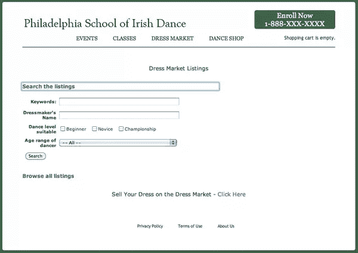

当您单击**浏览所有列表**链接时，accordion 会关闭顶部的 div，并在同一页面中打开浏览 div。

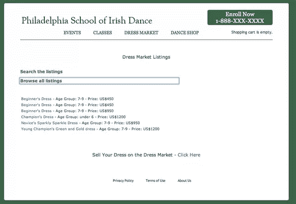

给你。如果您喜欢冒险，搜索表单会预加载一个标签，用于加载搜索结果*{ module _ web results }*。使用 jQuery 突出显示返回的搜索结果。

关于这个库的完整文档可以在 jQuery UI 上找到[。](http://jqueryui.com/demos/accordion/)

**电子邮件确认**

除了连接站点页面之外，您还需要自定义新注册用户收到的电子邮件，以及他们在 marketplace 中创建新项目后收到的邮件。**注册**电子邮件可以从**管理**菜单进行配置，选择**定制系统电子邮件**，然后选择**安全区域登录详情**。

您可以定制提交新项目后发送的电子邮件，方法是点击**管理 Web 应用**，选择您的新应用，然后点击**设置自动回复器**。我们不需要在这方面花费太多的细节——您可以自定义文本，并访问动态标签来为电子邮件添加更多数据。

现在让我们回顾一下:我们已经创建了一个应用程序、列表页面、详细信息页面和提交页面。我们将访问权限仅限于登录的客户，创建了一个注册/登录页面，定制了电子邮件消息，并通过适当的链接将所有内容编织在一起。今天还不错，嗯？所有这些都不需要创建自定义代码。既然你已经有了一个新的应用程序，不如去看看它产生的一些活动吧？

**用户活动报告**

请记住，拓展业务的主要方式之一是增加现有客户的互动和交易。建立营销来吸引新客户是至关重要的，但是一旦你得到了他们，用时事通讯、特别优惠和其他相关的交流来保持他们的兴趣。

Adobe Business Catalyst 提供了强大而直观的工具来挖掘您从 web 应用程序中收集的数据，因此您和您的客户可以发展他们的在线业务。除了您将在管理部分的仪表板中看到的活动数据之外，您还可以构建关于在线服装市场活动的自定义报告。

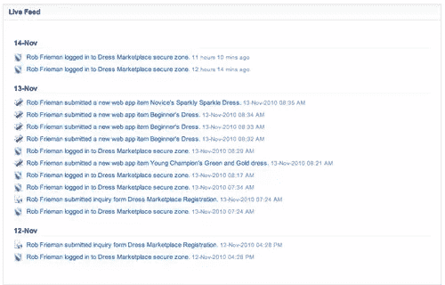

转到**报告**部分，点击**创建客户报告**。选择底部项目，为**客户和网络应用**构建报告；然后点击**下一个**。

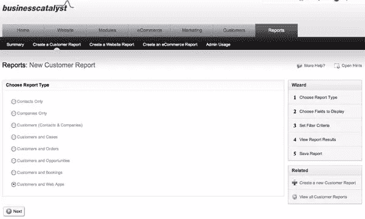

在报告中选择所需的字段。我根据我们制作的应用程序的类型选择了一些。

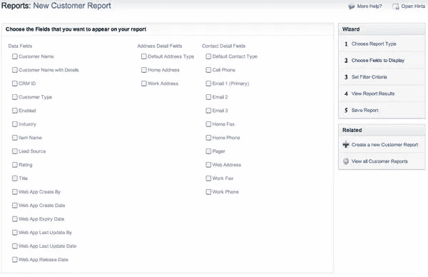

接下来，告诉它要过滤哪些数据。

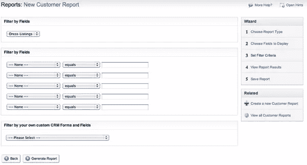

在底部名为**Filter by your own customer CRM Forms and Fields**的部分，在下拉列表中选择您的 web 应用。如果我们让**显示所有字段**处于选中状态，您将在第一个屏幕中看到一个根据标准过滤所有字段的报告。由于您的测试数据，这可能最终成为一行数据的交集。相反，不要选中它，然后点击**生成报告**。

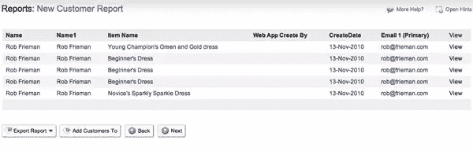

您应该会看到一个列表，其中列出了提交的所有项目、提交者和日期。现在，单击“下一步”以命名并保存报告。

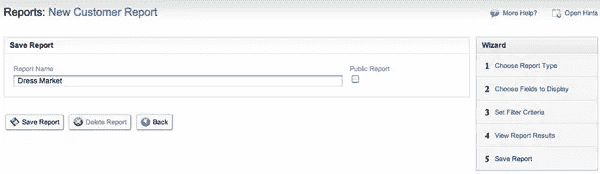

这份简单的活动报告是生成营销列表的第一步。想想交叉销售的机会！

现在你有了一个高度活跃的用户社区，他们在你的网站上创建账户，无需额外的营销就能到达。你可以在网上商店添加服装制作和相关产品，对报道进行细分，并向这些客户发送有针对性的广告。

你可以专门为这部分客户群制作时事通讯，增加网站其他部分的流量，从而发展你的业务。

**我们所取得成就的局限性**

值得注意的是，我们刚刚构建的内容以及您可以使用 Business Catalyst web 应用程序构建的内容存在一些限制。例如，我们将无法购买 web 应用程序项目。虽然商业催化剂网络应用程序非常强大，但重要的是你要做一些研究，找出什么是可能的，什么是不可能的。

**总结**

在本文中，我们探讨了 Adobe Business Catalyst 如何帮助您释放您的客户拥有的最强大的资产:客户。

用户生成的内容可以让网站从一个客户只希望接收信息的地方，变成一个他们用来交换信息的工具。Adobe Business Catalyst 精细控制的 web 应用程序管理功能使这种潜在的转变成为现实。

这种工具最好的一点是，随着越来越多的客户使用它并了解它，它会越来越大。用户生成的内容是扩展您的在线业务范围的一种强有力的方式，而 Adobe Business Catalyst 是利用这种力量的一种很好的方式。

现在你可以[进行我们编辑的小测验](https://www.sitepoint.com/quiz/adobebusinesscatalyst/business-catalyst-part-3)来看看你从这篇文章中吸收了多少。

**note:**SitePoint Content Partner

本教程是在 Adobe 的支持下完成的。我们与 Adobe 合作，由 SitePoint 独立编写，努力共同开发对您(读者)最有用、最相关的内容。

## 分享这篇文章