# slide deck——一个真正的高级 jQuery Slider 插件

> 原文：<https://www.sitepoint.com/slidedeck-premium-jquery-slider-plugin/>

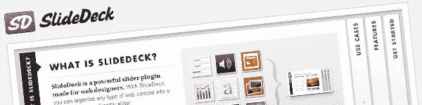

## **简介:**

SlideDeck 是另一个 jQuery slider 插件。它像一个典型的 jQuery 滑块一样滑动内容和图片。那么使用这个高级的或者付费的 jQuery 插件和一个可以立即下载使用的免费插件有什么区别呢？简单，幻灯片提供了全面的功能，这是免费插件所不能做到的。如果这个插件已经是 SEO 友好的了，你还能要求什么呢？将放入幻灯片的内容将在您自己的代码中清晰地组织起来，并由搜索引擎自动索引。这样，你可以节省做 SEO 相关工作的时间。

## **特性:**

下面是这个奇妙的 jQuery 插件的特性。

| 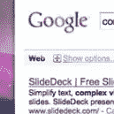 | **SEO 友好**此滑块的内容将被搜索引擎正确索引。 |

|  | **自动播放**当访问者到达你的网站时，这个插件会自动播放幻灯片。一个好的位置可能是在页眉之后的顶部，或者可以作为页眉本身。 |

|  | **滑块模式**关闭幻灯片标题栏，切换到传统滑块。 |

| 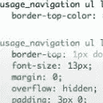 | **全 CSS 定制**通过自定义 CSS 来匹配您的网站配色方案或设计。 |

| 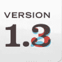 | **免费小版本升级**获得一个绝对免费的小版本升级。 |

| 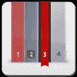 | **自定义皮肤**SlideDeck 从一开始就有很棒的设计，但有时最好换个角度来看。所以这个插件有多种皮肤。 |

|  | **优先支持**获得 WordPress 和 JavaScript Core 的 SlideDeck 专业版的实时完全优先支持。 |

| 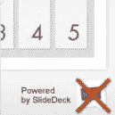 | **无品牌**购买专业版时，底部不再有“由...驱动”链接。 |

|  | **触摸屏支持**SlideDeck 支持 iPhone、iPad 等触摸屏手持设备。 |

| 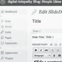 | **图形用户界面**SlideDeck WordPress 插件在设置中有自己易于使用的图形用户界面。 |

|  | **RSS 提要智能幻灯片组**使用您保存的 rss 源作为媒介，在几秒钟内创建智能幻灯片。这包含在专业版中。 |

| 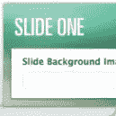 | **背景图像支持**SlideDeck 支持根据您的选择改变每张幻灯片的背景。您甚至可以添加图像和删除内容，使其成为一个普通的图像滑块。这包含在专业版中。 |

| 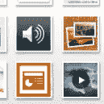 | **视频和多媒体资料就绪**视频、图片库、音乐播放器和任何媒体资源都可以放在 SlideDeck 的幻灯片中。 |

| 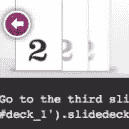 | **幻灯片进度 API**使用 SlideDeck 的 JavaScript 核心中包含的幻灯片控制 API 从外部控制您的幻灯片。你甚至可以设计自己的下一个和上一个按钮，独立导航，并使用幻灯片播放 API 来控制你的幻灯片 |

|  | **滑动控制逻辑 API**使用幻灯片控制逻辑 API 来控制用户可以即时访问哪些幻灯片。 |

| 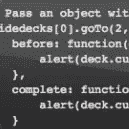 | **回调 API**SlideDeck 可以在幻灯片之间运行功能。 |

## **文档:**

**兼容性**

SlideDeck 兼容各种现代浏览器，包括 Firefox 3.5+，MSIE 7+，Safari 3+，Chrome 2+，Opera 10.5+。然而，由于缺乏 CSS 转换支持，SlideDeck 不支持 Firefox 2 和 3。

**升级**

SlideDeck 升级很容易，你所要做的就是用你下载的最新版本替换我们的 slidedeck.jquery.js 文件。

**幻灯片中的幻灯片**

SlideDeck 在幻灯片中提供幻灯片。您可以在幻灯片之间水平导航，也可以在幻灯片内垂直导航。

**可下载的皮肤**

SlideDeck 的最新版本允许你使用皮肤。为您的幻灯片创建定制风格，以定制您的网站。

## 结论:

总的来说，这个插件非常有用，非常有帮助，非常灵活。SlideDeck 的综合功能做得非常好。这个插件值得为它的高级功能和视觉外观买单。

*官网:[http://www.slidedeck.com/](http://www.slidedeck.com/)*

## 分享这篇文章