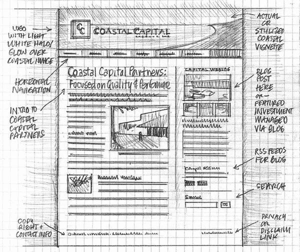
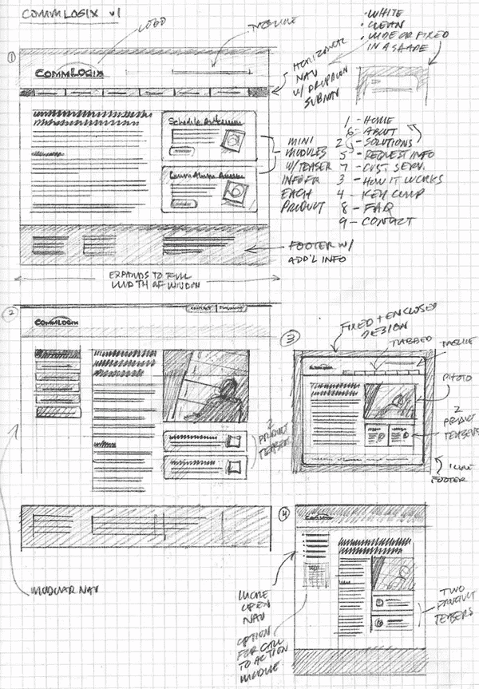

# 网页设计流程第 3 部分:布局

> 原文：<https://www.sitepoint.com/the-web-design-process-part-3-layout/>

所以你会见了你的客户并且[发现了关于他们的一切](https://www.sitepoint.com/the-web-design-process-part-1-discovery/)，然后你离开并且设计了你的[信息架构](https://www.sitepoint.com/the-web-design-process-part-2-information-architecture/)。现在你所要做的就是做你的探索工作，设计你的界面。

重要的是要记住设计是关于交流的。作为一名设计师，你的工作是创造一些美观、实用、易获取的东西，并提供有用和有趣的内容。设计应该作为用户和他们试图寻找的信息之间的渠道，而不应该成为障碍。我们都见过看起来令人惊叹但需要博士学位才能找到路的网站，或者拥有大量信息但展示得如此糟糕以至于网站使用起来很痛苦的网站。

所以这一步是你真正开始做一些“设计”工作的一步。你在哪里做设计工作？Photoshop？插画师？烟花？Gimp？没有。以上都不是。如果你想快速地得到一些想法，至少不需要。一张白纸和一支铅笔让你专注于设计，而不必太担心背后的技术。实际上，你可以在 10 分钟内在纸上勾画出比你在同一时间在电脑上布局更多的想法。你只需要一个便宜的笔记本或一令复印纸，不要担心有一本笔记本(除非你真的想要一个)或其他花哨的笔记本。

根据您在流程的最后一步中设计出的信息架构，勾画出您的网页所需的区域。你将在哪里放置标志，导航，主要内容，侧栏？它们相对于彼此有多大？

由[迈克·罗德](http://www.flickr.com/photos/rohdesign/3307873748/)绘制的线框草图

现在有一些我们已经习惯使用和看到的被认为是面包和黄油的网页布局。大多数网站都有以下部分:

**1。包含块**

每个网页都有一个容器。通常容器是使用居中对齐的 **div** 标签来设置的，这样无论用户显示器的分辨率如何，网站的内容总是位于屏幕的中间。该容器保存页面上的所有元素，并防止它们超出浏览器窗口的边界，进入空白区域。您可以将该容器的宽度设置为 **fluid** ，这意味着它会扩展以填充浏览器窗口的宽度；或者**固定**，这样无论窗口大小，内容宽度都一样。

**2。标志**

网站品牌应该包括公司现有营销形式中存在的公司标志和颜色，如名片和宣传册。如果没有现有的标志，那么你可能需要为此创建一个设计。Logo 设计本身就是一个很大的任务。通常出现在网站上的徽标也是一个返回到网站主页的链接。

**3。导航栏**

一个网站的导航系统应该易于使用和查找。普通网络用户希望在页面顶部看到导航。

**4。主要内容**

将主要内容作为页面的焦点，因为这是你的网站访问者正在寻找的。如果他们不能很快找到它，他们就会离开，不再回来。

 ****5。侧边栏**

侧边栏为额外导航或子导航提供了一个区域。如果你的网站非常简单，你可能不需要在布局中放置侧边栏。随着网站变得越来越复杂，侧边栏对于提供链接让访问者更深入地了解你的网站非常有用。在博客上，你会经常看到边栏上有最近的帖子，档案，最近的评论，这可以帮助你的访问者轻松地浏览你的网站。如果你在你的网站上放广告，侧边栏通常包含广告块。

**6。页脚**

页脚位于页面底部，通常包含版权、联系方式和法律信息，以及一些到网站主要部分的链接。随着时间的推移，页脚变得越来越精致，设计师对背景图形也变得非常有想象力。通过将最终内容与浏览器窗口的底部分开，页脚应该向用户表明他们在页面的底部。

图片由[迈克·罗德](http://www.flickr.com/photos/rohdesign/3307874546/sizes/l/in/photostream/)拍摄

这些是今天出现在网站上的主要模块。您可能希望创建一个使用所有或部分这些块的布局。通过用铅笔勾画出你的布局，你可以避免使用电脑时可能出现的问题。** 

## **分享这篇文章**