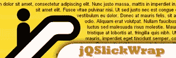
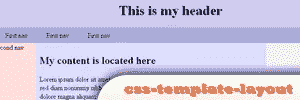
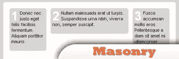
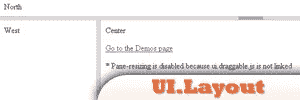
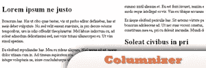
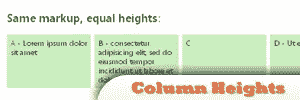

# 8 个令人惊叹的 jQuery 页面布局插件

> 原文：<https://www.sitepoint.com/8-stunning-jquery-page-layout-plugins/>

**Have you ever considered using jQuery to help you with web page layouts?**

现在，用 jQuery 做任何事情似乎都是可能的。事实上，我在这里列出了 8 个 jQuery 插件，可以帮助你轻松地设计你的网页。这是制作专业网页布局的最佳方式，尤其是如果你是在没有任何内容管理系统的帮助下手工制作你的网站。这样做的好处是，你可以借助自己的想法或概念来设计自己的网页布局。

以下是 8 个 jQuery 页面布局插件的列表:

## [1。jQSlickWrap](http://jwf.us/projects/jQSlickWrap/)

这是一个很酷的 jQuery 插件，可以强制文本环绕不规则形状的对象，如 splat、对角线形状、圆形等。
 
现场演示:
[http://jwf.us/projects/jQSlickWrap/example2.html](http://jwf.us/projects/jQSlickWrap/example2.html)

## [2。js-列](http://code.google.com/p/js-columns/)

 
现场演示:
[http://kenneth.kufluk.com/google/js-columns/](http://kenneth.kufluk.com/google/js-columns/)

## [3。CSS-模板-布局](http://code.google.com/p/css-template-layout/#%28jQuery%29_implementation_of_the_CSS_Template_Layout_Module)

一个 CSS 模板布局模块，借助 jQuery 实现。这个脚本用于解析一组给定的 CSS 规则，并按照规范显示它们的内容。

## [4。砖石工程](http://desandro.com/resources/jquery-masonry/)

这个插件被认为是 CSS 浮动的另一面。这将垂直排列元素，然后水平对齐网格。这种效果可以最小化不同高度的元素之间的垂直间隙。
 
现场演示:
[http://desandro.com/demo/masonry/docs/](http://desandro.com/demo/masonry/docs/)

## [5。UI。布局](http://desandro.com/resources/jquery-masonry/)

这个插件可以创建任何界面外观。
 
现场演示:
[http://layout.jquery-dev.net/demos/example.html](http://layout.jquery-dev.net/demos/example.html)

## [6。MB。集装箱加](http://pupunzi.open-lab.com/mb-jquery-components/mb-containerplus/)

这可以让你的容器拖动，调整大小，折叠和最小化。
 
现场演示:
[http://pupunzi . com/# MB . components/MB . container plus/container plus . html](http://pupunzi.com/#mb.components/mb.containerPlus/containerPlus.html)

## 7 .[。专栏作家](http://welcome.totheinter.net/columnizer-jquery-plugin/)

这个插件会自动将你的内容布局成报纸专栏风格。您还可以设置它的宽度和列数。
 
现场演示:
[http://welcome.totheinter.net/autocolumn/sample1.html](http://welcome.totheinter.net/autocolumn/sample1.html)

## [8。等高](http://www.filamentgroup.com/lab/setting_equal_heights_with_jquery/)

这个插件循环遍历一个元素最顶层的子节点，并将最小高度值设置为最高高度值。
 
现场演示:
[http://www.filamentgroup.com/examples/equalHeights/](http://www.filamentgroup.com/examples/equalHeights/)

## 分享这篇文章