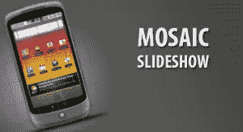
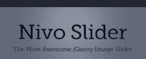
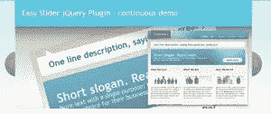
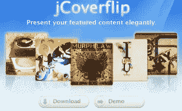
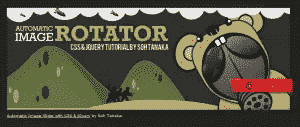
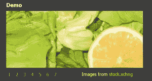
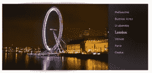
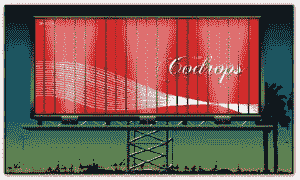
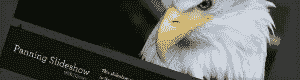
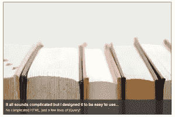

# 10 个惊人的 jQuery 图片滑块

> 原文：<https://www.sitepoint.com/10-amazing-jquery-image-slider/>

jQuery 图片幻灯片可能会派上用场，它可以让你的网站看起来更专业，也可以让它更加用户友好。下面是 10 个 jQuery 幻灯片插件的精选。

我已经包括开发人员的网站以及演示页面，以便您可以清楚地看到它会是什么样子，然后再决定使用它。它们有独特的转场效果。其中一个使用类似马赛克的效果，而另一些使用柔和的缓解效果等等。它们可以很容易地安装和定制，以适应您的网站的外观。你可能需要稍微熟悉 Javascript 和 CSS 来进行定制，但是只要你明白你在做什么，一切都会好的。

## [1。马赛克幻灯片放映](http://tutorialzine.com/2010/03/mosaic-slideshow-jquery-css/)

这个 jQuery 图像滑块有类似马赛克的效果。一个很酷的效果，比其他 jQuery 图片滑动条有优势，因为它的动画非常独特。

 
[现场试玩](http://demo.tutorialzine.com/2010/03/mosaic-slideshow-jquery-css/demo.html)

## [2 .nivo slider〔t1〕](http://nivo.dev7studios.com/)

一个非常专业的 jQuery 图片滑块。它使用了简洁的效果和动画的过渡。

 
[现场试玩](http://nivo.dev7studios.com/demos/)

## 3.简易滑块 1.7

数字导航 jQuery 滑块。

 
[现场试玩](http://cssglobe.com/lab/easyslider1.7/01.html)

## [4。JCoverFlip](http://www.jcoverflip.com/)

优雅地呈现您的特色内容。这使用了类似专辑封面的效果。

## 5.自动图像旋转器

带有 CSS 和 jQuery 的自动图像滑块。

## [6。jQuery Blinds](http://www.littlewebthings.com/projects/blinds/)

百叶窗效果 jQuery 图像滑块。

[现场演示](http://www.littlewebthings.com/projects/blinds/)

## [7。巴拉克幻灯片](http://devthought.com/blog/projects-news/2008/06/barackslideshow-an-elegant-lightweight-slideshow-script/)

一个优雅、轻巧的幻灯片。

[现场演示](http://devthought.com/wp-content/projects/mootools/barackslideshow/Demo/)

## [8。旋转广告牌系统](http://tympanus.net/codrops/2009/12/16/creating-a-rotating-billboard-system-with-jquery-and-css/)

使用 CSS 旋转广告牌系统效果的 jQuery。

[现场演示](http://devthought.com/wp-content/projects/mootools/barackslideshow/Demo/)

## [9。动画平移幻灯片显示](http://buildinternet.com/2010/02/animate-panning-slideshow-with-jquery/)

用 jQuery 制作动画平移幻灯片。

[现场演示](http://s3.amazonaws.com/buildinternet/live-tutorials/panning-slideshow/panning-slideshow.htms)

## 10。jQuery 简易幻灯片 v1.1

一个易于使用的 jQuery 图像滑块。它比其他 jQuery Image Slider 有优势，因为它提供了简单的效果和简单的编码。

[现场演示](http://dev.daledavies.co.uk/easyslides/)

## 分享这篇文章