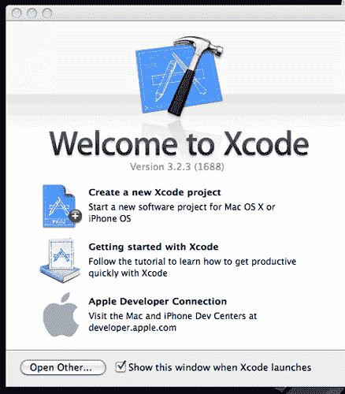
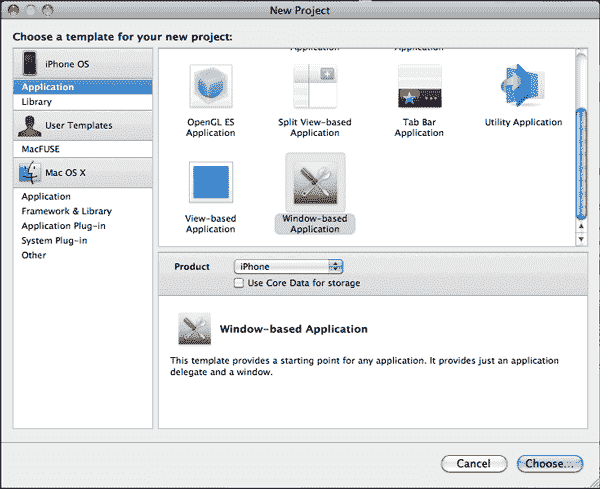
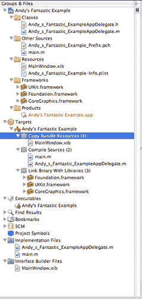
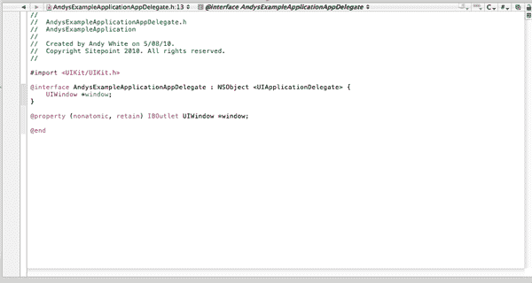
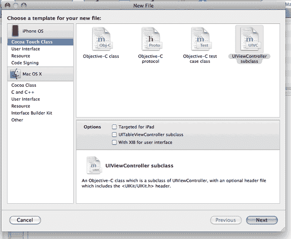
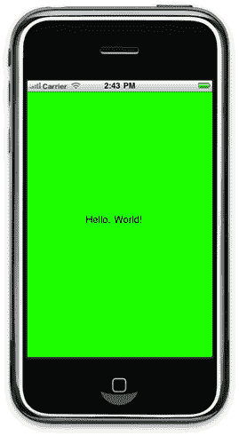
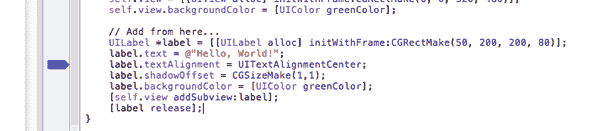

# 启动 iPhone 开发

> 原文：<https://www.sitepoint.com/kicking-off-iphone-development/>

为 iOS 平台开发会有很多乐趣。你有一套全面的 API 来做各种各样的事情——从地理定位到音频输出和 3D 图形——还有一个很好的平台来运行你的代码。如果你幸运的话，你甚至可以在 App Store 上赚一大笔钱(尽管有一些关于多少钱的争论！).当然，也有一些缺点。Objective-C(用于编写 iOS 应用程序的 C 派生语言)的语法有点奇怪和吓人，需要一段时间才能理解。如果您来自服务器端环境，那么平台本身有一些您可能不熟悉的额外要求。(这些主要与资源有关，避免资源的过度使用，以及对来电之类的事件做出响应)。让你的开发工具发挥出最大潜力还需要前期成本:苹果公司每年收取 99 美元，授权你在你的设备上测试你的代码——这就是所谓的严厉的爱。嘿，抬起头来！编写 iOS 应用程序非常有趣。掌握 Xcode 并真正开始开发可能会很困难，但本文试图减轻这一负担。我会帮你克服一些困难，这样你很快就能恢复健康。

**note:** Requirements

Mac OS X 10.6+

Xcode can only be run on Mac OS X. Sorry non-Mac users, I don’t make the rules!

At least a beginner grounding in C or comparable language

If you’re unfamiliar with C, C#, Java, or C++, I’d strongly encourage you to write at least a few simple command-line applications in one of these languages; this will enable you to grow used to the idea of headers and implementation files, compiling, linking, and static-typed languages.

iOS hardware to test on—that is to say, an iPhone or iPad

Strictly speaking, it’s not a necessity, as you can use the built-in simulator to test your apps; however, there are differences between the software environment the simulator runs in and the real-deal iPad or iPhone hardware, so you may wish to test your apps on the actual hardware it’s intended to run on.

## 下载并安装 Xcode 3.2

我们首先需要的是 Xcode 和 iOS 软件开发工具包(SDK)。这些是编写应用程序所需的基本工具。苹果对他们的开发者工具保持一定程度的控制，所以你需要注册[苹果开发者计划](http://developer.apple.com/programs/register/)。别担心，开始是免费的；除非你想在苹果硬件上测试你的应用，否则是免费的(第一次成功总是免费的)。如果你还没有这样做，你必须创建一个苹果 ID。您可以使用现有的 iTunes、Apple 在线商店或 MobileMe 帐户(如果您有这些帐户的话),这将节省您的打字时间。确认邮件应该会很快到达。当你收到时，登录[苹果开发者会员中心](http://developer.apple.com/membercenter/)。欢迎您的是会员中心仪表板，这是您下载工具、开发套件和文档的一站式点。一旦您拥有一个完全付费的 iOS 开发人员计划帐户，该仪表板还允许您提供用于测试和开发目的的设备。这也是你准备应用程序发布的地方，并最终发布到应用商店。现在，我们将只下载 Xcode 和 iOS SDK。点击开发中心下的 iOS 。接下来，选择下载，最后是 Xcode 3.2.4 和 iOS SDK 4.1 (或者类似的——当你读到这里的时候，版本号可能已经增加了)。注意:这是一个很大的下载量，重 2.3GB。这是 Mac OS X 应用程序的标准安装。另外请注意，在安装过程的最后，您必须退出 iTunes。

## 您的第一份申请

现在好戏开始了！开发 iOS 应用程序有几种方法。Apple 提供了一套预建的应用程序模板来帮助您开始使用。大部分使用界面构建器，苹果的所见即所得 iPhone 和 iPad 界面创建器。目前，它是一个独立的应用程序，与 Xcode 一起工作，通过 iOS 可以解析的特殊 XML 文件将视觉元素链接到代码元素。在 Xcode 的下一个版本 Xcode 4 中，Interface Builder 将成为开发环境不可或缺的一部分。如果你熟悉微软 Visual Studio 的环境，它会更像微软 Visual Studio 的窗体界面。使用界面构建器有一些明显的优势:

*   没有猜测的大小，布局，或与所见即所得界面结构的方向；你设计什么就是什么
*   更轻松、更快速地迭代您的应用
*   只需最少的代码即可运行的预构建界面元素
*   视图切换和其他复杂代码杂耍的抽象

在很多情况下，使用界面构建器没有任何好处。如果你正在制作游戏或高度互动的界面，标准的工具不能胜任。如果您的视图将包含大量动态生成的元素，那么 Interface Builder 也无法满足您的需求。我还认为，在让工具为您生成代码之前，您应该尽可能地了解“幕后”发生了什么。结果是，你不太可能在以后感到失落。解决界面构建器的细节超出了本文的范围。现在，我们只是要写一个非常简单的“你好，世界！”证明一切正常的申请。在后面的文章中，我们将一起使用 Interface Builder 和 Xcode 来构建更令人兴奋的应用程序。启动 Xcode，你会看到欢迎屏幕；左侧将看起来像[图 1，“Xcode 的欢迎屏幕”](#fig_welcome "Figure 1. Xcode’s welcome screen")。

**图一。Xcode 的欢迎屏幕**



点击新建项目。你会看到新项目对话框，如图 2[所示，“Xcode 的新项目对话框”](#fig_newproject "Figure 2. Xcode’s New Project dialog")。您可以通过选择文件 > 新建项目随时进入该对话框。

**图二。Xcode 的新项目对话框**



你会看到一些不同类型应用程序的选项。这些选项包括:

Navigation-based Application

Used for apps like Notes, the Address Book, or Mail, this application usually consists of a main view with a list of items. Each subview (accessed by clicking an item in the list) has a back button to return to the previous view.

OpenGL ES Application

This will create a 3D application or game, typically. A word of advice, though: this is not for the faint of heart.

Split View-based Application

This app is solely for the iPad. A menu at the top gives you control over a spacious central area for displaying information and controls.

Tab Bar Application

The dialler, iTunes, and Tweetie are examples of Apps built on this model. A set of navigation controls at the bottom of the screen give you access to several views that you can flick between at will.

Utility Application

Used for apps like Weather, this is only for the iPhone—you can’t make them for the iPad. One screen gives you information, and a press of a button flips the information screen over to present controls. (This is the most typical scenario; you could actually put anything you wanted on either side.)

View-based Application

A relatively bare-bones app, this just gives you a View (which you can modify to your heart’s content) and a controller for that view. We’ll be starting out with one of these.

Window-based Application

About as basic as you can get, this is just a window and an *App Delegate* (the essential code that receives events from iOS and responds to them). You’ll need to implement your own Views.

请注意，以上只是模板，是您开发应用程序的起点。许多应用程序包含来自这些模板的元素；例如，Tweetie 既有导航栏又有标签栏。甚至有可能在另一个视图中包含一个 OpenGL ES 3D 视图——您肯定被宠坏了。现在，选择基于窗口的应用。我们将从最基本的开始，然后从那里开始。为您的项目命名，然后点击继续。

## 欢迎来到 Xcode 旋风之旅

我们到了，在 Xcode 里。这里发生了很多事。顶部是工具栏，如图 3 中的[所示，“Xcode 工具栏”](#fig_toolbar "Figure 3. The Xcode toolbar")。从这里，使用最左边的下拉菜单，您可以选择您的目标架构、可执行文件和目标(如果您的项目包括多个)、配置(调试或发布)和设备(硬件设备或软件模拟器)。

**图 3。Xcode 工具栏**


最初，你会希望坚持调试配置。这些构建包含大量代码，专门用于帮助您跟踪代码中的问题；然而，它们运行起来比发布版本慢得多。还有一类特殊的错误可能会潜入您的代码中，它们只出现在发布版本中，因此不时地在发布配置中测试您的应用程序是值得的。现在，我们将忽略工具栏的其余部分——除了最重要的按钮:构建并运行。这将编译您的应用程序，并将其设置为在您选择的设备(或模拟器)上运行。现在可以随意点击了；你只会看到一个空白的屏幕。完成后，您可以安全地退出模拟器。在左边我们有组&文件窗格。这显示了你的应用程序的结构，包括文件系统上的原始内容，以及一些更多的虚拟信息；例如，在 Targets 下，您可以展开您的项目并查看构建过程将如何发生。

**图 4。各组&文件面板**



目前，组&文件窗格中的重要位在类、其他资源和资源下。我们可以暂时忽略其他的。编辑器，如图 5 所示，“编辑器窗口”，是你编写大部分代码的地方。如果你点击**Shift**+**Command**+**E**，它会放大并接管文件浏览器所占用的空间。如果你在一个头文件中，你可以用 **选项** + **命令**+**Up**切换到实现文件(反之亦然)。

**图 5。编辑窗口**



双击组&文件窗格中的单个文件，您可以将它们弹出到自己的窗口中。就我个人而言，我不喜欢很多窗口飞来飞去，所以我很高兴听到 Xcode 4 将推出标签的传言。

## 欢迎您的申请

iPhone 应用程序都有一个相当常见的结构。每个应用通常都有一个`main.m`文件(在文件浏览器中的其他来源下),它实例化了 AppController(稍后会详细介绍)。资源目录是所有非代码文件应该存在的地方。一旦你开始开发更复杂的应用程序，你会想把图像、文本文件和其他杂集放在这里。AppController 是操作系统消息进入应用程序的第一个入口点。值得浏览一下`*`ApplicationName`* AppDelegate.m` ，了解一下你的应用程序需要响应的事件。如果您正在创建非常简单的应用程序，这些方法中的一些或多或少是可选的，但是如果您计划基于任何显著复杂的用户输入来存储数据，您将希望实现像`applicationWillResignActive`和`applicationDidBecomeActive`这样的方法。这些方法允许您响应应用程序生命周期中的变化，例如当它即将终止时。AppDelegate 本身做不了多少事情。我们需要添加一个视图。因为 iOS 应用程序遵循模型-视图-控制器模式，我们还需要一个视图控制器。创建新文件:文件 > 新文件(或 **命令** + **N** )。Xcode 给我们的选项之一是 UIViewController 子类。整洁！选择它，并给它一个合适的名称。Xcode 也会自动为我们生成一个头文件。

**图 6。创建新文件**



如你所料，你会有两个新文件。这些组件构成了您的 ViewController，它负责接收输入事件并通过操纵视图来响应它们。通常，一个 ViewController 应该负责一个视图。不过，这并不是一个硬性规定；如果您想以不同的方式组织您的应用程序，这取决于您。如果你看一下你的 ViewController 的实现文件(即`.m`文件),你会看到苹果已经为我们提供了一堆预建的函数，注释掉了。我们可以实现我们需要的功能，但是它们会是什么呢？我们有一个 ViewController，但是我们需要一个视图。让我们继续在 ViewController 中创建一个视图。取消对`loadView`的注释，如下所示:

```
- (void)loadView {  *self.view = [[UIView alloc] initWithFrame:CGRectMake(0, 0, 320, 480)];  self.view.backgroundColor = [UIColor greenColor];*}
```

如果你现在点击构建并运行…你会失望的。我们已经构建了视图，但是我们仍然需要告诉 AppDelegate 我们创建的 ViewController 的存在，并要求 AppDelegate 实例化视图。切换到`*`ApplicationName`* AppDelegate.h` 。我们需要添加 ViewController 作为 AppDelegate 的属性，如下所示:

```
#import <UIKit/UIKit.h>#import "AndysExampleApplicationViewController.h"@interface AndysExampleApplicationAppDelegate : NSObject <UIApplicationDelegate> {  UIWindow *window;  *AndysExampleApplicationViewController *viewController;*}@property (nonatomic, retain) IBOutlet UIWindow *window;*@property (nonatomic, retain) AndysExampleApplicationViewController *viewController;*@end
```

您会注意到我们在`@interface`定义中添加了 ViewController 作为 AppDelegate 的属性。稍后，我们使用`@property`，这是一种自动声明属性的 getters 和 setters 的语法。现在切换到您的 AppDelegate 实现文件(`*`ApplicationName`* )中。首先，我们需要为 AppDelegate 的 viewController 属性创建 getter 和 setter 方法。我们可以自己声明这些方法，但是有一种更简单的方法，使用`@synthesize`:`

```
#import "AndysExampleApplicationAppDelegate.h"@implementation AndysExampleApplicationAppDelegate@synthesize window;*@synthesize viewController;*#pragma mark -#pragma mark Application lifecycle
```

`@synthesize`按照惯例，调用应该总是在你的`@implementation`声明之后，在任何方法定义之前。我们已经声明希望在 AppDelegate 中使用我们的新类，并创建了访问器方法来在我们的 AppController 上获取和设置它。现在我们需要告诉 AppController 实例化这个类。我们将修改方法`applicationDidFinishLaunchingWithOptions`来这样做:

```
- (BOOL)application:(UIApplication *)application didFinishLaunchingWithOptions:(NSDictionary *)launchOptions {  // Override point for customization after application launch.  [window makeKeyAndVisible];  *self.viewController = [AndysExampleApplicationViewController alloc];  [window addSubview:self.viewController.view];*  return YES;}
```

我们添加了一行来分配(`alloc`)ViewController，并添加了一行来将 view controller 的视图添加到窗口中。这很关键——窗口需要知道它包含的视图，视图需要知道它们包含的任何其他视图或 UI 元素。现在点击构建并运行。你应该会看到一个耀眼的亮绿色屏幕。干得好！您已经创建了一个视图。不过，这里很无聊……让我们来点刺激的。让我们添加一个标签。这是一个简单的可视元素，包含一些文本。在 ViewController 的`loadView`方法中，添加下面突出显示的代码:

```
- (void)loadView {  self.view = [[UIView alloc] initWithFrame:CGRectMake(0, 0, 320, 480)];  self.view.backgroundColor = [UIColor greenColor];  *UILabel *label = [[UILabel alloc] initWithFrame:CGRectMake(50, 200, 200, 80)];  label.text = @"Hello, World!";  label.textAlignment = UITextAlignmentCenter;  label.shadowOffset = CGSizeMake(1,1);  label.backgroundColor = [UIColor greenColor];  [self.view addSubview:label];  [label release];*}
```

我们已经为一个`UILabel`元素分配了内存。我们将其初始化为 50 个单位的宽度和 200 个单位的高度，偏移量为 X 200(屏幕上下)和 Y 80(屏幕横向)。点击构建并运行，您应该会看到标签出现在您的视图中，如图[图 7 所示，“我们的亮绿色”Hello，World！【app】](#fig_hellogreen "Figure 7. Our bright-green “Hello, World!" app")。

**图 7。我们亮绿色的“你好，世界！”应用程序**



## 使用调试器

如果它不起作用，或者它的行为不符合您的预期，会发生什么？Xcode 附带了一个全功能调试器。您可以在编辑器中的特定代码行设置断点。断点告诉应用程序在特定的代码行停止执行，并向调试器报告。从那里，您可以检查应用程序已经实例化和设置的变量和对象，以清楚地了解正在发生的事情。在你的 ViewController 的`loadView`方法中设置一个断点，点击你代码旁边的大灰色条，如图[图 8，“设置断点”](#fig_breakpoint "Figure 8. Setting a breakpoint")所示。

**图 8。设置断点**



现在点击构建和调试，再次启动你的应用程序。等等，那是什么？通过添加一个断点，我们已经表明我们想要运行调试器，所以构建和运行按钮已经改为构建和调试。您的代码将执行到断点，然后停止。按下项目窗口顶部的 Show Debugger 按钮(它看起来像一个杀虫剂喷雾罐)。瞧，调试器。在左边，您可以检查您的代码运行到这一点的函数序列；在右边，你可以看到你的应用程序的内存内容(包括局部和全局变量)。您甚至可以在这里更改它们的值。这让你有能力一步一步、有条不紊地诊断你的应用程序所做的改变。当您准备好继续时，点击调试器顶部的继续按钮。

## 下一步是什么？

我们已经学习了如何设置 Xcode 和创建一个非常基本的应用程序。我们还简要介绍了模拟器和调试器，它们都是创建应用程序的基本工具。苹果通过苹果开发者中心可以获得大量的文档。从教程到 API 文档应有尽有，如果你想继续开发应用程序，这是必读书。以下是我找到的一些关键读物:

*   [Cocoa Fundamentals Guide](https://developer.apple.com/iphone/library/documentation/Cocoa/Conceptual/CocoaFundamentals/Introduction/Introduction.html) 涵盖了 Cocoa 和 Objective-C，对于那些希望使用 iOS 或 Mac OS X 应用程序的人来说，这是一本很好的语言入门书。
*   [iOS 应用编程指南](https://developer.apple.com/iphone/library/documentation/iPhone/Conceptual/iPhoneOSProgrammingGuide/Introduction/Introduction.html)提供了 iOS 应用的必备；关于实现标准应用程序行为的部分是必读的。
*   iPhone 人机界面指南是学习如何为 iPhone 制作优秀用户界面的良好开端。

如果你想在应用程序开发方面更进一步，我推荐使用这个示例应用程序，并添加一两个用户可以与之交互的按钮。学习 UIKit 以及如何实现响应式控件，然后继续使用 Interface Builder 创建您的 UI，并将其与 Xcode 中的控制器挂钩。去年，斯坦福大学开设了一门 iPhone 应用程序编程课程，该课程的[视频可通过 iTunes U](http://deimos3.apple.com/WebObjects/Core.woa/Browse/itunes.stanford.edu.2024353965.02024353968) 获得。这些视频信息量很大，非常值得一看。

## 结论

我们已经向您介绍了作为 iOS 应用程序开发人员的第一步。从这里，您可以访问大量资源，这些资源将教您如何开发越来越复杂的功能，并创建人们真正喜欢使用的应用程序。后续文章将着眼于创建更复杂的应用程序，包括使用界面构建器创建 UI，以及通过 HTTP 从 Web 访问信息。敬请期待！

## 分享这篇文章