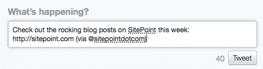
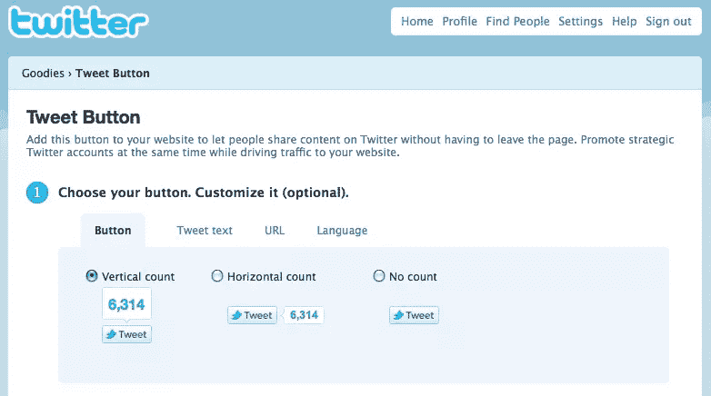
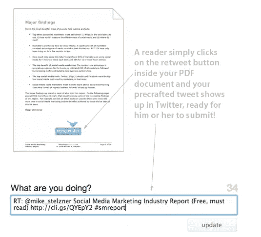
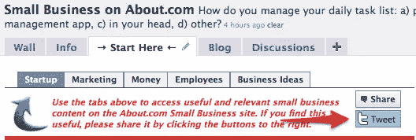

# 如何在任何地方添加 Tweet 按钮

> 原文：<https://www.sitepoint.com/add-tweet-button-anywhere/>

社交分享是增加网站流量、寻找新订户和充分利用发布内容的绝佳方式。无论分享是通过 Twitter、脸书还是其他方式，你让分享过程越简单，你的内容就越有可能被分享。如果你有一个 WordPress 博客，你只需点击几下就可以添加社交分享按钮，方法是从现有的众多社交分享插件中选择一个。但是如果你想提供一种方式让你的读者从你的博客之外的地方分享你的内容，那就不那么容易了。首先，以下是在一些非博客位置添加 Twitter tweet 按钮的说明，这样你的读者就可以在 Twitter 上与他们的关注者分享了。

## 创建标准的 Tweet 链接

点击 tweet 按钮会在用户的 Twitter 屏幕上预先填充 tweet 文本，然后用户只需点击 Tweet 按钮即可发布更新。创建链接是大多数 tweet 按钮的第一步，但如果你想在你的副本中插入一个文本 tweet 链接，直接链接也很有用。以下是推文链接的标准格式:**链接开头:** `http://twitter.com/home/?status=` ****推文正文:** `Check out the rocking blog posts on SitePoint this week: http://www.sitepoint.com (via @sitepointdotcom)` **完整链接:** `http://twitter.com/home/?status=Check out the rocking blog posts on SitePoint this week: http://www.sitepoint.com (via @sitepointdotcom)`**

 **点击此处查看它的运行情况:测试它。

## 使用 Twitter 的 Tweet 按钮

Twitter 提供了一个工具来从他们的网站上创建一个 tweet 按钮。因为它使用了 JavaScript，所以有些限制，但是它可以是一个很好的方法，例如在您的网站上开始使用 tweet 按钮。你只需选择你想使用的按钮，输入你的 tweet 文本和 URL，然后复制并粘贴代码。

## 在电子邮件中添加推文按钮

在电子邮件营销活动中添加 tweet 按钮需要创建一个图片，并使用上面显示的标准链接格式进行链接，尽管这并不总是那么简单。最大的挑战是适应各种电子邮件客户端，并预测您的电子邮件营销服务将如何呈现链接。请确保您测试了链接，因为您可能需要使用 [URL 编码](http://en.wikipedia.org/wiki/URL_Encoding)，这样链接才能正常工作。

**tip:** Include a Hashtag

如果你想在预先格式化的推文中使用标签，用%23 代替井号，这样可以正确显示(这适用于所有推文链接，而不仅仅是电子邮件中的链接)。

## 在 PDF 中包含 Tweet 按钮

在 PDF 中添加 tweet 按钮可以通过将图像放入原始非 PDF 文档中，然后在发布前将链接添加到 PDF 中来完成。这个过程和一些很棒的技巧一起在[社会媒体审查员](http://www.socialmediaexaminer.com/how-to-add-retweet-buttons-in-your-pdf-documents/)博客上被概述。

## 在你的脸书页面上整合一个推文按钮

由于 JavaScript 的原因，Twitter 上的 tweet 按钮在脸书上不起作用，所以要在你的脸书页面上添加 tweet 按钮，你需要有一个 FBML 标签，一个托管在某处的按钮图像，以及上面创建的标准链接。然后，你只需将按钮直接编码到你的 FBML 代码(或其他自定义标签)中，以便于共享。

**warning:** Check Your Length

一定要检查你的推文的总字符数。我们知道 Twitter 允许 140 个字符，但 120 个或更少的字符允许该推文很容易被转发和再次分享。

**您在哪里使用推文按钮来鼓励分享您的内容？你认为它在驱动新流量方面有效吗？**

## 分享这篇文章**