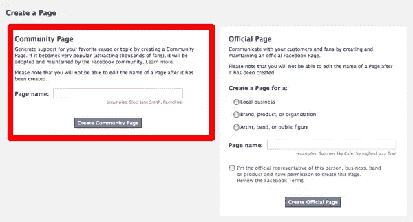

# 关于脸书社区页面你应该知道什么

> 原文：<https://www.sitepoint.com/facebook-community-pages/>

脸书社区页面并不是一个新功能；它们在 2010 年 4 月作为测试版推出。关于社区页面是如何创建的，谁选择你连接的社区页面，以及它们提供什么内容所引起的混乱，有很多评论。

本质上，社区页面是脸书控制的维基百科版本，现在社区页面上的大部分内容来自脸书直接从维基百科授权的内容。

## 社区页面有什么意义

根据脸书的说法，社区页面的目标是为用户提供一种方式来了解更多关于一个主题、一项事业或一次经历，并查看脸书社区中的其他人对这个主题的看法。脸书的帮助区是这样描述社区页面的:

> 社区页面是一种新型的页面，使您能够看到人们对您关心的事情的看法，并发现与您分享这些联系的朋友和人。它们与您可以连接的任何其他页面相似，尽管它们不会在您的新闻提要中生成故事，也不会由单个作者维护。在相关主题可用的地方，它们还显示了脸书从维基百科获得许可的内容。
> 
> 我们认为您在脸书的经历会有所改善，因为您的个人资料会变成对您来说很重要的所有关系的生动地图，而不是您兴趣的静态列表。

## 什么样的社区页面

您可能还没有注意到，但是您的个人资料会根据您的兴趣和您输入的信息自动链接到不同的社区页面。例如，在我的信息选项卡上，我列出了我就读的高中和大学，它们都是脸书批准的社区页面的链接:

## 关于社区页面你需要知道的

那么，除了解释你个人资料中的一些随机链接之外，这一切对你来说意味着什么？有两件事你需要知道:

### 1)如果你的通用话题社区页面变得流行，脸书可以接管它。

一些社区页面可以由用户创建，就像创建常规页面一样(通过从您的页面管理页面单击[创建页面](http://www.facebook.com/pages/manage/?act=29824216#!/pages/create.php)链接):

上面写着，“通过创建一个社区页面，为你最喜爱的事业或主题争取支持。如果它变得非常受欢迎(吸引成千上万的粉丝)，它将被脸书社区采用和维护。”所以基本上，如果你创建了一个普通的主题页面，并且它变得非常受欢迎，脸书会控制它。

### 2)您的商业页面可以随时重新归类为社区页面。

对于商业用户来说，最重要的因素可能是，如果你在脸书上拥有或管理一个商业页面，你随时都可能失去控制。如果您的页面被重新分类，您可以对该决定提出上诉，但是如果您曾经试图在某个问题上获得支持，您知道直接联系脸书并获得答复是多么具有挑战性。

根据 Entrepreneur.com 上的文章“[如何避免脸书商业页面重新分类](http://blog.entrepreneur.com/2010/09/how-to-avoid-facebook-business-page-recategorization.php)”，你可以通过获得一个虚假的网址，定期更新你的页面，并积极增加新的粉丝，来降低脸书突然出现并声称你的商业页面为社区页面的几率。

我们真的不知道社区页面会如何变化，或者重新分类的页面会发生什么，但如果你为你的业务做任何事情，这绝对是你需要关注的一个领域。

想看看今年早些时候的一些批评，请阅读“[亲爱的脸书，你现在在搞什么鬼？](http://outspokenmedia.com/social-media/facebook-community-pages/)、[脸书讨厌你的牌子](http://doteduguru.com/id5054-facebook-hates-your-brand.html)

你对社区页面有什么看法？重新分类的可能性会影响你使用脸书网页的方式吗？

## 分享这篇文章