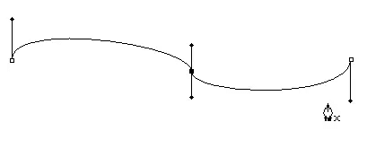
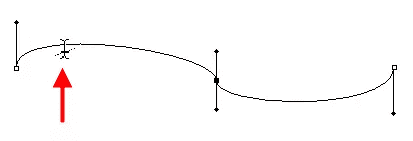
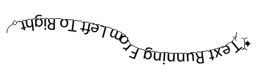
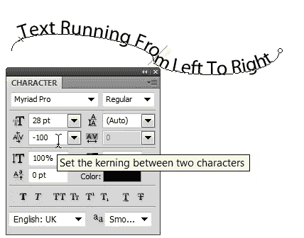
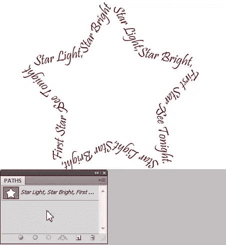

# 在 Photoshop 中的路径上创建文字

> 原文：<https://www.sitepoint.com/creating-type-on-a-path-in-photoshop/>

Photoshop 让您可以轻松地将水平和垂直文本添加到图像中。使用 type 的最令人兴奋的方式之一是将它包裹在一条路径上。您可以将文字添加到使用钢笔工具绘制的开放或封闭路径中，或者添加到矩形、椭圆形或多边形等形状中，自定义形状工具提供了数百种矢量形状供您使用。当您将文本附加到路径时，
文本和路径都保持可编辑状态，因此您可以根据需要调整路径的形状以及文本的大小或颜色。下面是怎么做的。

以下是将文本附加到自定形状的方法:

1.使用钢笔工具绘制路径。绘制路径的方向决定了文本的流向。

2.从工具箱中选择水平文字工具，然后将光标悬停在路径边缘上方。您将看到一条波浪线出现在 I 形光标下方。这告诉你它能识别你要附加文本的路径。单击一次，然后开始键入。

3.您可以使用选项栏或“字符”面板中的任何对齐按钮来对齐路径上的文本。

4.您可以沿着路径前后滑动文本，或者使用路径选择工具(文字工具下方的黑色箭头)选择文本，将文本从路径的顶部翻转到底部。

当光标旁边出现向右的小箭头时，向左或向右拖动以移动文本。要将文本翻转到路径的另一侧，请将光标拖动到路径下方。

如果您的文本消失，这意味着起点和终点之间的空间太小，无法容纳您的所有文本。您可以通过调整其中一个点或更改文本大小来调整它。只需切换回文字工具或双击图层面板中文字图层的缩略图，然后进行选择。

5.有时，字母会靠得太近，您可能需要在“字符”面板中调整单个字母的字距调整或所有字母的字距调整，以防止它们在狭小的空间中发生冲突。

6.要使文本位于路径的上方或下方，而不是直接位于路径上，请在字符调板中调整基线偏移。

7.自定义形状工具提供了大量的形状来玩。从工具箱中选择自定义形状工具。它隐藏在矩形工具下面。在工具选项栏上，将自定义形状选项设置为路径，并在形状下拉框中选择一个星形。如果你看不到一个星形，从上下文菜单中选择形状(小三角形)。

8.拖出星形，然后使用水平文字工具添加一些文字。我用的是普里什蒂纳，红色 28 码。

9.完成后，您可以通过单击路径面板的灰色区域来隐藏路径。现在你将会看到你的文本以星形出现。

## 分享这篇文章