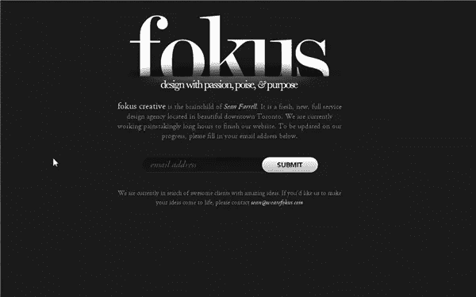
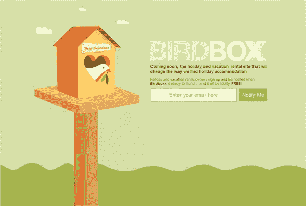
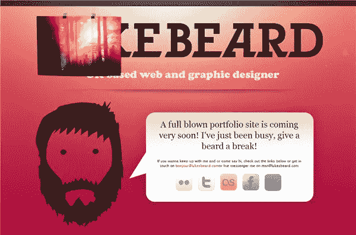
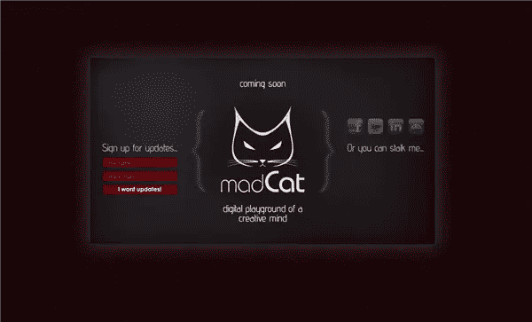
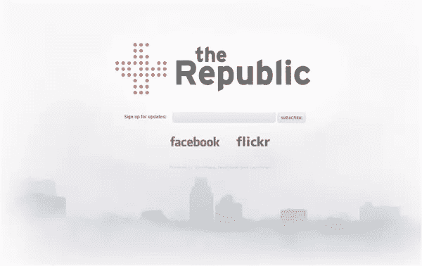
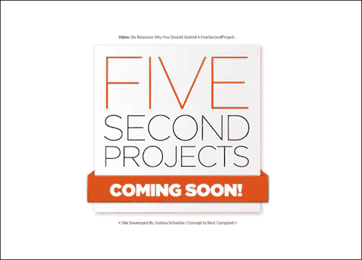
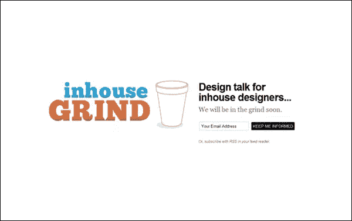
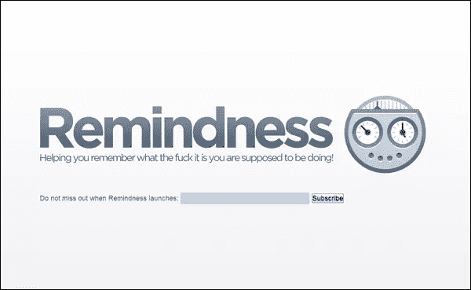

# 即将到来的艺术页面

> 原文：<https://www.sitepoint.com/the-art-of-the-coming-soon-page/>

去年我们看了一下[如何设计一个成功的即将到来的页面](https://www.sitepoint.com/design-a-successful-coming-soon-page/)，现在似乎是一个重温这个话题的好时机，来看看一些更漂亮的“即将到来”页面的例子。

**什么是即将到来的页面？**

在最基本的层面上，即将到来的页面让你网站的访问者知道一些新的东西，无论是一个全新的网站，一个重新设计或一个新的应用程序，都将很快推出。这也是一个重要的机会，你可以得到你的访客的电子邮件地址，这样你就可以让他们知道什么时候有新的东西推出。让我们面对现实吧，不管你的设计有多可爱，没有你的提醒，很少有人会记住它，所以让他们知道你的电子邮件信息，或者说服他们订阅你的时事通讯、邮件列表或 RSS 订阅。

**在你的页面上放什么**

大多数即将发布的页面会提供一个简短的介绍，让访问者知道当你发布时会发生什么。

[我们是焦点](http://www.wearefokus.com/)

订阅表格通常很短——大多数只有一个字段来获取访问者的电子邮件地址——你不想让人们填写不必要的信息，从而让他们感到厌烦。

[鸟笼](http://birdboxx.com/)

行动号召按钮被设计得很突出，无论是在尺寸、颜色还是内容方面。即将到来的页面要求访问者穿上皮衣。

当您准备您的页面以供发布时，您可以让人们知道您在哪些社交网站上，以便他们可以与您保持联系。

Lukes Beard 有一个简单的语音气泡，带有一些文本和社交网络图标，以及在待售印刷品左上角的预览。

下面是即将到来的页面的一些更引人注目的例子。

[疯猫](http://madc.at/)

[我们是共和国](http://wearetherepublic.org/)

[五秒项目](http://fivesecondprojects.com/)

[Uooo](http://www.uooo.tv/)

[在室内研磨](http://www.inhousegrind.com/)

[提醒](http://remindness.com/)

总而言之，成功的“即将推出”页面简单、醒目，并为您提供了一种机制，让您可以从有足够兴趣向您提供信息的访问者那里收集电子邮件详细信息。

最近，你有没有看到什么给你留下深刻印象的即将发布的页面？请随意分享。

## 分享这篇文章