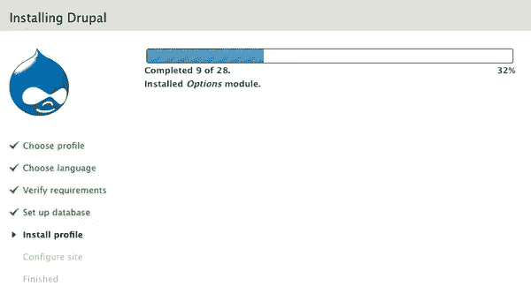
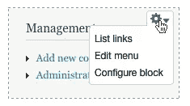

# 手放在 Drupal 7 测试版上

> 原文：<https://www.sitepoint.com/hands-on-the-drupal-7-beta/>

上周，Drupal 团队[发布了他们久负盛名的 CMS 版本 7](http://drupal.org/drupal-7.0-beta1) 的第一个测试版。Drupal 7 问世已久，在国际神秘人[马克·博尔顿](http://www.markboulton.co.uk/)的帮助下，它受益于一次大规模的 UI 改进。

我承认，我对 Drupal 又爱又恨。我在过去的几个项目中使用过它，由于 Drupal 开箱即用的复杂功能，我能够快速启动并运行它们。然而，Drupal 总是有一个陡峭的学习曲线，有限的文档，以及许多独特的做事方式。我完全跳过了版本 6，但是随着围绕版本 7 改进的一些讨论，我认为这是一个很好的时间来看看发生了什么。

总的来说，测试版感觉相当完美。虽然我没有过分严格地使用它，但它似乎是完整的，我没有遇到任何错误。当然，我不会急于将它安装到您的生产站点上！但是你应该没有问题把它扔在你的虚拟机上玩。

## 装置

你对 CMS 的第一印象通常来自于它的安装程序，在这一领域落后于 WordPress 之后，Drupal 7 终于可以运行了。安装程序首先让您选择标准安装或最小安装(前者将为您激活和配置几个公共模块，而后者是一个基本的选择)。然后，您需要填写您的数据库信息和一些其他关键设置，以及输入您的第一个用户的详细信息，然后安装程序将继续相应地配置数据库。

## 管理

安装完成后，Drupal 7 会把你放到新网站的首页。与 WordPress 不同，Drupal 的管理界面被集成到了网站本身。这是有道理的，因为 Drupal 自称是一个社区 CMS，而不是像 WordPress 这样更传统的发布平台。在 Drupal 以前的版本中，管理界面采用额外的侧边栏小部件的形式；然而，在 Drupal 7 中，管理界面更像是位于站点本身之上的一层。顶部有一个固定的菜单栏，包含所有管理功能的链接；点击任何一个项目，相关的选项页面将作为一个模态对话框显示在网站的顶部。如果您已经使用 Drupal 很长时间了，一开始可能会感到困惑，但是在使用了一段时间后，我发现我很快就习惯了。有些部分已经被移动了(例如，内容类型管理过去放在内容中，现在放在一个新的叫做结构的部分中)，但总体来说，它还是很好的旧 Drupal。

主题中的块和区域的内联编辑非常漂亮，如下所示:

所以，总的来说，我是新 UI 的粉丝:这是一个完整的更新，它设法保留了独特的身份并展示了平台的优势。

## 在后台

不过，Drupal 7 不仅仅是华丽的 UI:它的代码库也有重大变化。一个主要的变化是迁移到 PHP 5；从版本 7 开始，Drupal 要求 PHP 最低版本为 5.2。

从开发人员的角度来看，Drupal 7 最令人兴奋的新增功能之一是新的 Field API。Drupal 以前的版本依赖于 CCK(内容构建工具包)模块来添加新的内容类型和字段；它几乎总是你在任何新的 Drupal 站点上安装的第一个模块。Field API 旨在取代 CCK，并将这一功能引入 Drupal 的核心。但它不止于此:内置的内容类型，如节点、用户和分类术语现在也与字段 API 绑定在一起，所以这些字段是开发人员随意修改的公平游戏。

不幸的是，这个 API 虽然有概要的文档，但没有用示例代码清楚地解释；因此，如果您想开始使用它，在您觉得可以在您的项目中使用它之前，需要进行一些挖掘。

## 还有厨房的水槽

Drupal 7 还提供了大幅改进的文件和图像处理、针对用户权限和角色的更好的 API、性能改进等等。要获得最新消息的完整列表，请务必查看[变更日志](http://api.drupal.org/api/drupal/CHANGELOG.txt/7)。

## 摘要

虽然从设计和开发的角度来看，Drupal 7 都是令人印象深刻的成果，但是缺乏良好的文档仍然让开发人员难以驯服。也就是说，请继续关注 SitePoint 上关于新 API 特性的教程！

你们 Drupal 用户中有谁玩过测试版吗？你有什么想法？

## 分享这篇文章