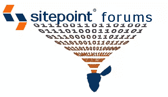

# 社区书和其他有趣的话题

> 原文：<https://www.sitepoint.com/the-community-book-and-other-interesting-topics/>

不幸的是，本周我没有像乳房一样令人兴奋的话题可谈，但这并不是说 SitePoint 社区没有太多的事情发生。

我们最新的课程，Russ Weakley 的[实用 CSS 今天开始。你们当中那些上过 Russ 以前的课程 CSS Live 的人会知道他是一个明星，他的课程不容错过。Russ 做得最好的事情之一是他积极参与课程](https://www.sitepoint.com/premium/courses/html-css-for-beginners-3009)[论坛](https://www.sitepoint.com/forums/)，这无疑使我的工作变得更容易！在这个课程中，你将把你的基本 CSS 技能提升到一个新的水平，并把它们应用到实际的网站建设中。

本周我特别兴奋的一件事是社区图书项目。提交的作品越来越多，从我目前所读到的来看，我们将会有一个杰作！我们的文章涵盖了从 TCP/IP 到 SEO 的所有网络内容。我会随时通知你，但是你可以期待在新年的早些时候看到一些切实的东西，一切都在计划中。

本周，我们的脸书主页因我们的营销人员 Shayne Tilley 的精彩传记而炙手可热。Shayne 向我们讲述了他在 Sitepoint 的时光，并向有抱负的营销人员提供了一些关于他在产品开发方面所做工作的见解。在“了解我们”活动中，下一位嘉宾是联合创始人兼品牌大师 Mark Harbottle。请在本周末查看我们的[人员选项卡](http://www.facebook.com/sitepoint?v=app_11007063052)，查看马克的简历。

这周我想提到的最后一件事是非常重要的。2010 年的投票只剩下一天了。净奖。我们已经被提名为年度社区网站，所以如果你喜欢我们所做的，一定要为我们投票！(顺便提一下，我们非常有才华的播客团队已经被提名为年度播客)。

**本周热点话题**

本周，他们在 CSS 论坛上讨论字体这个古老的问题。你如何[强迫你的用户使用字体](https://www.sitepoint.com/forums/showthread.php?t=705457)？

在 [PHP 应用设计论坛](https://www.sitepoint.com/forums/forumdisplay.php?f=147)中，超级极客们正在讨论[控制器路由](https://www.sitepoint.com/forums/showthread.php?t=704816)。

我们这个月的[照片展](https://www.sitepoint.com/forums/showthread.php?t=705294)是关于季节的。拿起你的手机，抓拍一张照片，然后发布到[普通聊天论坛](https://www.sitepoint.com/forums/forumdisplay.php?f=9)上，这样我们就能看到此刻你所在的世界是什么样子了。

在本周的[刚刚开始你的设计](https://www.sitepoint.com/forums/forumdisplay.php?f=16)论坛中，有一个关于成为一名网页开发者的[之旅的有趣话题。](https://www.sitepoint.com/forums/showthread.php?t=700972)

我不干了。祝你一周愉快。

*特征图像由克里斯·罗伯茨从[数字精度](http://www.digitalprecisionnc.com/)到*

## 分享这篇文章