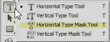
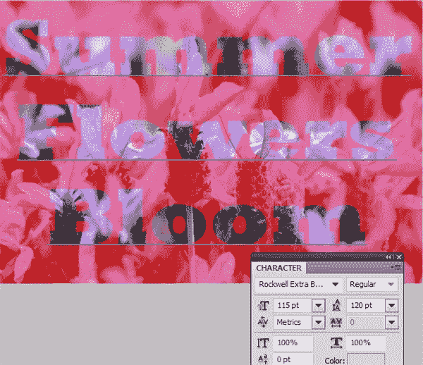
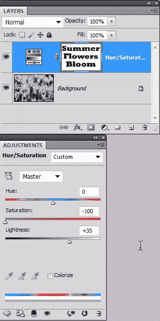
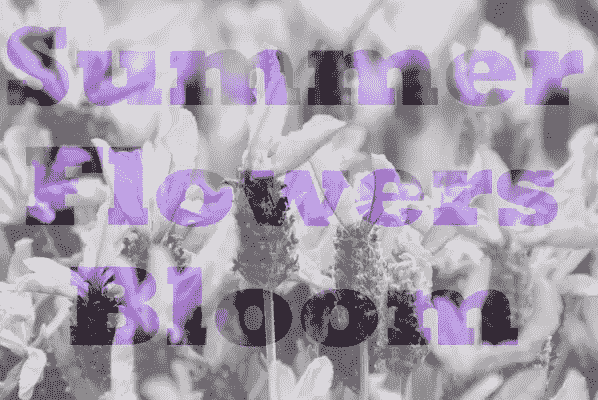
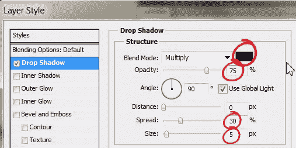
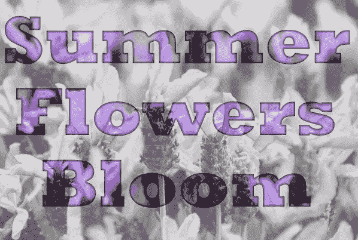

# 在 Photoshop 中用照片淡入淡出创建空心字体

> 原文：<https://www.sitepoint.com/create-hollow-type-with-a-photo-fade-in-photoshop/>

在 Photoshop 中，通常有几种方法可以创建相同的效果，无论是通过使用工具、菜单命令还是面板。在这个简短的教程中，我们将看看如何使用水平文字蒙版工具创建透明文字的效果。使用“普通文字”工具，然后选择文字，可以获得类似的效果，但是此方法删除了一两个步骤。

1.打开要应用文字的图像。在这个练习中，我用的是一些紫色花朵的照片。我已经把图片的宽度缩小到 600 像素，所以如果你想用和我一样的设置，可以随意下载这张图片。

2.从工具栏中选择水平文字蒙版工具。它隐藏在普通文字工具下面，所以在文字工具上按住鼠标一秒钟可以看到弹出菜单。

3.从选项栏上的字体系列菜单中选择一种字体。这种方法最适合使用粗、肥的字体，因此选择区域会相当大。我用的是 RockWell Extra Bold，字号 115 磅，行距 120 磅。

点击你的图像，你会注意到红色(或 rubylith)作为一个面具出现。当你输入字母时，它们看起来是透明的。在这个阶段，您仍然可以通过高亮显示文本并在选项栏或字符调板中进行更改来正常编辑文本。

4.当文字看起来靠右时，单击选项栏最右侧的黑色勾号以接受遮罩，或者只需按数字键盘上的 Enter 键。这创建了一个文本选择，你会看到熟悉的行进中的蚂蚁。红色覆盖消失。

文本不再是可编辑的，你会注意到图层面板中没有新的文本图层。如果您在接受遮罩后决定编辑或重新格式化文本，则必须重新开始。

5.对于这个例子，我想淡出字母周围的背景，所以我们将反转选择。选择**选择>反转**选择除字母以外的所有内容。

6.在“图层”面板中，单击“创建新的填充或调整图层”按钮(半黑/半白圆圈)，然后从弹出式菜单中选择“色调/饱和度”。我们正在使用一个调整层，使原始照片保持不变。

在打开的“调整”面板(CS4 和 CS5)中，通过将饱和度降低到–100 来移除照片的颜色。然后将“亮度”滑块拖到+35，使照片变亮，使文本更清晰。

你的图像应该是这样的:

如果你想的话，你可以停在这里，这就是使用水平文字蒙版工具的全部内容，但是我想让文字突出一点，所以我将添加一个图层样式。

7.确保在图层面板中选择了被遮罩的图层，然后点击图层面板底部的图层样式按钮(Fx)。从下拉菜单中选择内阴影。

我用深紫色(#330033)代替黑色作为阴影。黑色有时会有点太过严肃。设置距离为 0，扩散为 30%，大小为 5 像素。

文本现在应该非常醒目了。

## 分享这篇文章