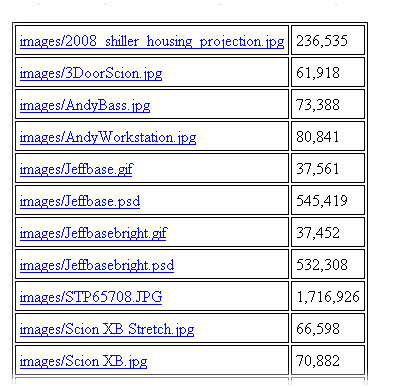

# 编程亚马逊 S3，第二部分

> 原文：<https://www.sitepoint.com/s3-php-part-2/>

在这个系列的第一部分中，Jeff 向我们展示了如何开始编程亚马逊的 S3 存储服务。如果您按照该教程进行操作，您将设置好您的 AWS 帐户，下载 CloudFusion 库并使用您的身份验证密钥进行设置。您还将看到一些从 PHP 代码中创建存储桶和检索存储桶列表的简单方法。

本周我们将更进一步:我们将向您展示如何将文件上传到 S3，创建一个简单的缩略图存储服务，并使用 CloudFront CDN 分发您的文件。

这两篇文章都摘自 SitePoint 的新书《在云中托管你的网站，亚马逊网络服务使之变得简单 》。它们都摘自第四章，这也是本书[免费 PDF 样本](https://www.sitepoint.com/books/cloud1/samplechapters.php)的一部分。

我假设你已经完成了第一部分。既然您已经知道了如何创建存储桶并在网页中列出它们，那么是时候谈谈亚马逊 S3 的主要特性了:存储文件。不过，在此之前，是时候绕个小弯了。

**important:** Running the Code

本文中以 shebang ( `#!/usr/bin/php`)开头的程序应该从命令行运行。其他的是通过网络服务器运行的。

## 处理复杂的云融合数据结构

到目前为止，我介绍的 CloudFusion 函数都返回简单的数据结构——字符串数组。然而，我将在本文后面使用的函数返回一个更复杂的数据结构，称为`ResponseCore`。S3 以 XML 文档的形式返回结果；CloudFusion 使用 PHP 的 SimpleXML 包解析 XML，并将解析后的对象包含在响应中，可以通过名称引用这些对象。<sup>[1](#ftn.id2753118)</sup>

**warning:** CloudFusion Has Become the AWS SDK for PHP

自从我们出版这本书和本系列的第一篇文章以来，CloudFusion 库已经成为 PHP 的官方 [AWS SDK。这个版本改进了对 AWS 区域的支持，以及一系列其他改进。这可能意味着，如果您不使用库](https://aws.amazon.com/sdkforphp/)的 [2.5 版本，您将需要对代码进行一些轻微的调整，但由于新的 1.0 SDK 完全基于旧的 CloudFusion 代码库，这些变化应该很小，而且很少。](https://sitepoint-code-archive.s3.amazonaws.com/cloud1/cloudfusion_2.5.zip)

下面的代码调用 S3 列出桶`BOOK_BUCKET`中的前 1000 个对象，然后调用 PHP 方便的`print_r`函数来显示结果对象树:

**例 1。`chapter_04/list_bucket_objects_raw.php`(节选)**

```
#!/usr/bin/php<?phperror_reporting(E_ALL);require_once('cloudfusion.class.php');require_once('include/book.inc.php');$s3 = new AmazonS3();$res = $s3->list_objects(BOOK_BUCKET);print_r($res);exit(0);?>
```

结果输出太长，无法完整显示(我的存储桶有 465 行)。让我们来看一些摘录。这是第一部分:

```
$`php list_bucket_objects_raw.php`ResponseCore Object[header] => Array(  [x-amz-id-2] => Ya7yAuUClv7HgR6+JJpz0sYDM1m4/Zy+d0Rmk5cSAu+qV+v+6➥9gLSHlytlD77wAn  [x-amz-request-id] => 14AA13F3F0B76032  [date] => Thu, 28 May 2009 06:51:26 GMT  [content-type] => application/xml  [transfer-encoding] => chunked  [connection] => close  [server] => AmazonS3  [_info] => Array  (    https%3A%2F%2Feditor.sitepoint.com => https://sitepoint-aws-cloud-book.s3.amazonaws.com/    [content_type] => application/xml    ⋮
```

第一行表示数据类型为`ResponseCore`。接下来，我们会找到一些标准的 PHP 数组。如果需要，我们可以像这样访问数据:

```
$res->header['transfer-encoding']$res->header['_info']['url']
```

`$res`是一个对象，`header`是对象的一个实例变量，所以使用`->`操作符来访问它。`header`实例变量是一个 PHP 数组，所以使用数组语法访问它的成员。

在第二行中，`header`的`_info`成员本身是一个数组，所以第二组括号用于访问里面的`url`值。

在输出中再往下一点，我们会发现以下内容:

```
[body] => SimpleXMLElement Object(  [Name] => sitepoint-aws-cloud-book  ⋮
```

`body`实例变量的类型是`SimpleXMLElement`。它从一个`Name`实例变量开始，这个变量可以作为`$res->body->Name`来访问。

再往下，我们终于找到了我们来这里的目的——桶中的对象列表:

```
[Contents] => Array(  [0] => SimpleXMLElement Object  (    [Key] => images/2008_shiller_housing_projection.jpg    [LastModified] => 2009-05-22T23:44:58.000Z    [ETag] => "e2d335683226059e7cd6e450795f3485"    [Size] => 236535    [Owner] => SimpleXMLElement Object    (      [ID] => 7769a42be4e57a034eeb322aa8450b3536b6ca56037c06ef19b1e1➥eabfeaab9c      [DisplayName] => jeffbarr    )    [StorageClass] => STANDARD  )  ⋮
```

可以看到`body`包含一个名为`Contents`的实例变量，这是另一个包含 bucket 中所有文件的数组。桶中的每个文件由一个`SimpleXMLElement`对象表示；每个都有`Key`、`ETag`、`Size`、`Owner`和`StorageClass`成员，访问方式如下:

```
$res->body->Contents[0]->Key$res->body->Contents[0]->ETag$res->body->Contents[0]->Size$res->body->Contents[0]->Owner->ID$res->body->Contents[0]->Owner->DisplayName$res->body->Contents[0]->StorageClass
```

当然，您可以自由地使用中间变量来使代码更短或更有效。

您可能想知道对象名(`Contents`、`Key`、`Size`等等)是从哪里来的。`list_objects`方法向 S3 发出 HTTP `GET`请求，获取桶中前 1000 个对象的列表。请求返回一个 XML 文档，CloudFusion 解析并将其作为`body`对象返回。对象名直接取自文档中的 XML 标记。

如果我们要修改前面的脚本以打印出其中的一些值，它可能看起来像这样:

```
#!/usr/bin/php<?phperror_reporting(E_ALL);require_once('cloudfusion.class.php');require_once('include/book.inc.php');$s3 = new AmazonS3();$res = $s3->list_objects(BOOK_BUCKET);*print("Bucket Url: " . $res->header['_info']['url'] . "n");print("Bucket Name: " . $res->body->Name   . "n");print("First Key:  " . $res->body->Contents[0]->Key . "n");print("Second Key: " . $res->body->Contents[1]->Key . "n");*exit(0);?>
```

在上面的例子中，我们输出了 bucket 的 URL 和名称，后面是 bucket 中前两项的键。

我们现在已经走到了弯路的尽头。我希望这是一次风景优美，但有教育意义的旅行。接下来，我们将使用这个新发现的知识来创建一个非常方便的实用函数。

## 以网页形式列出桶中的对象

在我们能够编写一个脚本来输出一个网页内的一个桶中的所有对象的列表之前，我们首先必须编写一个相当复杂的函数。我们将这个函数添加到我们的`book.inc.php`文件中，并将其命名为`getBucketObjects`:

**例二。`chapter_04/include/book.inc.php`(节选)**

```
function getBucketObjects($s3, $bucket, $prefix = ''){  $objects = array();  $next = '';  do  {    $res = $s3->list_objects($bucket,         array('marker' => urlencode($next),            'prefix' => $prefix)      );    if (!$res->isOK())    {      return null;    }    $contents = $res->body->Contents;    foreach ($contents as $object)    {      $objects[] = $object;    }    $isTruncated = $res->body->IsTruncated == 'true';    if ($isTruncated)    {      $next = $objects[count($objects) - 1]->Key;    }  }  while ($isTruncated);  return $objects;}
```

这个函数比迄今为止您见过的任何函数都要复杂，但是没有必要担心。前面我告诉过你，对 S3 的一个“列表桶”请求将返回最多 1000 个键，不管桶中有多少个键。我们的`getBucketObjects`函数只是一次又一次地调用`list_objects`,直到 S3 说没有更多的对象要返回:

| [](#co-getbucketobjects-1) | 我们的函数接受三个参数:一个`AmazonS3`对象、一个 S3 桶和一个默认为空字符串的前缀值。 |
| [](#co-getbucketobjects-2) | 我们使用一个`do … while`循环，这样循环体总是至少运行一次。 |
| [](#co-getbucketobjects-3) | 每次调用`list_objects`，我都会传入一个名为`$next`的值。第一次通过循环，`$next`是一个空字符串，`list_objects`从桶的开头(按字母顺序排列)开始。在后续的循环迭代中，`$next`被设置为前一次迭代返回的最后一个键。这告诉 S3 按照前一次迭代的最后一个键的字母顺序开始检索键。 |
| [](#co-getbucketobjects-4) | 如果`list_objects`调用失败，函数返回 null 。 |
| [](#co-getbucketobjects-5) | 我们从返回给我们的`list_objects`调用的响应体中检索`Contents`数组，然后遍历存储在`$objects`数组中的每个值。这个数组最终将是我们的返回值。 |
| [](#co-getbucketobjects-6) | 调用`list_objects`返回的数据包含一个名为`IsTruncated`的元素。如果这个值是字符串`"true"`，列表是不完整的，有更多的对象要被发现。这个条件也用于控制环路。 |
| [](#co-getbucketobjects-7) | 如果列表不完整，我们设置`$next`值准备开始下一次迭代。 |
| [](#co-getbucketobjects-8) | 当循环终止时，返回`$objects`数组。 |

将它们放在一起，这个函数获取桶中的所有对象，将它们放入一个数组中，并返回该数组。

**tip:** Avoid Going Loopy

我将坦率地承认，当我第一次写这段代码时，我没能正确地陈述终止条件。我知道这很棘手，所以我在顶部使用了一个 print 语句，以确保我避免创建一个无终止的循环，否则会失去控制，增加我的 S3 账单。我建议你在构建和测试任何要花钱执行的代码时也这样做。

有了这个函数，创建 bucket 中的对象列表就变得容易了。我们要做的就是:

**例 3。`chapter_04/list_bucket_objects_page.php`(节选)**

```
<?phperror_reporting(E_ALL);require_once('cloudfusion.class.php');require_once('include/book.inc.php');$bucket = IsSet($_GET['bucket']) ? $_GET['bucket'] : BOOK_BUCKET;$s3 = new AmazonS3();$objects = getBucketObjects($s3, $bucket);$fileList = array();foreach ($objects as $object){  $key = $object->Key;  $url = $s3->get_object_url($bucket, $key);  $fileList[] = array('url' => $url, 'name' => $key,                     'size' => number_format((int)$object->Size));}$output_title = "Chapter 3 Sample - List of S3 Objects in Bucket' .    '${bucket}'";$output_message = "A simple HTML table displaying of all the' .    ' objects in the '${bucket}' bucket.";include 'include/list_bucket_objects.html.php';exit(0);?>
```

这段代码生成一个网页，并可以在 URL 查询字符串中接受一个可选的`bucket`参数。让我们把这个拆开，看看它是如何工作的:

| [](#co-list-objects-page-1) | 这段代码检查是否提供了`bucket`参数。如果是，那么它被用作`$bucket`的值。否则，使用默认值`BOOK_BUCKET`常量。 |
| [](#co-list-objects-page-2) | 这里我们调用自定义的`getBucketObjects`函数，该函数获取给定桶中的对象列表，并将它们存储在`$objects`数组中。 |
| [](#co-list-objects-page-3) | 下一步是迭代数组并处理每个数组。 |
| [](#co-list-objects-page-4) | 我们在`$fileList`数组中为每个对象存储三个值:对象的 URL、键(我们存储为`name`)和大小(转换为整数并格式化为数字)。 |
| [](#co-list-objects-page-5) | 我们包含了 HTML 模板来输出`$fileList`数组中的值。 |

下面是`list_bucket_objects.html.php` HTML 模板的样子:

**例 4。`chapter_04/include/list_bucket_objects.html.php`(节选)**

```
<!DOCTYPE html PUBLIC "-//W3C//DTD XHTML 1.0 Strict//EN"  "https://www.w3.org/TR/xhtml1/DTD/xhtml1-strict.dtd"><html  xml:lang="en" lang="en"><head>  <title><?php echo $output_title ?></title></head><body>  <h1><?php echo $output_title ?></h1>  <p><?php echo $output_message ?></p>  <table>    <thead>      <tr><th>File</th><th>Size</th></tr>    </thead>    <tbody>    <?php foreach($fileList as $file): ?>      <tr>          <td><a href="<?php echo $file['url'] ?>">              <?php echo $file['name'] ?></a>          </td>          <td><?php echo $file['size'] ?></td>      </tr>    <?php endforeach ?>    </tbody>  </table></body></html>
```

该模板遍历`$fileList`数组并为每个文件创建一个表格行，在第一列放置一个文件链接，在第二列放置文件大小。

[图 1，“在 S3 桶中列出对象”](#fig_s3_list-objects "Figure 1. Listing objects in an S3 bucket")显示了它的样子(我已经上传了一些文件到我的桶中)。

**图一。在 S3 桶中列出对象**



你可能已经发现了这样一个事实，我们现在已经拥有了制作一个简单的 S3 文件浏览器所需的所有部件。我把这作为对你的挑战。只需做一点点工作，你就能连接`list_buckets_page.php`和`list_bucket_objects_page.php`。

## 分享这篇文章