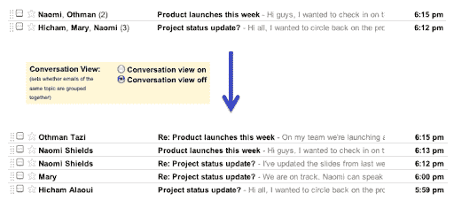

# 如何关闭 GMail 对话视图

> 原文：<https://www.sitepoint.com/gmail-conversation-view-off/>

即使是最狂热的谷歌抨击者也有一个 GMail 账户。不喜欢什么？它速度快，免费，提供几个 GB 的存储空间，并拥有最好的垃圾邮件过滤器之一。这很棒——即使你只是把它用于一次性网站注册。

不过其中比较有争议的一个功能是“对话视图”。这将相关的消息分组到线程中，并且从第一天起它就是唯一的选择。这是一个激烈辩论的话题:该视图工作良好，但如果你习惯于传统的收件箱，如(2010 年前)Outlook 或其他电子邮件客户端，则需要一点心理上的重新配置。

根据[谷歌的博客](https://googleenterprise.blogspot.com/2010/09/threaded-email-or-not-now-its-your.html):

> 我们真的希望每个人都能学会喜欢对话视图，但是我们意识到它不适合某些人。

许多人只是喜欢无线索收件箱。如果你属于这一类人，你会很高兴听到谷歌已经将对话视图设为可选。要改变它:

1.  点击屏幕右上角的“设置”链接。
2.  在常规选项卡上，选择打开或关闭对话(向下第六个选项)。

(请注意，该设施将于本周推出，因此您可能需要再等一两天才能看到。企业用户应该确保在 Google Apps 控制面板中选择了“启用预发布功能”。)

这是一个受欢迎的补充。我知道有几个人放弃了 GMail，或者在 GMail 上挣扎，因为对话视图与他们以前的经历太不一样了。自动线程化有很多好处——尤其是当你收到很多邮件的时候——但是标准收件箱更容易理解，对很多用户来说也很好用。

但是说真的，谷歌花了 6 年才实现这个选项！我想，迟到总比不到好。

你喜欢还是讨厌线程邮件视图？你是因为它而抛弃了 GMail 吗？新选项是否鼓励您重试该服务？

## 分享这篇文章