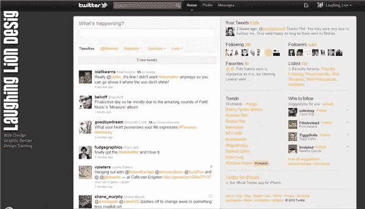
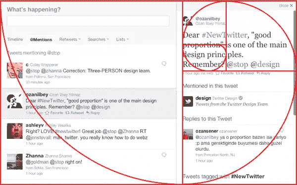
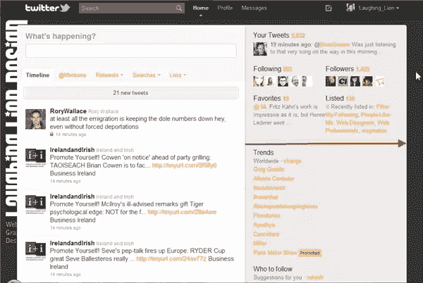
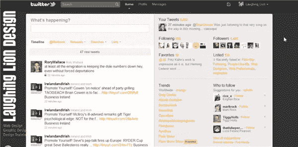
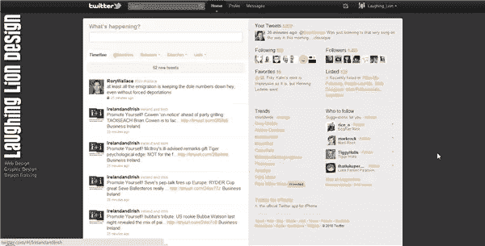

# Twitter 的新设计

> 原文：<https://www.sitepoint.com/new-design-for-twitter/>

Twitter 网站的设计已经发生了变化。这些变化包括在顶部有一个新的搜索栏，链接到你的个人资料和信息。左侧面板仍然保存着您的所有推文和消息，您可以在时间线、提及、转发、搜索和列表之间点击。

右手边的面板现在更大了，也更有条理了。在这里，您可以找到您的帐户信息、您的最后一条推文、您的关注者和您关注的人、最新趋势以及供用户关注的建议。

“显示更多”推文按钮已经消失，取而代之的是不间断滚动，当你滚动时推文就会被载入。

在 Twitter 的 flickr 页面上，Twitter 的创意总监 Doug Bowman 展示了一张覆盖着黄金比例曲线的设计图片，并附有以下简要说明:

> 对于任何对#NewTwitter 比例感兴趣的人来说，要知道我们并没有把这些比例留给运气。
> 
> 当然，这只适用于 UI 最窄的版本。如果您的浏览器窗口更宽，您的详细信息窗格将扩展以提供更大的效用，摆脱这些比例。但是最窄的宽度显示了我们开始的地方，比例。

与 DeviantART、Etsy、Flickr、Ustream、Vimeo 和 YouTube 等公司的新合作将允许多媒体嵌入流媒体，包括直接从 Twitter 主页播放视频内容的能力。

这些变化可能会使你定制的 Twitter 背景过时，因为新的设计是半流动的。无论显示器分辨率如何，左侧面板的大小似乎保持不变，而右侧面板的大小则各不相同。

*1024×768 像素* 

*1280 x 720 像素*

*1600 x 900 像素*

该设计将在未来几周推出，所以如果你还看不到它，它很快就会出现在你面前。

你觉得 Twitter 的新设计怎么样？你经常使用 Twitter 主页还是更喜欢使用诸如[**Tweetdeck**](http://www.tweetdeck.com/beta/)**和**[**Digsby**](http://www.digsby.com/)**之类的应用？**

## 分享这篇文章