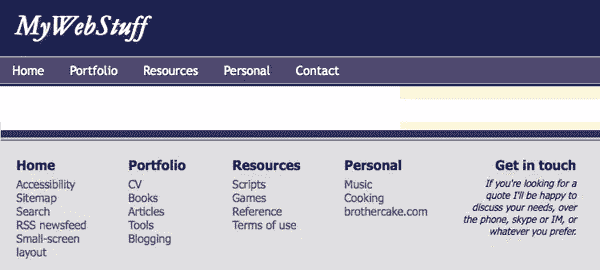
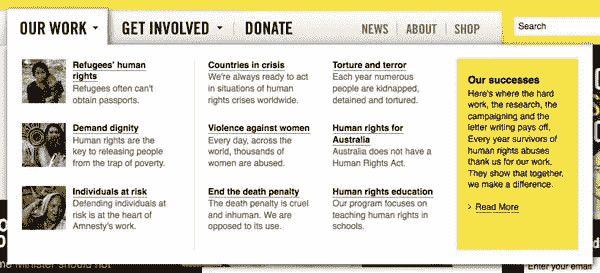

# 页脚是菜单

> 原文：<https://www.sitepoint.com/the-footers-the-menu/>

下拉菜单和弹出菜单经常伴随着一系列的可用性和可访问性问题——不稳定的行为，隐藏在文件夹下的内容，或者缺少键盘访问，等等。不过，在很大程度上，这些问题是可以解决的(参见:[“制作下拉菜单的正确方法”](https://www.sitepoint.com/the-right-way-to-make-a-dropdown-menu/))。

然而，还有另一个更难解决的问题:如何以及在哪里创建这些菜单使用的内容的问题。

基本上有两种选择:

*   **在硬编码的 <abbr title="HyperText Markup Language">HTML</abbr>** 中将菜单创建为分层列表。顶部导航栏是一个无序列表，它的每个子菜单都是一个嵌套列表，是触发它的顶层项目的子级。这种方法的问题是，它意味着在 <abbr title="HyperText Markup Language">HTML</abbr> 中创建一个大的结构，这对于屏幕阅读器和其他串行设备来说是相当烦人的。简而言之，当一些用户代理缺乏有选择地显示和隐藏内容的能力时，这是一大堆需要放入静态 HTML 的内容。
*   **即时生成菜单**。子菜单内容是根据需要从 JavaScript 中的配置数据创建的，并根据需要从顶级触发器中追加或删除。这种方法的问题是，如果没有脚本，或者在不支持或不触发触发事件的浏览器中，内容是不可访问的。这种解决方案依靠其他形式的导航(如网站地图)来弥补内容的不足。

这些解决方案都不完美；一个组的可用性降低，或者另一个用户组的可访问性降低。要是有第三条路就好了…

## 第三条路

下面的图片是一个简单的网页截图，它是许多网站设计的典型，因为它有一个页眉和一个页脚:

**一个样本网页的页眉和页脚**

页眉包含触发下拉菜单的主导航，页脚包含辅助导航。注意到他们有什么相似之处吗？

顶部导航栏中的每个链接都指向网站的一个主要部分。页脚中的每组链接都是针对网站的相同主要部分的。它们完全对应，当实现下拉菜单时，它很可能包含我们在页脚看到的相同链接。

换句话说，**页脚*就是*菜单**。那么为什么不把*字面意思*变成菜单呢？

## 让克隆人进来

让我们设计一个菜单，用一个链接列表作为顶部导航栏；然后，当鼠标或键盘事件触发下拉菜单出现时，我们将通过**克隆页脚链接**的相应部分来创建该菜单。

这是两全其美的事情:

*   我们确实有静态 <abbr title="HyperText Markup Language">HTML</abbr> 中的菜单内容，但是它是结构化的、可用的、不碍事的。默认情况下所有内容都在那里的可用性问题得到了解决。
*   我们正在动态地生成菜单，但是我们使用的内容仍然存在于静态的 <abbr title="HyperText Markup Language">HTML</abbr> 中。使用动态创建的菜单的可访问性问题得到了解决。

我做了一个功能齐全的演示来说明这个概念，这个菜单脚本来自我之前链接的下拉菜单。菜单脚本不完善；如果我有更多的时间，我会收紧事件流(并在 <abbr title="Internet Explorr 6">IE6</abbr> 测试它！)—但它应该可以很好地演示这个概念，如果你想进一步发展这个想法，这是一个很好的起点。

## 制作大型菜单

我们可以把这个概念更进一步！最近我为澳大利亚大赦国际做了一些工作，那里的网站设计需要包含大量内容的复杂的巨型菜单:

**大赦国际澳洲网站的巨型菜单**

该网站还有一个页脚，页脚中有结构化的链接，与我给你展示的第一个演示非常相似。

**来自同一站点的页脚**

所以我能够使用这种技术来实现基本菜单。但是我可以更进一步，在页脚链接中添加补充内容*隐藏在页脚中*。每个菜单链接的缩略图和长描述仍然存在于页脚中，但你只能看到主链接本身。区别只是 <abbr title="Cascading Style Sheets">CSS</abbr> —当链接列表在页脚时，附加内容是看不见的；当它们在大菜单中时，它是可见的并被重新设计了样式。

访问澳大利亚大赦国际网站来看看这是怎么回事。

如果你想进一步发挥这个想法，你也可以[下载一个演示压缩文件](https://www.sitepoint.com/examples/footermenu/demo.zip)。这是一个可以以多种方式扩展的想法；理论上，*任何*类型的动态内容都可以用这种方式设计——从页面的另一部分获取数据，在那里它以不同的形式存在。

## 分享这篇文章