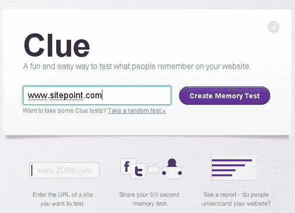
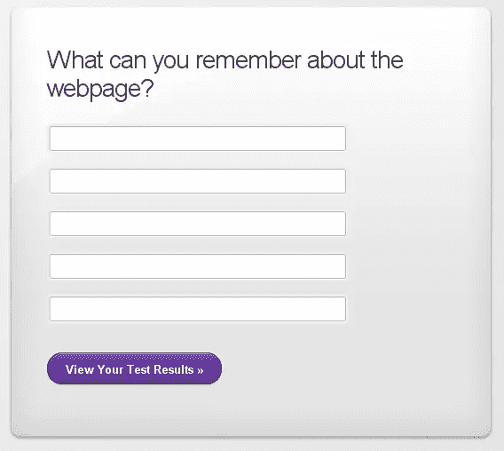

# 你的网站值得纪念吗？找到线索

> 原文：<https://www.sitepoint.com/is-your-site-memorable-find-out-with-clue/>

线索是一个全新的应用程序，可以让你测试访客对你的网站印象最深的是什么。这个应用是由 Zurb 开发的，他也制作了优秀的[弹跳应用](http://www.bounceapp.com/)，我在今年早些时候[评论过这个应用](https://www.sitepoint.com/share-your-design-ideas-get-feedback-with-bounce/)。

如果你想知道你的行动号召按钮是否产生了影响，你的标志是否以一种好的方式吸引了注意力，或者它压倒了页面上的所有其他东西，你的产品图片是否在五秒钟或更短的时间内达到了目的？Clue 是一个方便的免费工具，可以帮助网页设计者检查哪些部分比较突出。

要使用这款应用，你只需输入你想要测试的页面的网址，应用就会抓取一张截图，然后进行一个简短的记忆测试。

**五秒测试**

测试表明，网络用户的注意力持续时间非常有限，所以五秒测试背后的想法是，如果有什么东西在头五秒抓住了你。我在自己的网站上测试了它，感觉有点不舒服，因为我只记得一两件事。可能是熟悉滋生了轻视和遗忘，但这个测试确实让我想到了可以改进的地方。

不用说，还有一个社交媒体方面，你可以在推特、脸书、其他网站或通过电子邮件分享你的线索测试的链接。测试之后，你可以访问你的结果链接，看看人们对你的页面记住了什么。

如果你是一名艺术家或平面设计师，你可以将 Clue 与图像托管服务结合使用，找出你的平面设计、绘画或照片中最令人难忘的内容。只要图片可以上传，并且你有一个 URL，你就可以创建一个快速测试。

Clue 是一款免费且非常易于使用的应用程序，但显然是为名为 [Verify](http://www.verifyapp.com/) 的更大的商业应用程序设计的简单试用程序。Verify 有更多的功能，让你测试“页面给人的感觉如何，他们会点击页面的哪个位置，他们更喜欢两个版本中的哪一个”等等。

## 分享这篇文章