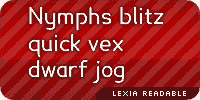
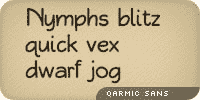
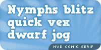

# 漫画无反击战

> 原文：<https://www.sitepoint.com/the-comic-sans-strikes-back/>

你必须同情可怜的文森特·康纳瑞。作为一名受人尊敬的商业摄影师，他拥有排版硕士学位，设计并[暗示](http://en.wikipedia.org/wiki/Font_hinting)了许多世界知名的字体，包括[投石机 MS](http://en.wikipedia.org/wiki/Trebuchet_MS) 和[喜鹊](http://www.daltonmaag.com/browse/fonts/dama/magpie)。

但是人们见到他会说什么呢？"嘿，你就是那个没有漫画的家伙，对吗？"

事实上，他在漫画上的工作几乎是事后的想法；解决了 Times New Roman 对于一只卡通狗来说是一种蹩脚字体的问题。

从那时起，我们看到了致力于镇压的家庭手工业的兴起:

*   大卫和霍利·库姆斯夫妇的 bancomicsans.com 从 90 年代末就开始抨击这种字体。
*   Safari 现在有了一个扩展，旨在从你的浏览体验中清除漫画 San。
*   为了向电影*[【Helvetica】](http://www.helveticafilm.com/)*致敬，斯科特·哈奇森和安东尼·梅多斯目前正在寻找资金来完成他们的纪录片 *[漫画 Sans 或世界上最讨厌的字体](https://vimeo.com/14690711)* 。
*   它甚至是笑话的笑柄:“喜剧演员 Sans 走进一家酒吧；酒保说，“我们不为你服务。"

不幸的是，正如无 Flickr 漫画集团所言，这种欢快但毫无艺术感的涂鸦没有任何要放弃的迹象。我们看到它被用在比以往更多的地方，从[商店招牌](http://www.flickr.com/photos/teflon/233319146/sizes/m/in/pool-69159300@N00/)到[产品包装](http://www.flickr.com/photos/doctorow/8238052/sizes/m/in/photostream/)到[墓碑](http://www.flickr.com/photos/doctorow/8238052/sizes/m/in/photostream/)。事实上，就在最近的 7 月份， [Ascender Corp 发布了一个为 Office 2010](http://www.fontmarketplace.com/font/ascender-2010-pack.aspx) 设计的字体包，宣传一个新的增强版漫画 San。

事实是，漫画诞生 15 年后，它仍在像禽流感一样传播。问题是，为什么？

很容易给 pat 设计师一个答案:“好吧，那些没有受过印刷训练的大众，他们不知道他们犯了什么样的错误。”然后为了达到效果，假装厌恶地翻白眼。

但这不仅仅是低级趣味。为什么漫画 San 会引起那么多日常用户的共鸣？有什么我们可以学习的吗？

### 漫画无:伟大的社会推动者

卡耐基梅隆大学最近的一项研究提出了一些有趣且有点令人不安的关于用户行为如何影响字体选择的发现。

在这项研究中，大学生们被问及他们过去曾经历过的尴尬和/或不道德的情况。它包括高度敏感的主题领域，如酒后驾驶和可卡因使用。

这份调查的 A 版被设计成看起来值得信赖和专业的，有着精致的字体选择和官方的大学品牌。

版本 B 采用了一种更轻松、有趣、随意的语调。它使用了无拘无束的漫画，并大量使用了现代文字语言，如“你有多坏？？？."

在调查前被问及时，所有用户都认为官方网站“更值得信赖”和“更专业”

然而，令人惊讶的是，结果表明，用户向漫画 Sans 调查透露的隐私细节几乎是官方页面的两倍。当在漫画中被问到同样的问题时，用户也认为*不太打扰*。某些东西让这些用户降低了他们的自然保护。

当然，还有其他因素促成了这一结果。你可能会说，大学品牌让人们有更多的理由担心后果。也许他们只是更愿意对漫画迷撒谎。

尽管如此，我认为还是有一些我们可以接受的事实。我们生活在脸书和 Twitter 的时代，不管喜欢与否，对于每一篇精心制作的博客帖子或给编辑的信，都有一千条一次性的推文、即时消息或墙更新。人类就是这样。

作为设计师，我们的首要工作是与用户建立联系——找到鼓励他们参与网站的方法。也许借用一种在外观和语言上有意识地未经修饰的风格可能是建立联系的最佳方式——即使这意味着采用你不喜欢的设计美学。

因此，这里有一个场景:你有一个带有会员注册页面的网站。会员数量与网站产生的收入直接相关。

如果 A/B 分割测试显示你的会员注册页面在漫画中显示的效果是两倍，你会这样做吗？

### 但是说真的，漫画桑斯？！

好的，我听到了。一定有几个温暖动人的替代品不会让你想钉死你的眼球？

去年，珍妮弗写了一篇关于这个问题的很棒的帖子，标题是“[朋友不要让朋友使用没有](https://www.sitepoint.com/friends-dont-let-friends-use-comic-sans/)的漫画。”我有三个个人最爱添加到列表中。

**[乐夏可读](http://www.k-type.com/?p=520)**

一个不太为人知的支持漫画的渠道是诵读困难群体。

通常，诵读困难症患者很难区分单个的字母形式，因此更依赖于识别一般的单词形状。

这意味着他们通常喜欢有长的上升和下降(即 b 和 p 上的词干)的不杂乱的无衬线字体。漫画桑斯莫名其妙的恶性传播往往使它成为最有可能符合要求的字体。

 令人高兴的是，嵌入式 web 字体的发展势头现在为我们提供了更多的选择。

K-Type 的 [Lexia Readable](http://www.k-type.com/?p=520) 在精神上类似于漫画 Sans，但更加精致。可以说，如果文森特知道这种字体会变得如此巨大，他就会设计这种字体。

Lexia Readable 个人使用免费，基本商业许可只需 10 美元。

 这个被巧妙地命名为 Qarmic Sans 的漫画是另一个了不起的 Sans 替代品。

乔安妮·泰勒的作品简洁而有机，从不显得笨拙。

Qarmic Sans 的另一个真正方便的方面是，它可以通过 FontSquirrel.com 的 T2 服务获得。除了标准的 TrueType 版本，它们还提供了浏览器就绪@font-face 代码，以及 iPhone 和 Internet Explorer 的替代格式。

**[HVD 漫画衬线](http://hvdfonts.com/)**

 我喜欢这种字体。没错，它不是严格意义上的手写字体，但它**是**的松散、有趣和非正式。字体设计师汉尼斯·范·多伦专门创造了它，作为漫画书的免费替代品，它让我想起了伟大的罗伯特·克鲁伯。抓住它。

## 漫画无:后记

在研究上一篇文章的过程中，我有一个*哇*的时刻，我想我应该和你分享一下。

我提到过，漫画的清晰度和比例经常使它受到患有诵读困难症的人的欢迎。我还注意到在墓碑上使用漫画 Sans 的一种非常规的用法，记录在[漫画 Sans Flickr 组织](http://www.flickr.com/groups/comicsans/)中。墓志铭的署名是“帕丽斯·因尼斯”

心血来潮，我决定在谷歌上搜索“巴黎旅馆”这个名字，它会返回一些关于一个叫巴黎旅馆的人在 1991 年写的一本书的参考资料。

这本书的名字叫做 [*战胜阅读障碍——一个男孩的故事*](http://www.paperbackswap.com/Defeating-Dyslexia-Boys-Paris-Innes/book/1856260062/) 。

现在，我没有办法确认这是同一个巴黎，但这将是一个相当令人信服的字体选择的解释。

有时字体选择不仅仅是纯粹的风格考虑。

## 分享这篇文章