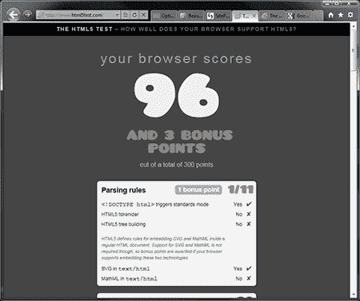
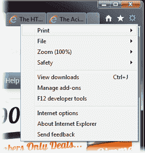
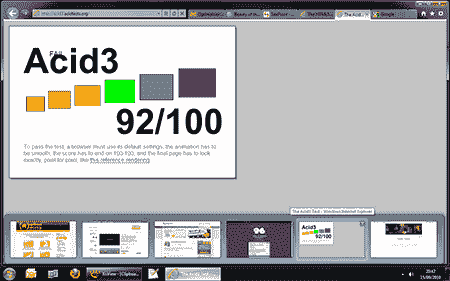
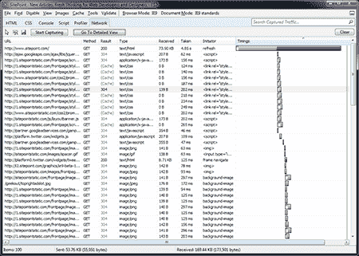

# IE9 测试版回顾

> 原文：<https://www.sitepoint.com/ie9-beta-review/>

它在这里。IE9 beta 1 在 IE8 发布 18 个月后到来。微软承诺了一个重要的更新，但是他们实现了吗？这篇评论是在使用了几个小时后写的。它们是第一印象，所以我的看法可能会随着时间的推移而改变…

## 装置

IE9 测试版可以从[**beautyoftheweb.com**](http://www.beautyoftheweb.com/)下载。这是一个厚颜无耻的域名，但微软已经制作了一个令人印象深刻的网站。我确信他们用少量的 Silverlight 作弊，但主要是 HTML5 和 jQuery 的可爱之处。

Windows 7 和 Vista 有 32 位和 64 位版本。如果你希望 64 位版本可以让你保留 32 位的 IE8，你会失望的——两个版本都更新了。该文件大小为 2.4MB，但在安装过程中会下载其他组件。完整安装大约需要 15 分钟，包括重新启动。我仍然觉得这对于一个浏览器来说有点可笑，但这并不比以前的版本差。

## 连接

没有真正的惊喜；IE9 的界面与[泄露的截图](https://www.sitepoint.com/ie9-screenshot-microsoft-leak/)相匹配。尽管 33%的 SitePoint 调查受访者认为这张照片是假的，我们还是仔细检查了它。

[ IE9 的界面——点击查看全图](https://blogs.sitepointstatic.cimg/tech/408-ie9-review-screenshot.png)

单个主工具栏包含后退、前进、地址栏(带有兼容性视图、刷新和停止图标)、选项卡、主页、收藏夹和工具。没有太多的空间放置标签，它们会迅速收缩。你可以调整地址栏的大小，但我很惊讶微软没有使用空白的标题栏空间。页面标题从不显示，所以我怀疑在未来的测试版中标签会上移。

工具选项是合乎逻辑的，尽管我会质疑其顺序。“打印”应该出现在顶部吗？也许这是因为微软想炫耀 IE 的打印设备——它们远远优于所有其他浏览器。

不幸的是，IE9 保留了完全混乱的互联网选项对话框。术语太多，选择不寻常，对新手帮助不大。高级用户还会纠结于奇怪的遗漏，例如记事本仍然是默认的 HTML 编辑器，不能用以前打开的标签页启动 IE。

如果需要，收藏夹、命令和状态栏仍然可用—右键单击图标或空白选项卡区域。不幸的是，IE9 的显示它的根源，它并不漂亮…

[ IE9 带收藏夹和命令栏——点击查看全尺寸](https://blogs.sitepointstatic.cimg/tech/408-ie9-review-bars.png)

正如你所料，Windows 7 集成非常出色，IE9 充分利用了任务栏功能，如 aero peek 和跳转列表。它工作得很好，尽管我更希望当鼠标悬停在小标签上时能看到预览。快速标签页屏幕也消失了？

[ IE9 Windows 7 功能–点击查看完整尺寸](https://blogs.sitepointstatic.cimg/tech/408-ie9-review-w7.png)

总的来说，默认界面干净，不张扬，明显受 Chrome 影响。虽然有一些小问题，比如裁剪后的按钮和减少的标签空间，但这是对 IE7/8 的巨大改进。

如果我能有一个最后的挑剔，那就是商标。微软在想什么？它从来没有特别的想象力，但新的玩具城版本并没有更好！

## 速度和稳定性

IE9 很快。非常快。如果速度是你换 Chrome 的唯一原因，IE9 将很快成为你的默认浏览器。冷启动最多需要 2 或 3 秒。接下来，打开和关闭 IE 是瞬间的，浏览器总是感觉反应灵敏。页面渲染速度很快，DirectX 在观看视频或快速动画时非常明显。

我怀疑微软正在使用预缓存占用内存的欺骗手段。此外，IE9 不恢复以前打开的标签，这进一步减少了启动时间。很少有用户会在意——他们只会欣赏 IE9 的速度和响应能力。

像 Chrome 一样，每个 IE9 标签作为一个独立的 Windows 进程运行，根据内容的不同，通常使用 6 到 60MB。Chrome 似乎每个标签使用的内存略少，但启动的进程更多，所以它们大致相当。稳定性对一个测试版产品来说是好的——我确实经历了一次崩溃和一些一次性的页面加载失败，但是浏览器标签仍然是打开的。

SunSpider 基准测试报告了一些有趣的 JavaScript 速度结果。在我的电脑上，Chrome 的成绩是 690 毫秒，IE9 32 位的成绩是 811 毫秒，略落后。这是对 IE8 的重大改进，但 IE9 64 位版的速度要慢得多，为 3，407 毫秒。

为了验证结果，我运行了最近的 [JavaScript 字符串连接测试](https://www.sitepoint.com/javascript-fast-string-concatenation)，结果更加奇怪:

*   IE9 32 位字符串串联运算符:5 毫秒
*   IE9 32 位数组连接:630 毫秒
*   IE9 64 位字符串串联运算符:12 毫秒
*   IE9 64 位数组连接:1，025 毫秒

IE9 中的连接操作符比 IE8 快，但是数组连接要差得多——大约慢 10 倍。为什么在 64 位操作系统上，32 位 IE9 的速度是 64 位版本的两倍？

在实践中，我怀疑许多人会经历缓慢的 JavaScript 性能。IE9 正在追赶 Chrome，但 IE 团队应该解决 64 位的问题。

## 网络标准

在我使用浏览器的有限时间里，我还没有遇到重大的布局问题。IE9 没有抛出任何惊喜，渲染和我预期的一样好或者更好。

HTML5 终于来了。IE9 beta 在[html5test.com](http://www.html5test.com/)的分数是相当低的 96/300，但是许多重要的设施是可用的，包括大多数新的标签、音频、视频、SVG 和画布。该浏览器缺少 HTML5 输入类型、地理定位和拖放等功能，因此我们只能希望微软选择在未来的版本中添加支持。

CSS3 有点不完整，但新的选择器和媒体查询得到了很好的支持，更常用的属性如多背景、框阴影、边框半径、不透明度、rgba 和 hsla 也得到很好的支持。IE9 在 [ACID3 测试](http://acid3.acidtests.org/)中得分 92/100——低于其竞争对手，但明显优于 IE8。

## 开发工具

自 IE8 以来，IE9 的开发工具有所改进，增加了一个新的网络选项卡来分析流量和延迟:

[ IE9 开发者工具——点击查看完整尺寸](https://blogs.sitepointstatic.cimg/tech/408-ie9-review-dev.png)

这是一个受欢迎的新增功能，但它比 Firebug 的 Net 选项卡或 Webkit 的开发者工具资源面板笨重且可用性差。

IE 的开发者工具总让人感觉像是在发布前几分钟匆忙安装在浏览器上的组件。它很有用，但是界面需要设计和可用性的彻底检查。我本来对生产 Visual Studio 的公司有更高的期望。

## 摘要

IE9 还处于早期阶段，但很明显这个浏览器已经超越了它的前辈一大步。IE8 的粉丝仍然会认可他们的浏览器，一些以前不满的用户会回来。

更简单的界面和惊人的速度是关键的改进——我肯定会在快速浏览的情况下使用它，也许会优先于 Opera 或 Chrome。也就是说，IE9 并不完美；界面需要调整，许多 HTML5 功能缺失。缺乏 XP 支持和稳定的更新时间表也令人担忧。

IE 团队在最终发布之前还有很多工作要做，但 IE9 测试版令人印象深刻。微软又回到了浏览器游戏中。

你喜欢 IE9 吗？请在下面留下您的评论，或者[在 SitePoint 投票](/)上投票。

## 分享这篇文章