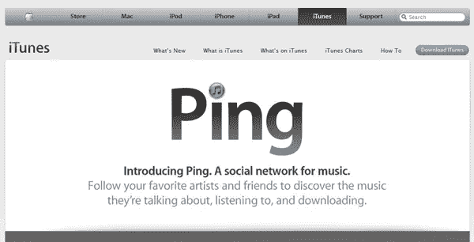
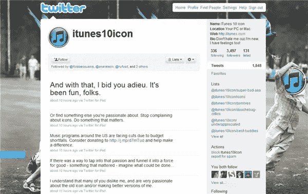

# 改变曲调:iTunes 的新图标设计

> 原文：<https://www.sitepoint.com/changing-tunes-new-icon-design-for-itunes/>

这算不上什么惊天动地的消息，但由于我们对这里的所有设计都感兴趣，我觉得应该提一下新的 iTunes 应用程序图标，它是随着上周 iTunes 最新版本的发布而出现的。就像所有与苹果相关的事情一样，它已经成为 Twitter 和博客上的一大话题。

新图标是一个相当普通的事情，深蓝色/黑色音符位于深蓝色玻璃风格的按钮上，带有阴影。最大的变化当然是去掉了音乐音符下闪亮的 CD。音符本身已经从一个光滑、有光泽、起泡的音符变成了更多的卡通风格。史蒂夫·乔布斯说，从图标中去掉 CD 的原因是*“我们认为这是合适的，因为，明年春天，看起来 iTunes 实际上将超过 CD 在美国的销量……我们认为‘也许是时候在标志中去掉 CD 了’。*

|  |  |
| 淘汰旧的… | 在新的时代。 |

这个图标也是苹果新的音乐社交网络 Ping 的一部分。

**

对这一图标的批评似乎大多是关于光滑的风格和斜面的边缘，有些人指责这是一种陈词滥调。也许是这样，但光滑不是苹果风格，或者至少是苹果非常流行的风格，并且被模仿对许多设计师有影响吗？查看 iTunes 主页上的文字处理，与光滑、倾斜、金属和反光的文字相比，图标看起来非常扁平。

其他人指出，iTunes 不再仅仅是一个在线音乐商店，而是一个巨大的娱乐中心，出售从书籍到电影的一切，这一点没有在图标设计中得到反映。查看[全新的](http://www.underconsideration.com/brandnew/archives/loony_tunes.php)文章，用幽默的眼光详细查看图标。

如果你想痛骂一番或轻轻拍拍它的背，你可以在 Twitter 上找到这个 iTunes10 图标为自己辩护。

新的图标设计会让你感到轻松还是冷淡？还是我们都有点太认真了？

## 分享这篇文章