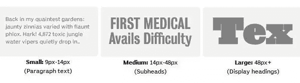

# Webtype.com 提供更多网络字体选项

> 原文：<https://www.sitepoint.com/more-web-font-options-with-webtype-com/>

你可能知道，像 [Typekit](http://typekit.com/) 和[谷歌字体预览](https://www.sitepoint.com/web-typography-made-easy-with-google-font-preview/)这样的服务为网页设计者提供了更多的灵活性和网页排版的选择。网络安全字体正慢慢成为过去。WebType.com 是另一项新的服务，提供“更好的网站，更好的类型”Webtype 的字体调色板是专门为 web 创建的，它们的字体是根据特定的目标大小准备的。

在以前的基于 flash 或图像的字体替换中，有一种趋势是只改变标题和副标题，而让主体文本保持“网页安全”字体。型设计师罗杰·布莱克说:

> Webtype 是第一个提供适合小尺寸阅读的 web 字体的服务，同时为 web 设计者提供了有趣的字体选择

可以按类别([衬线](http://www.webtype.com/catalog/style/?ts=692)、[无衬线](http://www.webtype.com/catalog/style/?ts=693)、[手写体](http://www.webtype.com/catalog/style/?ts=691)、[装饰性](http://www.webtype.com/catalog/style/?ts=828)、[标志&符号](http://www.webtype.com/catalog/style/?ts=782))或者按预期用途([小](http://www.webtype.com/catalog/intended/?ts=829)段落、[中](http://www.webtype.com/catalog/intended/?ts=866)副标题、[大](http://www.webtype.com/catalog/intended/?ts=830)大标题)浏览字体。要实现 Webtype 字体，您需要复制一大块在您选择字体时提供的 HTML，然后将其粘贴到您的 HTML 中。一旦它被粘贴进来，你可以在你的网站的 CSS 中指定字体。

所有 Webtype 字体都可以免费测试 30 天。你可以在这里看到全套的[计划](http://www.webtype.com/info/help/getting-started/#plan)，但是为了给你一个价格范围的概念，一个个人计划(例如为一个博客作者)提供每月 1GB 的带宽给多达 3 万个独立访问者，费用**从每年**10 美元起。流量大的网站的商业计划为每月 60 万的访问者提供每月 18 GB 的带宽，费用为每年 100 美元起。这些价格是针对单个 Webtype 字体的，而不是整个字库。

Webtype 是由字体和技术领域的几位专家合作而成，包括[字体局](http://www.fontbureau.com/)、 [Ascender](http://www.ascenderfonts.com/) 、[罗杰·布莱克](http://rogerblack.com/)、 [Petr Van Blokland](http://www.petr.net/) 和 [DevBridge](http://www.devbridge.com/) 。

## 分享这篇文章