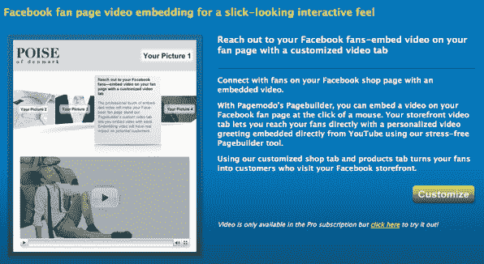
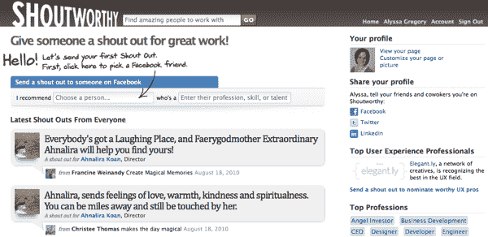
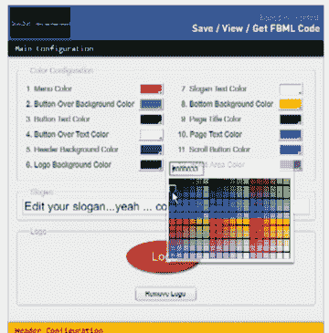
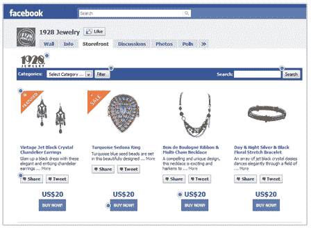
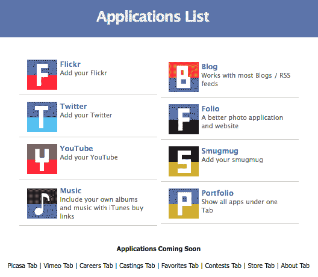

# 最大化脸书的五个新工具

> 原文：<https://www.sitepoint.com/tools-for-maximizing-facebook/>

既然我们今天[在谈论脸书](https://www.sitepoint.com/community-engaging-facebook-fan-page-techniques)，我想这将是一个合适的时间来分享一些最近推出的脸书应用和脸书扩展工具。

所有这些服务都致力于帮助您最大限度地利用粉丝页面和个人资料，无论是通过简化营销、设置协助还是与其他脸书用户联系。

## [页面模式](http://www.pagemodo.com)

  
Pagemodo 的 Pagebuilder 工具可以让你在没有任何技术或图形技能的情况下，定制设计并构建自己的脸书页面，并即时发布到脸书。这是一项免费服务，允许用户添加图片、嵌入视频、改变颜色、输入文本等等。

## [Shoutworthy](http://shoutworthy.com)

  
不仅仅局限于脸书，Shoutworthy 可以让你认识到你雇佣过的、合作过的或者仅仅是见证过他们出色工作的人，并通过社交网络与他人分享他们的成就。你注册 Shoutworthy，然后选择一个你在脸书的联系人，把你的评论贴在他们的墙上和 Twitter 上，然后推荐给他们。

## [静 520](http://static520.com)

 

Static 520 为那些不习惯为 Web 创建内容的人，或者那些想要更快完成的人，消除了创建自定义 FBML 页面的一些困难。您只需在您的粉丝页面上选择您想要的内容和布局，Static 520 就会创建代码。然后你复制并粘贴到你的静态 FBML 应用程序。

## [店面社交](http://storefrontsocial.com)

 

Storefront Social 脸书应用程序允许您直接从您的粉丝页面为您的粉丝创建购物体验。您可以突出显示产品，鼓励分享，提供折扣，并允许购买者点击立即购买，并自动连接到您的购物车。

## [Tabfusion](http://www.tabfusion.com)

 

Tabfusion 为您的脸书个人资料或粉丝页面提供了一系列应用程序，允许您自定义您的标签。他们目前有 Flickr、Twitter、YouTube、博客、音乐和其他一些应用程序，还有一系列应用程序即将推出。

你用过这些吗？你还使用其他工具或应用程序来处理你的脸书个人资料或粉丝页面吗？

## 分享这篇文章