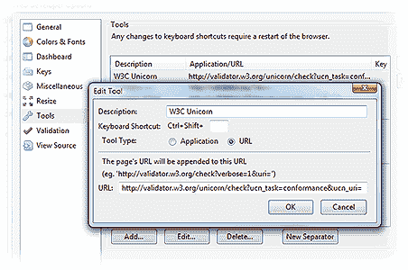

# 用 Unicorn 轻松检查代码:W3C 的统一验证器

> 原文：<https://www.sitepoint.com/w3c-unicorn-validator/>

作为一名 SitePoint 读者，您理解代码验证的重要性。即使你不是一个语义巫师，当你知道你的 HTML 和 CSS 是有效的时候，修复问题也容易得多。有许多在线和离线工具可以帮助您的验证工作，但是您通常需要分别测试 HTML、CSS 和提要。HTML5 验证器也供不应求。

W3C 的独角兽项目可以拯救你的理智。这是一个统一的系统，它聚集了来自几个验证器的结果，以产生一个单一的标记报告。它包括以下检查:

*   HTML —包括 HTML4、XHTML 和 HTML5
*   CSS 1、2、2.1 和 3(尽管它似乎默认为 2.1)
*   SVG 基本和微小
*   移动设备'适用性'
*   包括 RSS 和 Atom 在内的格式的提要检查器

这个工具可以在 validator.w3.org/unicorn/在线使用，或者你可以在 T2 下载开源的 Java 代码离线使用。

## Web Developer 工具栏集成

如果你使用的是火狐浏览器的 WDT 扩展(不是 Chrome——抱歉),你可以添加 Unicorn 作为验证工具。打开 WDT 选项对话框，在左侧窗格中选择**工具**。点击**添加**然后进入:

*   **W3C Unicorn** 获取描述
*   为工具类型选择 **URL** ，以及
*   输入网址
    `http://validator.w3.org/unicorn/check?ucn_task=conformance&ucn_uri=`

确定你的出路，你现在应该在你的 WDT 工具菜单中找到独角兽条目。

你试过独角兽吗？你的网站通过验证了吗？你会经常使用这个工具吗？

## 分享这篇文章