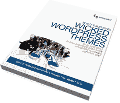

# 席卷全球

> 原文：<https://www.sitepoint.com/wordpress-taking-the-word-by-storm/>

WordPress。很性感。太好了。太棒了。无论你选择如何描述它，不可否认 WordPress 是一股不可忽视的力量。

2010 年 6 月，WordPress.com 上有 1，140 万个博客，加上 1，380 万个 WordPress.org 软件的活跃安装。这意味着今天至少有 1400 万人使用 WordPress 主题——而且这个数字还在疯狂增长！

这就是你的用武之地。

我们的新书*构建你自己邪恶的 WordPress 主题*将向你展示如何成为一个成功的主题作者，给你每月高达 25K 美元的收入潜力！令人印象深刻，是吧？

想加入行动吗？[点击此处获取您的副本](https://www.sitepoint.com/premium/library)。

全明星阵容的作者包括主题框架大师艾伦·科尔；WordPress 向导，Raena Jackson Armitage 畅销主题作家布兰登·r·琼斯；和在线市场专家 Jeffrey Way，这本书包含了你需要的所有专业知识来构建销售的 WordPress 主题。

你会了解到:

*   有效地使用设计元素来创造惊人的主题
*   利用专题框架的力量
*   创建颜色变体和自定义小部件
*   应用你现有的 CSS 技能来修饰你的主题
*   推广和销售你的主题以获取最大利润

[点击此处获取您的副本](https://www.sitepoint.com/premium/library)。

* * *

## 分享这篇文章