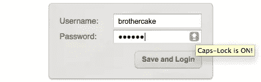

# 更好的密码#3:大写锁定警告

> 原文：<https://www.sitepoint.com/better-passwords-3-caps-lock-warnings/>

到目前为止，我已经研究了两种提高密码字段可用性的可能解决方案；其中，第二个想法——添加一个[“显示密码”复选框](https://www.sitepoint.com/better-passwords-2-show-password/)，将该字段转换为纯文本——比第一个想法(创建类似 iPhone 的[“屏蔽密码”字段](https://www.sitepoint.com/better-passwords-1-the-masked-password-field))更受欢迎。

总的来说，show-password 方法似乎更简单直接，对用户更有意义，并且更好地解决了原来的问题。但是它并不完美，因为它有自己的可用性问题(根据它是如何实现的，正如我们所看到的)。

更重要的是，这两种想法都有一个问题，那就是它们有可能增加在屏幕上显示密码的风险。尽管只是通过用户操作，但两者都将你的部分或全部密码暴露在纯文本视图中，这只是他们所做的一个事实。然而，这是这个问题的开始！

也许我们不得不接受这个解决方案再次引发了问题，密码只要出现在屏幕上就需要被混淆。我们可以走另一条路，完全停止混淆密码，像一些人主张的那样，承受后果；就我个人而言，我觉得很难接受。

想到这些，我又有了一个不试图解决如此完整问题的想法；它只是解决了一个特定且常见的用户错误。在大多数操作系统的主用户登录字段中，您几乎肯定见过这种情况。

## 大写锁定警告

这个想法很简单，当用户在启用了 caps-lock 的情况下输入密码时，会显示一个**警告。它可能是一个文本警告，或者某种图标。这是对密码字段可用性的一个简单补充，可以防止输入意外的大写字母。**


**带有大写锁定警告图标的登录表单**

这个行为实际上已经在 Mac/WebKit 浏览器中实现了*，比如 Safari。因此，我将向您展示一个脚本，它以一种干净和渐进增强的方式将其添加到所有浏览器的`"password"`字段中。*

请看一下演示，并获取一份脚本副本:

*   **[大写锁定警告演示](https://www.sitepoint.com/examples/password/CapsLockWarning/demo.html)**
*   **[下载脚本](https://www.sitepoint.com/examples/password/CapsLockWarning.zip)**

## 脚本如何工作

首先，我们必须创建警告元素本身。这只是一个具有指定名称的`class`的 <abbr title="HyperText Markup Language">HTML</abbr> `<strong>`元素，以及一个也复制到其`title`的短消息文本。

在这种情况下，消息只是说 <q>Caps-Lock 已打开！</q>；它的样式使得文本不可见，只有一个小图标叠加在输入的右侧。它几乎与 Mac/WebKit 浏览器中使用的图标相同(并且与现有的功能相协调)，所以有些人可能已经很熟悉了。

正是如此，它可以以这种方式设计，它有工具提示和文本(脚本从文本复制工具提示)。如果你愿意，也可以通过显示文本使它在视觉上更加明显；该演示包括一些可供选择的风格，你可能会喜欢尝试。

最终，脚本会像这样转换标记:

```
<label for="pword">Password:</label>
<input type="password" id="pword" name="pword" />
```

…要像这样标记:

```
<label for="pword">Password:</label>
<span>
    <input type="password" id="pword" name="pword" />
    <strong class="capslock-warning" title="Caps-lock is ON!"
         style="display:none;">
         Caps-lock is ON!
     </strong>
</span>
```

如您所见，默认情况下使用`display`隐藏警告元素。脚本的另一项工作就是在适当的时候显示和隐藏警告。

## 检测大写锁定

实际上，*无法直接检测*是否启用了大写锁定。在一些浏览器中，我们可以检测到`caps-lock`键本身的按键事件，但是为了有用，我们必须首先知道它是被启用还是被禁用——这是我们无法做到的！

然而，我们可以*通过我们接收到的输入数据`onkeypress`间接推断*大写锁定的使用；本质上:**如果**输入的字符是大写字母 <q>A</q> 到 <q>Z、</q>T10、而`Shift`键是*未按下*、**那么**我们可以推导出大写锁定的用法。

在这种情况下，我们显示警告元素。

从那个位置，我们可以推断出按下`caps-lock`键上的*下一个*键本身就是*禁用*大写锁定，所以我们可以继续隐藏警告。不是所有的浏览器都报告这个事件(例如 Opera 和 WebKit 浏览器)，但是它是不重要的功能，只是一个额外的接触。

内务处理的最后一点是，当密码字段失去焦点时，如果警告元素可见，通常会将其隐藏。

## 被施魔法的

就是这样！一个非常简单的剧本，一个非常简单的工作。它未能解决密码混淆问题，但它本身也没有产生任何问题。

*缩略图致谢: [123 色度像素](http://www.flickr.com/photos/123chromapixels/2991450281/)*

## 分享这篇文章