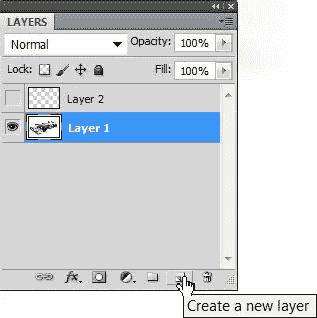
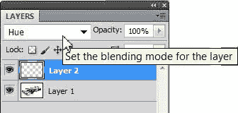
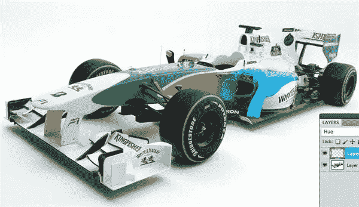

# 在 Photoshop 中使用色相混合模式更改颜色

> 原文：<https://www.sitepoint.com/change-colors-in-photoshop-with-the-hue-blend-mode/>

在 Photoshop 中，有几种方法可以重新绘制或更改对象的颜色。在这个简短的教程中，我们将看到一个非常简单的方法，通过在一个单独的层上绘画来重新着色，然后使用混合模式来“应用”新的绘画工作。混合模式允许您控制不同图层上的颜色如何相互作用。所以让我们开始吧。

1.打开要更改对象颜色的图像。这张图片是来自 [Formula 1](http://www.f1-site.com/wallpapers/2010/f1/presentation/forceindia/force-india-vjm03-f1-wallpaper-2010-1.jpg) 网站的免费壁纸。

2.点击图层面板底部的新建图层图标，在图片上方新建一个图层。

3.点击图层面板顶部的混合模式菜单，设置新图层的混合模式为色相。

4.选择笔刷工具(B ),然后点击前景色选择你想要应用的颜色。使用拾色器挑选一种颜色，然后单击“确定”。

5.开始在你要改变颜色的物体上的新层上绘画。因为你正在绘制的图层应用了色相混合模式，所以绘制不会不透明。高光、阴影和光亮都处理得非常好。

6.如果你犯了一个错误或“走到线外”,你可以切换到橡皮擦工具(E ),仔细擦除新的颜色。由于混合模式的改变，这对于这个图像来说不是太大的问题。如果你在底层的白色像素上绘画，颜色不会改变。在这个例子中，我用浅蓝色笔刷绘制了橙色和红色的制服。

7.最后，为前景选择另一种颜色，并在轮胎上的绿色车身和绿色条纹上涂色。

这只是在 Photoshop 中改变颜色的许多方法之一。这是非常快速和容易的，处理高光和阴影非常好。

## 分享这篇文章