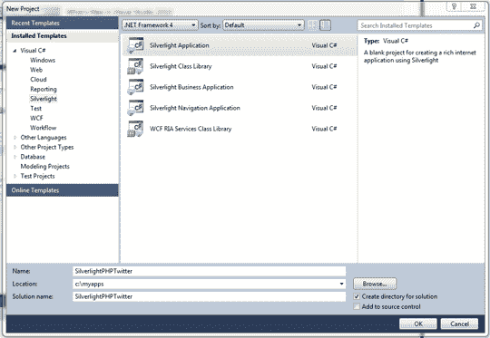

# Silverlight 和 PHP，第 2 部分:创建简单的 Twitter 客户端

> 原文：<https://www.sitepoint.com/silverlight-php-twitter/>

在我的[上一篇文章](https://www.sitepoint.com/article/php-silverlight)中，我谈到了如何用 PHP 创建一个简单的 web 服务，并使用来自 [Silverlight](http://www.silverlight.net/getstarted/) 的服务。本文将借鉴那篇文章中的概念，在 Silverlight 中创建一个非常简单的 Twitter 客户端。

在过去的几年里，像 Twitter 这样的服务变得非常受欢迎，不仅仅是因为它们以消费者为中心，还因为它们开放了自己的 API 供开发者使用。例如，Twitter 通过 RSS 和 ATOM feeds 公开了大量数据，因此加载数据就像一个结构良好的 URL 调用一样简单。然后 Silverlight 能够处理这个提要并从中提取内容(在本例中是 Tweets)。

我们将在本文中构建的应用程序将允许您输入 Twitter 搜索词，并显示 Silverlight 中收到的推文。不幸的是，这个过程并不像从 Silverlight 加载 URL 那么简单，因为存在跨域访问策略。

在我们开始之前，强烈建议您阅读我以前关于 PHP 服务和 Silverlight 的文章，因为我在那里介绍的基本信息是我们在这里讨论的前提。

这一次，我们有一个微软赞助的[文章测验](https://www.sitepoint.com/quiz/microsoft/silverlight-php-twitter)来测试你完成后的学习。

## 什么是跨域访问？

Silverlight 和其他 RIA 技术(如 Adobe Flash)被限制为只能从其原始域访问数据。

例如，如果您在`http://www.mysite.com`托管您的 Silverlight 应用程序，您可以从您的 Silverlight 应用程序中自由加载来自该站点的任何 URL。然而，如果你试图从`http://www.yoursite.com`加载一些东西，调用将被阻止，你将在 Silverlight 中收到一个 404 错误——即使 URL 是正确的。

绕过这个限制的一个方法是在站点的根目录下放置一个 [`clientaccesspolicy.xml`](http://msdn.microsoft.com/en-us/library/cc645032(VS.95).aspx) 文件。Silverlight 将查找该文件，如果该文件存在(并且设置正确)，Silverlight 将获得访问其他服务器上的 URL 的权限。请注意，图像和其他媒体不受此限制。这与应用于浏览器中 JavaScript 的限制相同。有关 Silverlight 中跨域访问的更多信息，请参见[http://msdn . Microsoft . com/en-us/library/cc 645032(vs . 95)。aspx](http://msdn.microsoft.com/en-us/library/cc645032(VS.95).aspx) 。

### 解决方案

有一种相当简单的方法可以解决这些跨域访问限制。Twitter 没有提供 Silverlight 可以用来访问 Twitter APIs 的`clientaccesspolicy.xml`文件。然而，这些限制只适用于 Silverlight，而不适用于您编写的任何服务器端代码。因此，一个解决方法是在您的服务器上创建一个 web 服务，Silverlight 可以自由访问它，没有域限制，它将充当加载 Twitter 数据的代理。

所有这些听起来像是很多额外的工作，但是正如我们将看到的，它实际上相当简单。让我们从创建 PHP web 服务来访问 twitter 搜索开始。

## 从 PHP 搜索 Twitter

在我的[上一篇文章](https://www.sitepoint.com/article/php-silverlight)中，我描述了如何用 PHP 建立一个 web 服务。除了对 WSDL (Web 服务描述语言)文件和 PHP 服务文件进行一些更改之外，设置这个 PHP 服务需要完成的所有步骤都是相同的。此外，`index.php`文件已经被修改为指向新的 Silverlight XAP 包(您需要在 Visual Studio 中构建该文件，然后复制到您的 PHP 站点)。

首先创建一个新文件来保存新 web 服务的 WSDL，名为`twitterSearchService.wsdl`。这是 PHP 用来配置公开服务的文件。Visual Studio 还使用它来创建访问服务的类。

该文件需要包含以下内容(假设您的服务位于 web 根目录下名为`php`的目录中，否则只需根据需要更改路径):

**例 1。`php/twitterSearchService.wsdl`**

```
<wsdl:definitions      xmlns:soap="http://schemas.xmlsoap.org/wsdl/soap/"     xmlns:SOAP-ENC="http://schemas.xmlsoap.org/soap/encoding/"     xmlns:wsdl="http://schemas.xmlsoap.org/wsdl/"     xmlns:xsd="https://www.w3.org/2001/XMLSchema"     xmlns:tns="http://schema.example.com"     targetNamespace="http://schema.example.com">  <wsdl:types>    <xsd:schema targetNamespace="http://schema.example.com"/>  </wsdl:types>  <message name="getTwitterSearchRequest">    <part name="searchText" type="xsd:string"/>    <part name="lastTwitterId" type="xsd:string"/>  </message>  <message name="getTwitterSearchResponse">    <part name="getTwitterSearchReturn" type="xsd:string"/>  </message>  <wsdl:portType name="twitterSearchServicePortType">    <wsdl:operation name="getTwitterSearch">      <wsdl:input message="tns:getTwitterSearchRequest"/>      <wsdl:output message="tns:getTwitterSearchResponse"/>    </wsdl:operation>  </wsdl:portType>  <binding name="twitterSearchServiceBinding"       type="tns:twitterSearchServicePortType">    <soap:binding style="document" transport="http://schemas.xmlsoap.org/soap/http"/>    <wsdl:operation name="getTwitterSearch">      <soap:operation soapAction="urn:ageService/getTwitterSearch" style="document"/>      <wsdl:input>        <soap:body use="literal"/>      </wsdl:input>      <wsdl:output>        <soap:body use="literal"/>      </wsdl:output>    </wsdl:operation>  </binding>  <wsdl:service name="twitterSearchService">    <wsdl:port name="twitterSearchServicePort"         binding="tns:twitterSearchServiceBinding">      <soap:address location="http://localhost/php/twitterSearchService.php"/>    </wsdl:port>  </wsdl:service></wsdl:definitions>
```

这个文件与我在上一篇文章中使用的 WSDL 只有一点不同:名称已经更改，第二个参数已经添加到搜索请求中，响应返回类型从整数更改为字符串。

接下来，创建第二个名为`twitterSearchService.php`的文件。您会注意到 WSDL 文件引用了这个文件名。

让我们从配置 PHP 文件来公开 web 服务开始。在`<?php`标记内，添加以下代码:

**例二。`php/twitterSearchService.php`(节选)**

```
ini_set("soap.wsdl_cache_enabled", "0"); $server = new SoapServer("twitterSearchService.wsdl"); $server->addFunction("getTwitterSearch"); $server->handle();
```

与前一篇文章一样，这段代码加载 WSDL 文件，并添加一个指向名为`getTwitterSearch`的函数的指针，该函数将被用作执行 web 服务调用的实现代码。

考虑到这一点，您需要创建一个名为`getTwitterSearch`的新函数。

在刚刚粘贴到文件中的代码上面，创建一个名为`getTwitterSearch`的新函数，带有两个参数: *`searchText`* 和 *`lastTwitterId`* 。这些参数将被组合成一个 URL 来访问 Twitter 搜索 API。而 *`searchText`* 则相当明显， *`lastTwitterId`* 则未必。它用于指示搜索只查找自上次搜索以来发布的推文。这可以防止在后续搜索中返回相同的推文。

**例 3。`php/twitterSearchService.php`(节选)**

```
function getTwitterSearch($searchText, $lastTwitterId) {  ⋮}
```

该函数的代码非常简单:

**例 4。`php/twitterSearchService.php`(节选)**

```
function getTwitterSearch($searchText, $lastTwitterId) {  $searchUrl = "http://search.twitter.com/search.atom?q=".$searchText;  if(!empty($lastTwitterId)){    $searchUrl = $searchUrl."&since_id=".$lastTwitterId;  }  $twitterAtom = file_get_contents($searchUrl);  return $twitterAtom;  }
```

首先，使用参数`q`将搜索文本与 Twitter 搜索基础 URL 连接起来。如果`$lastTwitterId`不为空，它将作为参数`since_id`添加到搜索 URL 中。第一次搜索时，`$lastTwitterId`参数将为空，因为还没有加载 tweets。

然后用传入的搜索 URL 调用 PHP 函数`file_get_contents`。`file_get_contents`支持 URL 输入，从外部 URL 加载数据非常容易。然后将结果返回给 Silverlight 客户端。就这样:PHP 工作完成了。如此简单！

## Silverlight Twitter 客户端

既然已经有了加载 Twitter 搜索数据的服务，就可以创建 Silverlight 客户端了。首先在 Visual Studio 中创建新的 Silverlight 项目。出于本文的目的，我使用了 Visual Studio 2010 和 Silverlight 4 工具，但是 Silverlight 3 也应该可以工作(与 Visual Studio 2008 一起)。

按照上一篇文章中概述的步骤创建 Silverlight 项目；这次我们称它为 SilverlightPHPTwitter，如图[图 1，“创建一个新的 Sliverlight 项目”](#fig_newproject "Figure 1. Creating a new Sliverlight project")。

**图一。创建一个新的 Sliverlight 项目**



输入文件名后，您可以继续选择默认设置，直到看到您的 Silverlight 项目已经创建。您将看到`MainPage.xaml`文件已经准备好，可以开始添加代码来加载一些推文了！

## 分享这篇文章