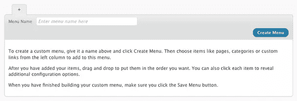
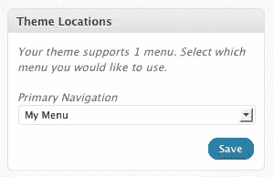
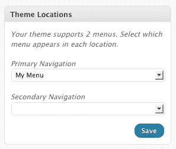

# 如何使用 WordPress 3.0 中新的自定义菜单功能

> 原文：<https://www.sitepoint.com/how-to-use-the-new-custom-menu-feature-in-wordpress-3-0/>

最近发布的 WordPress 3.0 最受欢迎的特性之一是增加了可定制的菜单。以前，用户不得不依靠他们的主题(或黑客)为他们的网站提供导航菜单，但是现在他们可以从 WordPress 仪表板编辑网站菜单。

我将首先向您展示这个功能在默认的新 WordPress 主题 Twenty Ten 中是如何工作的；然后，我会告诉你一些不同的方法，你可以在你自己的主题中使用它。

我假设你已经安装并运行了 WordPress 3.0。让我们先来看看新的菜单界面。点击 WordPress 仪表盘外观面板中的菜单，你会看到一个创建你的第一个菜单的界面:


**添加新菜单**

一旦你添加了一个菜单，页面左侧的界面就会被激活:你现在可以添加类别或页面到你的菜单，以及任何你喜欢的外部或内部链接。您还会看到一个对话框，告诉您您的主题支持菜单，并要求您为主导航分配一个菜单:

 **二十个十个主题的主导航**

这个主要导航是什么？它是显示在 Twenty Ten 主题标题图像下方的主菜单。您可能会问，为什么在您创建和分配自定义菜单之前，该菜单中就已经有元素了？好问题。

WordPress 3.0 的新菜单功能依赖于 [`wp_nav_menu`](http://codex.wordpress.org/Function_Reference/wp_nav_menu) 功能，这是一个聪明的功能。如果用户没有定义任何菜单，`wp_nav_menu`将返回标准的`wp_page_menu`，显示网站页面列表。这就是你现在所看到的。但是，如果您从主导航下方的下拉菜单中选择新菜单并单击 Save，您的自定义菜单将替换默认页面列表。

那么，现在你知道了新的菜单功能是如何工作的，但是你如何在你的主题中使用它呢？嗯，最简单的方法是在你希望自定义菜单出现的地方调用`wp_nav_menu`。就像帖子缩略图和 widget 化区域一样，你的菜单首先需要在 WordPress 上注册。让我们来看看 Twenty Ten 是如何做到这一切的。首先，在`header.php`中，我们找到了对`wp_nav_menu`的调用:

```
 < ?php wp_nav_menu( array( 'container_class' => 'menu-header', 'theme_location' => 'primary' ) ); ?> 
```

这比一个简单的调用要复杂一点，但也不会复杂太多:`container_class`简单地指定了将包装菜单的`div`的`class`属性，而`theme_location`告诉 WordPress 我们想要使用哪个注册的菜单。

为了找出菜单在哪里注册，我们需要转到`functions.php`，在那里我们找到了对名副其实的`register_nav_menus`函数的调用:

```
 // This theme uses wp_nav_menu() in one location.
register_nav_menus( array(
	'primary' => __( 'Primary Navigation', 'twentyten' ),
) ); 
```

这里使用的`'primary'`键对应于`wp_nav_menus`调用中指定的`primary`位置。我们来分析一下。我们告诉 WordPress，我们的主题将有一个菜单位置，称为`primary`，并将作为主导航显示给用户。然后，在头中，我们调用`wp_nav_menu`，向它请求用户分配给主位置的任何内容。很简单。

现在，如果你想给你的 WordPress 主题添加一个二级菜单会怎么样呢？就这么办吧。首先复制一份 2010 主题，在`style.css`中编辑主题信息，给它起一个你自己的名字。然后我们将更改`functions.php`中的部分，以注册一个额外的菜单:

```
// This theme uses wp_nav_menu() in two locations.
register_nav_menus( array(
  'primary' => __( 'Primary Navigation', 'twentyten' ),
  'secondary' => __('Secondary Navigation', 'twentyten')
) ); 
```

然后，无论你想让二级菜单出现在你的主题中的什么地方，只要简单地点击下面的按钮:

```
< ?php wp_nav_menu( array( 'theme_location' => 'secondary' ) ); ?> 
```

你就完了。如果您在仪表板中加载菜单界面，您现在会看到另一个下拉菜单，允许您选择第二个菜单:

 **我们的二级菜单**

## 从这里去哪里？

当然，除了我刚刚提到的，还有更多关于`wp_nav_menu`和新菜单的功能。和往常一样，你通往 WordPress 启蒙之路的第一站是[抄本](http://codex.wordpress.org/):你很快就会看到，`wp_nav_menu`有相当多的选项可供选择。当然，不要忘记每一个 web 开发人员面对新玩具时经过时间考验的技术:实验！

## 分享这篇文章