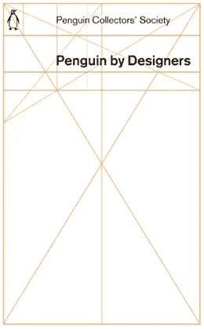
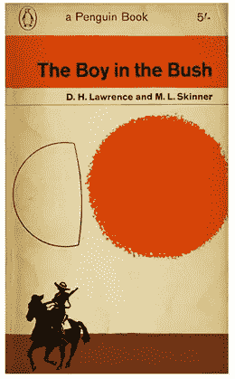
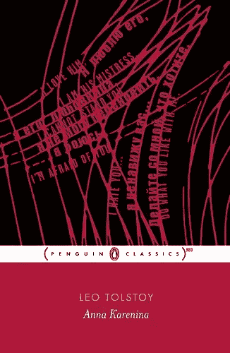
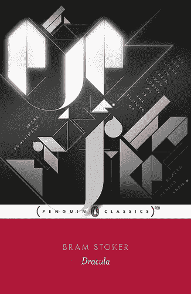
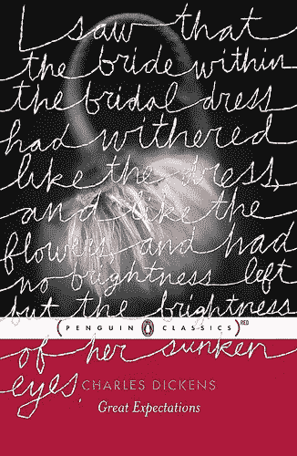
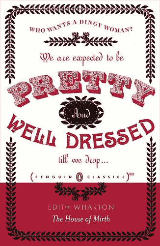
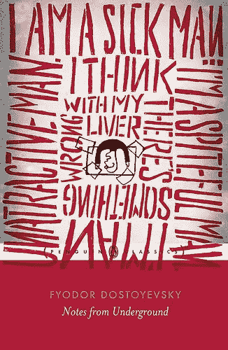
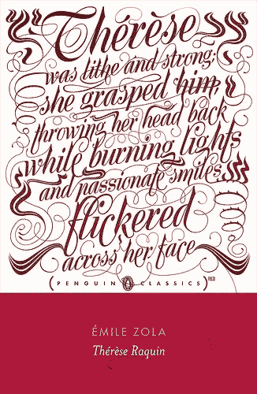
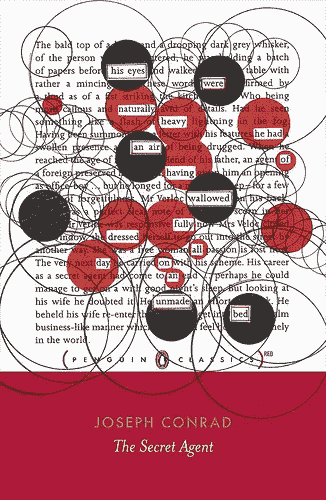
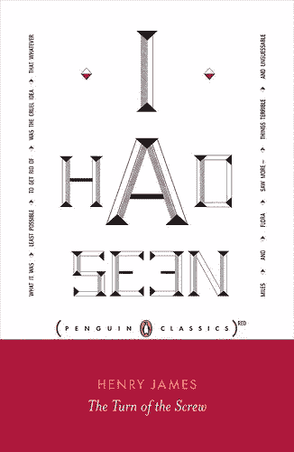

# 企鹅红封面重新设计

> 原文：<https://www.sitepoint.com/red-cover-re-design-for-penguin/>

企鹅图书因其独特的图书封面设计而久负盛名。我小时候喜欢封面，多年后，现在作为一名设计师，我更欣赏许多企鹅书籍封面上的网格布局，1946 年，德国印刷工人 Jan Tschichold 被任命为设计负责人，为所有企鹅书籍设计了严格的设计模板，还接受了一些书籍的插图封面。

这些模板在企鹅图书封面上使用了很多年。

 

最近，企鹅与 RED、艾滋病意识基金和一个新的设计师团队合作，为企鹅经典作品制作了八个新封面。新的封面底部有一个大的红色带，以及熟悉的企鹅标志，位于“企鹅经典”字样的中间。在红色的带子上面，每本书都以独特的印刷风格引用了书中的一段话。在一些书上，印刷字体将商标溢出到红色的带子上。最初的八个重新设计中的三个是由企鹅设计师吉姆·斯托达特、科拉莉·比克福德-史密斯和斯蒂芬妮·波萨维克在内部创作的，其余的封面分别由五个不同的设计师或工作室设计。

这是前八个封面:

燃料设计的安娜·卡列尼娜

非格式设计的德古拉

斯蒂芬妮·波萨维克设计的《远大前程》

内森·伯顿设计的欢乐之家

格雷 318 设计的《地下笔记》

由吉姆·斯托达特设计的 Therese Raquin

科拉莉·比克福德-史密斯设计的秘密特工

由弗里斯工作室设计的螺钉转动

在企鹅经典红色旗帜下重新发行的下一本书是由企鹅读者选择的《呼啸山庄》,还没有预览。你可以在这里阅读更多关于红色和企鹅合作背后的哲学。

你觉得这些新设计怎么样？

## 分享这篇文章