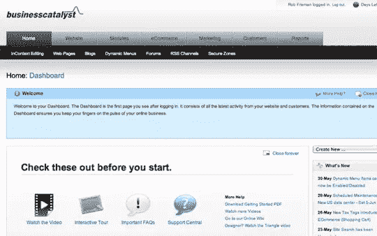
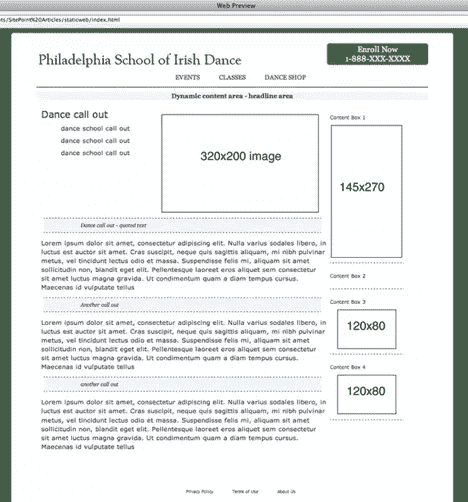
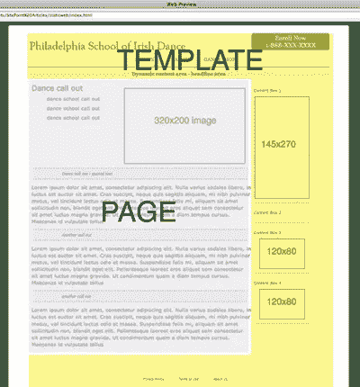

# Adobe Business Catalyst 简介

> 原文：<https://www.sitepoint.com/intro-business-catalyst/>

经济不景气的好处是，它让企业专注于基本要素，并迫使它们从销售的每件产品和每种客户关系中获取尽可能多的价值这对我们的设计室和客户都是如此。对于许多设计师来说，这意味着走出舒适区，为客户提供更广泛的解决方案，以增加销售额。仅仅提供一个网站是不够的——你需要与你的客户建立合作关系，帮助他们发展在线业务，而不仅仅是他们的网站。尽管您了解这个难题的各个方面，包括网站托管、在线销售、客户关系管理、电子邮件营销和分析，但提供一个将这些方面很好地集成在一起的解决方案可能是一个挑战，尤其是如果您经营一家后端开发和数据库资源有限的小公司。附加阅读包括:

*   [Adobe Business Catalyst 简介-第 1 部分](https://www.sitepoint.com/intro-business-catalyst/)
*   [Adobe Business Catalyst 简介–第 2 部分](https://www.sitepoint.com/business-catalyst-part-2/)
*   [Adobe Business Catalyst 简介–第 3 部分](https://www.sitepoint.com/introduction-to-adobe-business-catalyst-part-3/)
*   [如何使用 Adobe Business Catalyst 建立在线商店](https://www.sitepoint.com/how-to-set-up-an-online-store-with-adobe-business-catalyst/)

[Adobe Business Catalyst](http://www.businesscatalyst.com/) 让设计师能够交付完整的在线业务解决方案，而不仅仅是网站。Business Catalyst 提供网站管理、集成电子商务、一系列预建的数据驱动模块，以及报告和分析工具。我知道你很怀疑。让我们面对现实吧:一体化解决方案有着糟糕的历史记录。通常，一个提供商可能会做好一件事，然后尝试添加新的功能，使自己在竞争中脱颖而出。不幸的是，这些功能没有达到你的客户所需要的。在某种程度上，这是有道理的，不是吗？你的水管工可能很棒，但是你也想让他做你的牙医吗？好消息是，Adobe 带来了一套非常强大的有意义的功能，让您与您的客户合作，帮助他们发展他们的在线 *业务* ，而不仅仅是他们的网站。这意味着你可以花更少的时间来担心，嗯，你提供的解决方案的管道；相反，你可以花更多的时间创造价值，增加你和你的客户的收入。

## 解决方案平台

Business Catalyst 是基于网络的，可通过一系列定制化程度和功能不断提高的订阅模式获得。订阅模式的基础版起价为每月 16 美元，完整版起价为每月 39 美元。有一个 30 天的免费试用期，您可以使用它来跟随本教程。Adobe 还提供一次性付费的经销商计划。这些计划对于您使用 Business Catalyst 并不重要，但它们允许您将整个平台贴上白标，以便您可以使用内置的计费和客户管理工具，在您的品牌下向您的客户展示它。在这个分为两部分的教程中，我们将通过一个例子来为一所舞蹈学校建立一个网站。我们客户的目标是为现有的和新的学生和家庭提供信息，增加在线注册人数，销售产品，并为电子邮件营销建立基础。我会假设你已经知道如何设计一个网站，虽然我们会涉及一些基础知识，你知道 HTML，CSS 和 JavaScript。在教程的第一部分，我们将建立一个具有数据库后端的模板驱动的网站，加上集成的电子商务功能，包括购物车，结帐和支付处理。我们还将增加电子邮件营销，这样学校就可以接触客户，创造新的业务。在第二部分中，我们将深入探讨支付处理工作流和用户角色。我们还将探索一旦您构建了第一个表单，就可以为您的客户提供的丰富的数据挖掘和报告功能。我会假设你已经做了艰苦的工作，并设计了网站。我正在为费城的一所虚构的爱尔兰舞蹈学校使用一个简单的设计。正如我上面提到的，Business Catalyst 有一系列广泛的功能，您可以深入挖掘每一项功能。在本教程中，我们将使用这些工具:

*   模板
*   网页
*   模块
*   电子商务
*   Web 表单
*   电子邮件营销
*   报告

当你完成时，你将拥有建立一个拥有客户数据库和电子邮件营销功能的全功能电子商务网站所需的全部知识。您还将了解如何回答我们由 Adobe 赞助的[文章测验](https://www.sitepoint.com/quiz/adobebusinesscatalyst/intro-business-catalyst)！

## 仪表盘

首先，我们先熟悉一下环境。一旦您设置了帐户并登录，您就会看到一个非常广阔的基于网络的工作空间——仪表板。首次登录时，您将看到一组助手和教程。我们现在不会使用这些链接，所以你可以忽略它们。在它下面，你会看到显示你网站上所有活动的仪表板。因为它是全新的，不应该有任何网站活动。您会在页面顶部看到导航元素；当您将鼠标滑过它们时，您会看到每个项目的子导航菜单，如图 Business Catalyst Dashboard”所示。
**图 1。**商业催化剂仪表盘

Take some time to explore the tools and get familiar with the waythey’re organized. Once you run through them, you’ll find that the tools become intuitive, and you can easily understand the conventions that youneed to adopt. Adobe acquired a mature platform when they bought Business Catalyst, and it has very strong contextual help and support that provides instruction and examples. The Adobe team has also built good text-based and webcast-style support tools.

现在，让我们开始建立一个网站。如果你想“搬进”Business Catalyst，有一个有用的站点导入器，它会把你现有的站点导入到系统中。您可以从那里修改和配置站点。然而，在本教程中，我们将从头开始。Adobe Business Catalyst 与 Dreamweaver CS4 和 CS5 有着非常深入的集成，这使得在环境之间的移动几乎是一个无缝的过程。但是，在本演练中，我将保持简单，使用基于 web 的工具。让我们来看看我想出的设计——如图 2，“界面设计”揭示，到目前为止，它只是一个外壳。

**图二。界面设计**

我是计划的忠实粉丝；俗话说:“量两次，切一次。”正如您在图 3“理解模板和页面”中看到的，我已经确定了模板中的图像和文本区域，并且设计了一个简单的导航方案。我将从设计一个模板和一个页面开始。

**图 3。了解模板和页面**

黄色区域是模板，灰色区域是页面。我已经为网站编写了底层的 HTML 和 CSS。为了利用系统的内容管理功能，我将上传一些静态资产(CSS、JavaScript 和图像)，创建一个新模板，创建一个针对该模板的页面，并发布结果。

**All Roads Lead Home**

Adobe Business Catalyst 是一款非常成熟的产品，永远不会让您束手无策。导航总是给你一条回家的路，或者至少是去一个熟悉的地方。如果您对某些事情不确定，您可以在提交对项目的更改之前取消或离开。此外，每次您点击网页的保存和发布时，该事件都会被记录在审计跟踪中，因此您可以随时回滚到页面、模板或产品的先前版本。一些最常用的工具也有多种路径，包括导航栏上的快捷方式。我将描述一些最基本的访问工具的方法，这样你就可以熟悉这个领域，但是你自己也可以找到很多访问你最喜欢的工具的方法。

## 分享这篇文章