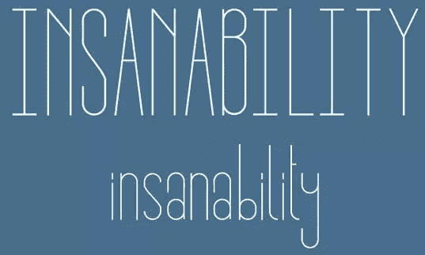
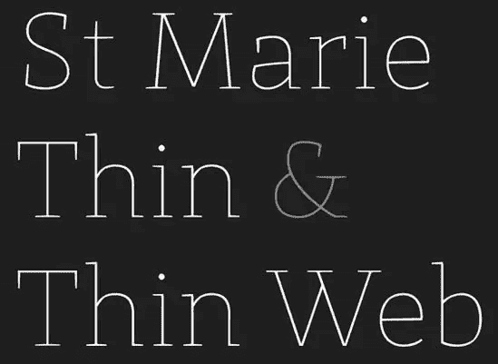
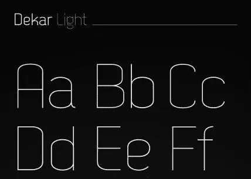
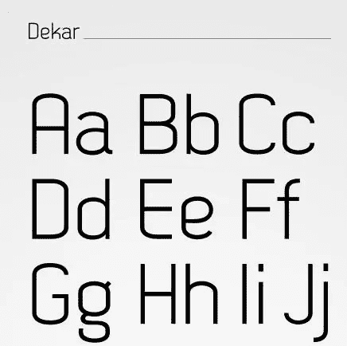
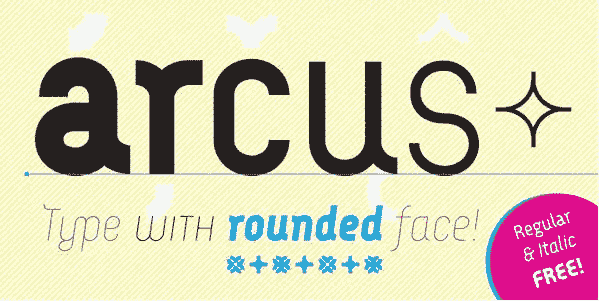
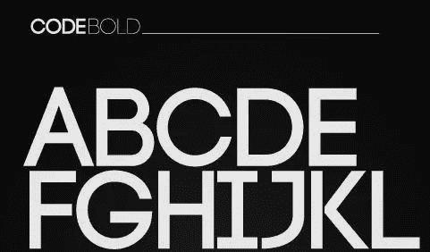
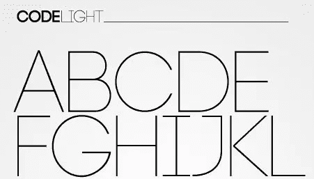
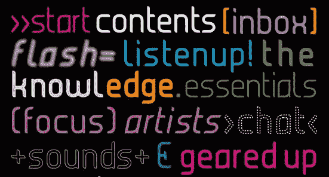
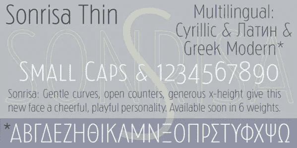

# Behance 上的印刷工提供的 8 种免费时尚字体

> 原文：<https://www.sitepoint.com/8-free-stylish-fonts-from-typographers-on-behance/>

我喜欢 Behance 有很多原因。首先，每天更新的大量在线设计、插图和摄影项目是灵感和视觉糖果的巨大来源。其次，因为网站上分享的免费设计“素材”。今年早些时候，我写了一篇文章，介绍了来自 Behance network 的十种免费显示字体，我认为是时候展示一些更好的排版作品了。所以，为了你的观赏乐趣和你的字体包，这里有另一套可爱的字体，可以免费下载。

Insanability 是由 [Cory Angen](http://www.behance.net/coryangen) 定制的字体。你可以在这里下载[。](http://coryangen.com/r/Insanability.zip)

圣玛丽薄&薄网由 [Sascha Timplan](http://www.behance.net/stereotypes) 提供。你可以在这里下载字体。

Deekar Light & Normal 免费字体由 [Fontfabric](http://www.behance.net/Simov) 提供。你可以在这里下载字体。

塞缪尔·卡诺基。你可以从[这里](http://new.myfonts.com/fonts/carnoky/arcus/)下载字体(在 myfonts.com 结账是 0 欧元)。

通过 [Fontfabric](http://www.behance.net/Simov) 对浅色和粗体字体进行编码。你可以在这里下载[。](http://fontfabric.com/code-free-font-3/)

Dhany Arliyanti 的果汁。你可以从 Dafont 这里下载《T2》的全家福。

杰森·卡塞尔的《桑丽莎的思考》。字体可以从 [CastleType 网站这里](http://castletype.com/html/tipoteca/sonrisa-thin.html)下载。

格雷格·埃克勒的《卡米萨多》是一个“具有过渡倾向的无衬线人文主义者”。你可以从邪恶马戏团下载到这里。

你觉得这些字体怎么样？有你喜欢的吗？

## 分享这篇文章