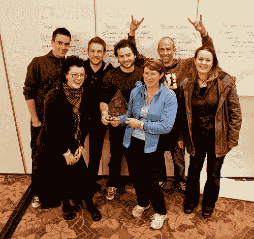

# 99 设计冠军为澳大利亚赢得金牌

> 原文：<https://www.sitepoint.com/99designs-champions-win-gold-for-australia/>

来自 [99designs](http://99designs.com) 的两名团队成员刚刚获得了最近的[威比奖](http://www.smartcompany.com.au/internet/20100506-australian-crowdsourcing-site-99designs-wins-big-at-webby-awards.html)，在 [Codaroos](http://twitter.com/codaroos) 赢得今年年度 [FullCodePress](http://fullcodepress.com) 国际网站日竞赛中，他们为澳洲赢得了金牌。

今天下午 4 点，在威灵顿市政厅，FullCodePress 评审团宣布，Codaroos 为他们的客户建立的网站 [Lions Hearing Dogs](http://fcpaus.netspace.co.nz) 被一致投票选为获胜者，击败了美国队的 [Timaru 精神健康支持信托](http://fcpusa.netspace.co.nz)网站和新西兰 CodeBlacks 建立的[华特·兰加塔希](http://fcpnzl.netspace.co.nz)网站。该公告发布在[官方 FullCodePress 网站](http://www.fullcodepress.com/2010/06/20/codaroos-victorious-but-everyone-a-winner-on-the-day/):

> 就这样，超过 24 小时的折磨人的魔法结束了。来自澳大利亚的 Codaroos，在对处于黄色角落意味着什么感到困惑之后，被 SitePoint 的 Sarah Taylor 授予 FullCodePress 2010 奖杯，作为总赢家。

这个六人小组包括用户体验倡导者詹姆斯·曼斯菲尔德和开发者拉克伦·唐纳德。前 99designs 员工 Adam Schilling 也是该团队的重要成员。

衷心祝贺所有参与这一精彩活动的团队。虽然 Codaroos 是今天的赢家，但这项工作的最终结果是，三个值得的非营利组织现在都有了一个令人惊叹的网站。

*如果你有兴趣重温这种神奇，你可以浏览[图片](http://flickr.com/photos/fullcodepress)、[视频](https://www.youtube.com/user/fullcodepress)采访、[推特档案](http://twitter.com/fullcodepress)和[显示每个网站发展历史的截图](http://www.fullcodepress.com/2010/06/19/follow-the-sites-as-they-are-built/)。*

## 分享这篇文章