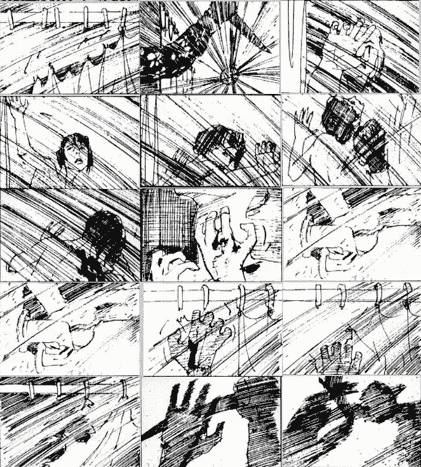
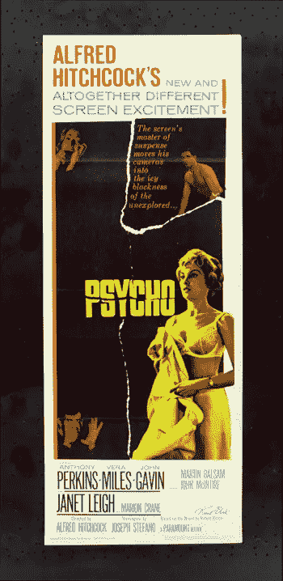
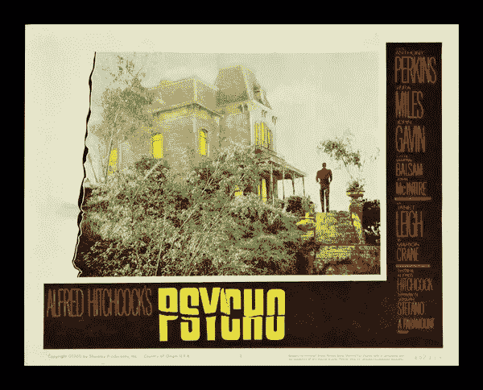
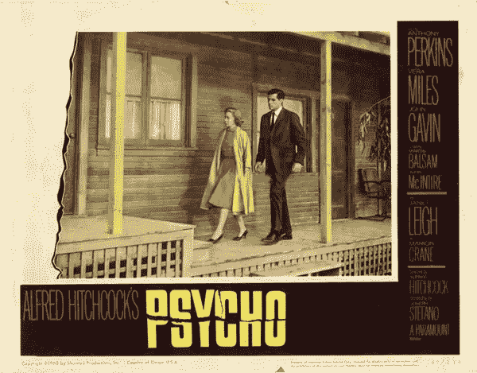
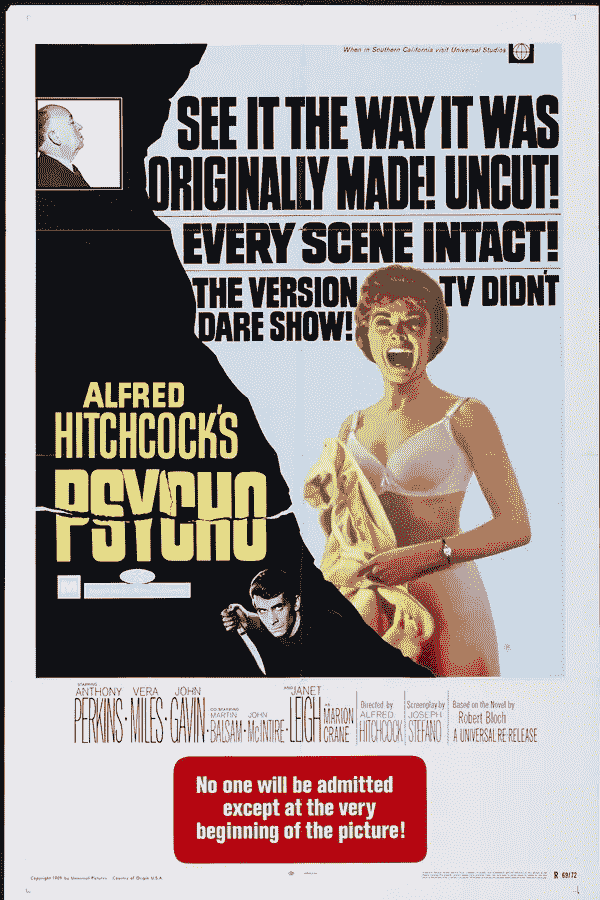

# 神经病，50 岁生日快乐

> 原文：<https://www.sitepoint.com/happy-50th-birthday-psycho/>

今天是阿尔弗雷德·希区柯克的电影《惊魂记》在纽约首映 50 周年纪念日。诺曼·贝茨、他的母亲和幽灵汽车旅馆的故事被誉为有史以来最有影响力的悬疑电影之一。那么为什么我在设计博客上提到它呢？几乎每部电影都有片头，而《惊魂记》是由另一位极具影响力的个人创作的，他就是平面设计师索尔·巴斯。这是回顾他精彩的标题设计作品的最佳时机。

开场演职员表看似简单。垂直和水平条的组合在屏幕上移动，显示出演职员表，伯纳德·赫尔曼的戏剧性配乐增加了张力。这些名字被分割开来，在屏幕上快速上下移动，可能传达了像诺曼·贝茨一样的人格分裂的想法。

<object classid="clsid:d27cdb6e-ae6d-11cf-96b8-444553540000" width="500" height="405" codebase="https://download.macromedia.com/pub/shockwave/cabs/flash/swflash.cab#version=6,0,40,0"><param name="allowFullScreen" value="true"><param name="allowscriptaccess" value="always"><param name="src" value="https://www.youtube.com/v/s4L9J-CUAl8&amp;hl=en_US&amp;fs=1&amp;rel=0&amp;color1=0x3a3a3a&amp;color2=0x999999&amp;border=1"><param name="allowfullscreen" value="true"><embed type="application/x-shockwave-flash" width="500" height="405" src="https://www.youtube.com/v/s4L9J-CUAl8&amp;hl=en_US&amp;fs=1&amp;rel=0&amp;color1=0x3a3a3a&amp;color2=0x999999&amp;border=1" allowscriptaccess="always" allowfullscreen=""></object>

《惊魂记》是索尔·巴斯和阿尔弗雷德·希区柯克的第三次也是最后一次合作。巴斯也是这部电影的顾问，为电影的一些场景绘制布景和场景，包括著名的淋浴场景。

**** 

经由[和. splinder](https://and.splinder.com/tag/saul+bass) 的图像

**《惊魂记》电影海报**

当我在为这篇文章做准备时，我发现了各种各样的心理电影海报。我相当肯定它们不全是索尔·巴斯设计的(如果有的话)，但它们看起来都很有趣，包括一眼就能认出的撕裂标志。

(注意:我找不到这些海报的署名，所以我认为版权属于创作者，我相信是环球影业。)

[")](https://www.sitepoint.com/wp-content/uploads/2010/06/Psycho_1960.jpg)

## 分享这篇文章