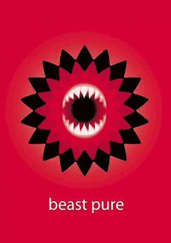
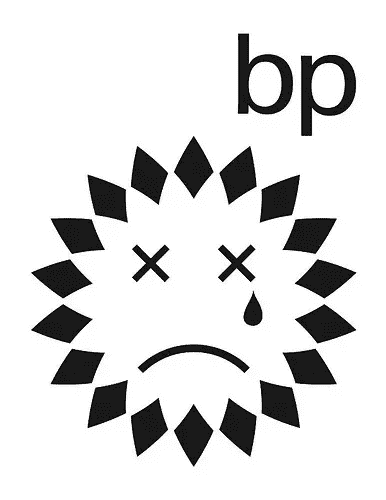
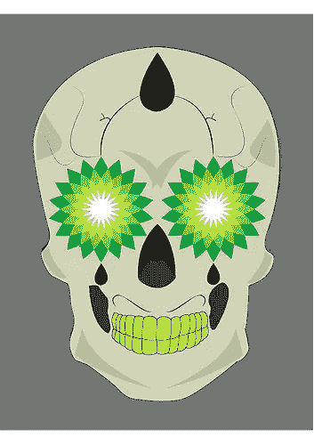
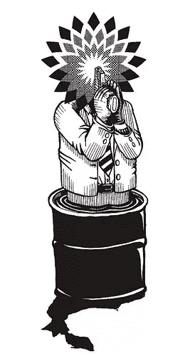
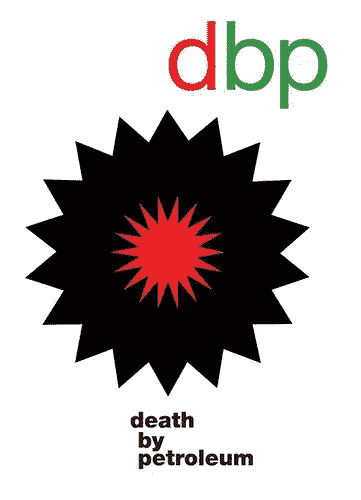

# 重新设计英国石油公司的标志

> 原文：<https://www.sitepoint.com/redesign-bps-logo/>

除非你一直住在洞穴里，否则你可能很清楚有史以来最严重的石油泄漏之一正在造成大规模的环境破坏，并摧毁美国南部海岸的大片地区。英国石油公司是造成漏油的设备和钻井平台的所有者，它正处于环境和公共关系灾难之中。

英国绿色和平组织发起了一项竞赛，邀请设计师为英国石油公司设计一个新标志，代表“超越石油”。英国石油公司正在追求“非常规石油”——加拿大沥青砂和深水钻井，并造成了巨大的破坏，更不用说墨西哥湾的灾难了。

> **你的任务**是为英国石油公司设计一个标志，表明该公司并没有“超越石油”——他们已经深陷沥青砂和深水钻探。

根据你对标志设计比赛的感觉，你可能会有兴趣参加这个比赛，即使只是作为一种发泄愤怒的方法。获胜的参赛作品将被绿色和平组织用来对抗英国石油公司。评委们正在寻找概念和想法，所以你不需要成为专业设计师，因为标志将由“顶级平面设计师”完成。有三类:专业设计师和设计生；普通大众；以及 18 岁以下的人。比赛将于 2010 年 6 月 28 日格林威治时间 5:30 结束，你可以在绿色和平网站上填写表格，下载模板，然后将你的概念艺术作品上传到绿色和平 Flickr 小组。

据该网站称，他们已经收到了大量的参赛作品，这里有一个迄今为止上传到 [Flickr 网站](http://www.flickr.com/photos/greenpeaceuk/sets/72157623796911855/)的设计小样本。

 4

你对这些品牌有何看法？你会参加自己的比赛吗？

## 分享这篇文章