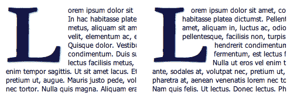
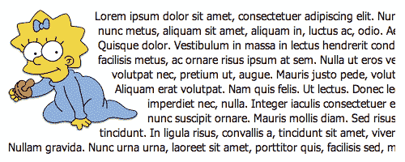
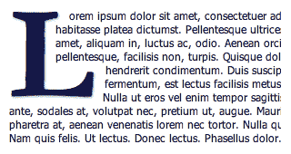

# 首字下沉:下一代

> 原文：<https://www.sitepoint.com/next-gen-drop-cap/>

最近我写了关于我们在博客重新设计中使用的首字下沉技术:[一个简单的 CSS 首字下沉](https://www.sitepoint.com/a-simple-css-drop-cap/)。[有一条评论](https://www.sitepoint.com/a-simple-css-drop-cap/#comment-944679)真的引起了我的兴趣，因为它问了一个我从未考虑过的问题:

> 我很感激能够在 CSS 中有这种首字下沉的功能，但是我来自传统的排版学校，即使在热金属排版的时代，我们也会调整这些字符的字距，使段落换行，符合首字下沉。—杰克

我承认我一开始不明白这一点(印刷术术语)，必须有人给我解释。评论者谈到了首字下沉，文字围绕字母的形状流动，而不仅仅是围绕其边界框，因此字母看起来更像是文字的一部分，而不像是一个独立的实体。要了解不同之处，请比较图 1 中的两个例子[“简单首字下沉与复杂首字下沉”](#fig-compare "Figure 1. Simple drop cap versus complex drop cap"):在左边，文字围绕字母的边界框排列成正方形；在右边，字母周围的形状更复杂。

思考这个问题时，我发现自己想起了几年前的一个例子，当时一些文本被放在一个非矩形的图像周围。我受到启发，开始尝试这个想法，结果证明它非常容易实现——尽管要做到完全正确有点复杂。

**图一。简单首字下沉与复杂首字下沉**



## 流动的彩车

基本的技巧是在段落的开头，内部文本之前添加一大堆“切片”:细长的矩形浮动条，围绕一行的高度，具有不同的宽度，文本可以在没有清除的情况下沿着边向下流动。例如，以下面的标记为例:

```
<p>  <span class="slice" id="s1"></span>  <span class="slice" id="s2"></span>  <span class="slice" id="s3"></span>  <span class="slice" id="s4"></span>  <span class="slice" id="s5"></span>  <span class="slice" id="s6"></span>  <span class="slice" id="s7"></span>  <span class="slice" id="s8"></span>  <span class="slice" id="s9"></span>  <span class="slice" id="s10"></span>  Lorem ipsum dolor sit amet, consectetuer adipiscing elit.   Nunc neque. In hac habitasse platea dictumst. Pellentesque   ultrices. Donec nunc metus, aliquam sit amet, aliquam in,   luctus ac, odio. Aenean orci velit, elementum ac, egestas   pellentesque, facilisis non ...</p>
```

用这个 CSS 样式化它:

```
p{  float: left;  clear: none;  font-family: tahoma,sans-serif;  font-size: 0.85em;  margin: 0;  line-height: 1.3;  background: url(maggie.jpg) no-repeat left top;}p .slice{  float: left;  clear: left;  display: block;  background: transparent;  height: 16px;  line-height: 1;  margin: 0 10px 0 0;}#s1 { width: 80px; }   #s2 { width: 97px; }   #s3 { width: 101px; }#s4 { width: 101px; }  #s5 { width: 93px; }   #s6 { width: 118px; }#s7 { width: 122px; }  #s8 { width: 162px; }  #s9 { width: 162px; }#s10 { width: 103px; }
```

最后你会得到一个类似于图 2 中的段落，“Maggie Simpson 两侧是杂七杂八的文本”(这本身就是一个很好的理由，如果你需要的话！).你也可以[在线查看这个例子](http://www.brothercake.com/reference/flowingfloats/example3c.html)。

**图二。玛吉·辛普森两侧杂文**



自然，切片大部分时间都是透明的，所以你看到的只是它们后面的背景图像。但是，如果我们将它们设计成可见且独立的样式，我们将清楚地看到图 3 中涉及的机制，“同样的辛普森小姐的图像，现在带有可见的切片”。你也可以在网上[查看这个例子](http://www.brothercake.com/reference/flowingfloats/example3x.html)。

**图 3。辛普森小姐的同一个图像，现在有了可见的切片**


## 使它变小

如果一切正常，我们可以用同样的想法实现更好的首字下沉吗？我们所要做的就是把一个大的字母放在一堆非常小的切片上，这些切片描述了字母的形状，我们创造了文字围绕字母流动的效果。这是完全相同的技术，只是规模较小。

然而，我们发现，我们正在创建的效果的*——我的意思是文本的形状变得有多流畅，以及它有多接近字母的轮廓——不是由切片的大小决定的，而是由受影响的文本的行数 决定的。本质上，相对于文本的其余部分，首字下沉越大，受其影响的行数就越多；这意味着文字更清晰地呈现出字母的形状(就像照片中有更多的像素)。*

 *## 让它变大？

我们在最开始看到的例子，现在再次出现在图 4 的[中，“一个大的“L”在围绕它流动的各种文本的前面”](#fig-big "Figure 4. A large “L” preceding miscellaneous text that flows around it")，用了八行来完全包围首字下沉—[我认为它看起来很棒](http://www.brothercake.com/reference/flowingfloats/example8.html)。

**图 4。杂七杂八的文本前面有一个很大的“L ”,环绕着它**



然而，你可以看到我们至少需要四到五行来围绕这封信，否则效果微乎其微；少于这个数字不足以描述大多数首都的形状。

## 就这么办吧！

最后，下面的代码让那个大的首字下沉字母“L”的文本在它的右边来回流动([查看演示](http://www.brothercake.com/reference/flowingfloats/example8.html))。首先，HTML:

```
<p>  <span class="slice s1"></span>  <span class="slice s2"></span>  ...   <span class="slice s19"></span>  <span class="slice s20"></span>          <strong class="first-letter">L</strong>orem ipsum dolor   sit amet, consectetuer adipiscing elit. Nunc neque. In   hac habitasse platea dictumst. Pellentesque ultrices.   Donec nunc metus, aliquam sit amet, aliquam in, luctus   ac, odio. Aenean orci velit ...</p>
```

为了节省空间，我已经删节了那个代码示例，省略了一些切片，但是这个演示实际上取了 20 个切片，由从`slice s1`到`slice s20`的`class`名称索引。它也有更多的文字。这是 CSS:

```
p{  font-size: 0.73em;  position: relative;  float: left;  clear: none;  font-family: tahoma,sans-serif;  color: #224;  margin: 10px 0 0 10px;  width: 50%;  line-height: 1.3;}p > strong.first-letter{  position:absolute;  left:0;  top:0;  font-family:garamond,times,serif;  color:#004;  font-size:12.5em;  line-height:0.72;  text-shadow:0.01em 0.01em 0.02em rgba(0,0,50,0.5);}p > .slice{  float:left;  clear:left;  display:block;  background:transparent;  height:0.435em;  line-height:1;  margin:0 8px 0 0;}p > .s1 { width:4.8em; }   p > .s2 { width:4.8em; }p > .s3 { width:4.6em; }   p > .s4 { width:3.6em; }p > .s5 { width:3.6em; }   p > .s6 { width:3.6em; }p > .s7 { width:3.6em; }   p > .s8 { width:3.6em; }p > .s9 { width:3.6em; }   p > .s10 { width:3.6em; }p > .s11 { width:3.6em; }  p > .s12 { width:3.6em; }p > .s13 { width:3.6em; }  p > .s14 { width:8.2em; }p > .s15 { width:8.1em; }  p > .s16 { width:8.1em; }p > .s17 { width:8em; }    p > .s18 { width:8em; }p > .s19 { width:7.9em; }  p > .s20 { width:7.9em }
```

这就是所需要的一切；不需要图像。因为所有重要的大小和尺寸都是 em 单位，你只需要改变容器段落的基本字体大小，它就会按比例缩放。

要使用不同的字母，您首先需要为切片添加背景颜色，以便您可以看到它们，然后逐个调整它们的宽度，直到字母被完全覆盖。你不必超级精确；稍微高估一点也没关系。例如，如果您发现当您希望某些行在切片下流动时，它们正好停在切片的边缘，您也可以稍微调整单个切片的高度，使文本向特定方向流动；例如:

```
p > .s1 { width:4.8em; }p > .s2 { width:4.8em; }p > .s3 { width:4.6em; height:0.385em; }p > .s4 { width:3.6em; height:0.485em; }p > .s5 { width:3.6em; }...etc
```

## 两条小皱纹

这种技术的一个小缺点是，它现在需要一个包装器来包装第一个字母。本设计中使用的原始技术采用`:first-letter`伪元素来创建首字下沉。然而，对于这些例子来说，这是不可能的，因为当前的浏览器没有为伪元素实现足够的 CSS 属性来完成这项工作(例如，定位失败，这是至关重要的)。在任何情况下，文本前出现切片元素意味着一些浏览器不再认为它是第一个字母。这就是为什么我们必须使用包装。

这项技术的另一个小问题是它在 IE6 中不能正常工作，尽管基本技巧可以；切片不成比例错位，周围文字位移不准确。也许有可能用黑客一点一点地调整它，直到它是正确的，但是谁还有时间做那些事情呢！

通过使用子选择器而不是后代选择器来降低 IE6 的效果是微不足道的，只留下第一个字母周围的`<strong>`标签的粗体。如果你真的感到有动力，你可以使用 CSS hack 为 IE6 定义一个不同的、更简单的首字下沉:

```
/* IE6's alternative drop-cap! */* html p strong.first-letter{    color:#003;    font-family:times,serif;    font-size:4.6em;    float:left;    margin:0.4em 0.2em 0 0;    line-height:0.7;}
```

除了这两个技术故障，还有一个不可避免的问题，那就是你是否被那些语义上多余的`span`元素所困扰。没有办法避免对它们的需求，因为仅仅在 CSS 中没有足够多的可行的伪元素来做到这一点。创造这种效果是有代价的，由你来决定最终结果是否值得。

## 现实世界的实施

所有这一切中最棘手的部分是定义所有这些片段的大小，以匹配您希望文本环绕的任何字母(无论大小和字体)。对于少数测试用例来说，这并不是真正的麻烦，但是如果您希望它具有真实世界的灵活性，您可能需要考虑精简和抽象实现。一种可能的方法是用 JavaScript 来实现。不过那完全是另一篇文章了…

## 分享这篇文章*