# 在 Photoshop 中制作一个卷曲的页面

> 原文：<https://www.sitepoint.com/make-a-page-curl-in-photoshop/>

您可以在网页或印刷设计中使用卷边来添加 3D 效果的暗示。我们将使用颜色填充调整层，渐变图层蒙版和扭曲来产生效果。例如，您可以将这种效果应用到现有的图像上，也可以将其应用到您可能在网站的侧边栏上使用的颜色块上。

1.在 Photoshop 中打开你的图片。我用的是这张由 [echiax](http://www.sxc.hu/profile/echiax) 拍摄的狗的华丽照片，可以在这里从[免费下载。](http://www.sxc.hu/browse.phtml?f=download&id=1271578)

[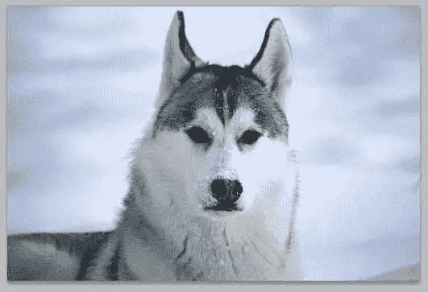](https://www.sitepoint.com/wp-content/uploads/2010/05/Dog.jpg)

2.重要的是，狗图片是在堆栈的最底层。如果你将狗复制并粘贴到 Photoshop 中，它会将图像放在默认的锁定背景图层之上的图层 1 中。如果有背景层，删除它，这样你就只有一层了。

[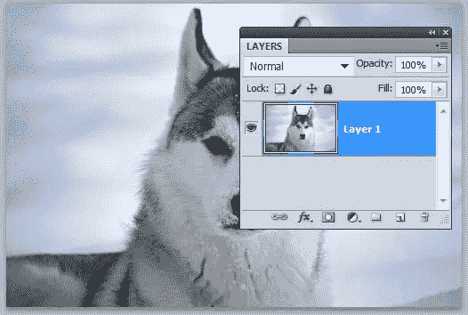](https://www.sitepoint.com/wp-content/uploads/2010/05/BottomLayer.jpg)

3.点击图层面板底部的新调整填充图标，从弹出菜单中选择纯色。

[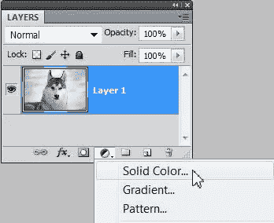](https://www.sitepoint.com/wp-content/uploads/2010/05/2solidColorAdjust.jpg)

4.对于颜色填充，选择黑色并单击确定。这一步创建一个新的层称为颜色填充 1 以上的狗的形象。

[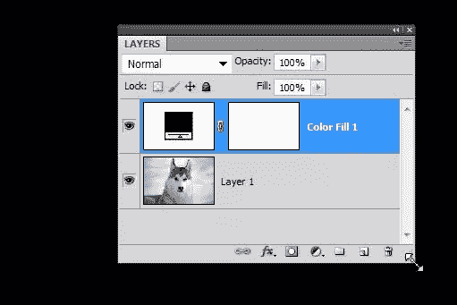](https://www.sitepoint.com/wp-content/uploads/2010/05/4ColorFillLayer.jpg)

5.我们需要应用一个渐变到图层蒙版的颜色填充 1 层，所以要确保它在图层面板中被选中。按下键盘上的 D 键，将前景颜色样本设置为黑色，然后从工具栏中选择渐变工具(G)。

6.在屏幕顶部的选项栏中，选择前景—透明渐变、线性样式、正常模式、100%不透明度、抖动和透明活跃。

[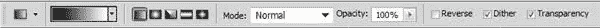](https://www.sitepoint.com/wp-content/uploads/2010/05/5Gradient.jpg) 
7。然后从左下角点击并拖动绘制渐变停止在图像的四分之一处，如下图。

[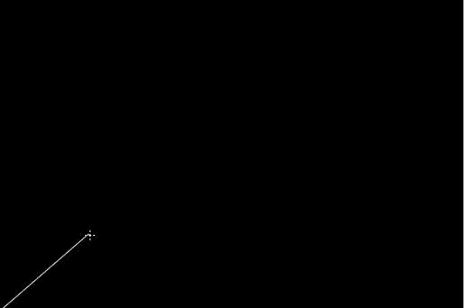](https://www.sitepoint.com/wp-content/uploads/2010/05/6GradientDrag.jpg)

结果应该是这样的:

[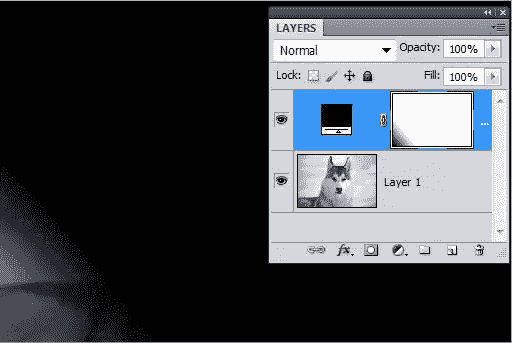](https://www.sitepoint.com/wp-content/uploads/2010/05/7GradientApplied.jpg)

8.现在我们需要扭曲我们的图层蒙版，选择颜色填充 1 图层，按 Ctrl + T (windows)或 Cmd + T (mac)开始自由变换。只有图层蒙版会被选中。

[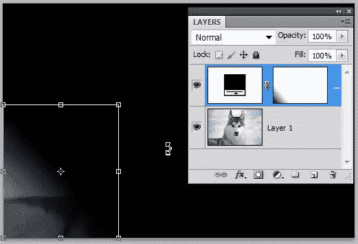](https://www.sitepoint.com/wp-content/uploads/2010/05/8FreeTransform.jpg)

9.在自由变换仍然处于活动状态的情况下，转到选项栏并选择“扭曲图标”命令。

[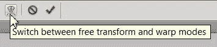](https://www.sitepoint.com/wp-content/uploads/2010/05/9Warp.jpg)

现在，您应该会在图像的左下角看到一个小的锚点网格。单击并拖动左下角的锚点，并将其拉向中间，如下所示。我还拖动 x 轴和 y 轴上的锚点来改变曲线的形状。(请参见箭头，了解向哪个方向拖动)。

[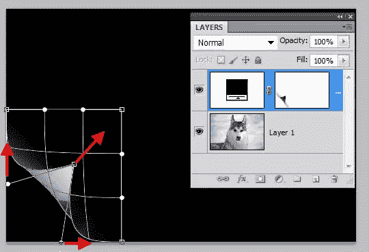](https://www.sitepoint.com/wp-content/uploads/2010/05/10DragWarp.jpg)

11.按键盘上的 Enter/Return 键提交变形更改。

[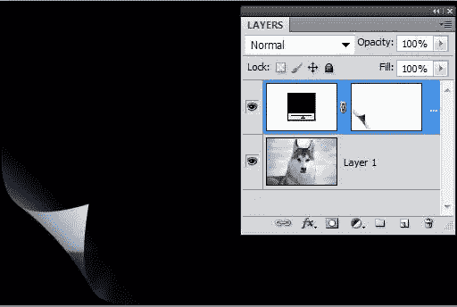](https://www.sitepoint.com/wp-content/uploads/2010/05/11CompleteWarp.jpg)

12.在颜色填充 1 层，将填充降低到 0%，以消除所有的黑色，并恢复底层图像层的可见性。

[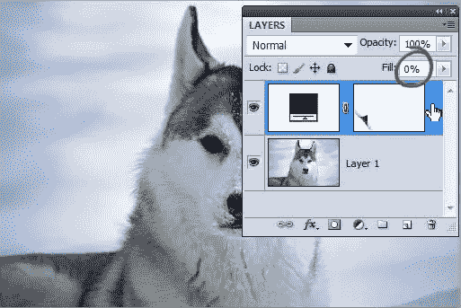](https://www.sitepoint.com/wp-content/uploads/2010/05/12Fill0.jpg)

13.右键单击(windows) / Ctrl 单击(mac)颜色填充 1 层，并从上下文列表中选择混合选项。设置不透明度为 90%，颜色为黑色，距离为 5px，大小为 5px。**先不要点击确定。**

[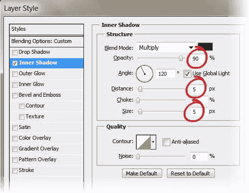](https://www.sitepoint.com/wp-content/uploads/2010/05/13InnerShadow.jpg)

你现在应该看到你的页面开始卷曲。

[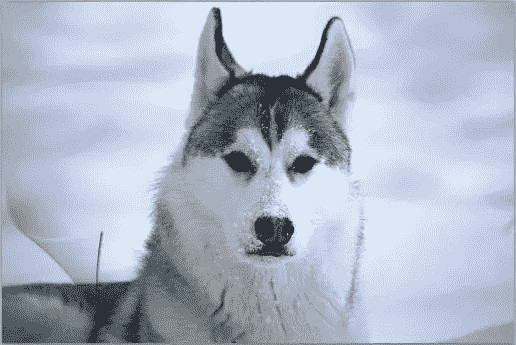](https://www.sitepoint.com/wp-content/uploads/2010/05/13PageCurl.jpg)

14.我们需要修复卷曲的前景曝光。点击单词 Stroke，然后设置大小为 10px，颜色为白色，位置为外侧。单击确定。

[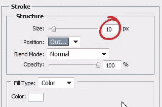](https://www.sitepoint.com/wp-content/uploads/2010/05/14Stroke.jpg)

[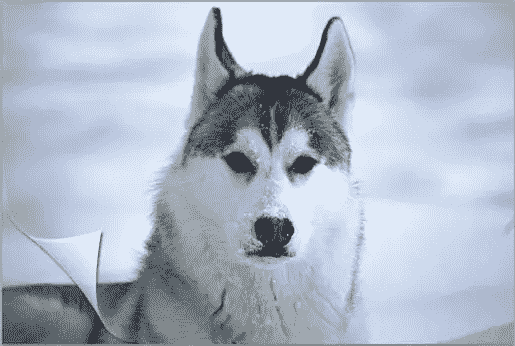](https://www.sitepoint.com/wp-content/uploads/2010/05/15pageCurl.jpg)

15.我们可以在颜色填充 1 层和狗层之间添加一个新层。在新图层上，用柔软的白色圆形笔刷仔细涂抹，填充图像的左角。

[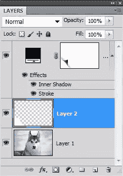](https://www.sitepoint.com/wp-content/uploads/2010/05/16Layers.jpg)

您的最终图像应该是这样的:

[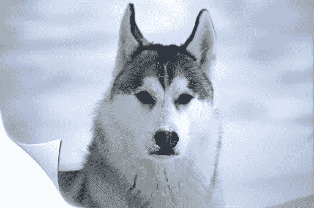](https://www.sitepoint.com/wp-content/uploads/2010/05/17FinalImage.jpg)

## 分享这篇文章